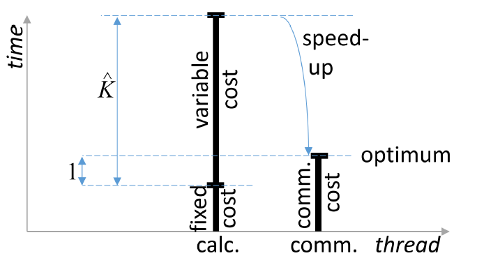

## 摘要

本文主要提出了一种比较激进的梯度量化方法，它可以将梯度中的每一位都量化为1bit，而且每次的量化误差都会补偿进下一轮量化梯度当中，因此称为带有误差补偿的1bit梯度量化方法。

>值得一提的是，本文是将量化引入分布式机器学习的开山之作，同时，这种非常激进（因为量化为1bit）的量化方式，极大减小了通信成本，而且误差补偿的方法非常具有启发性。

本文主要针对并行SGD的AdaGrad、自动最小批量大小选择，双缓冲机制以及模型并行等多个方面进行探究。在实验上证实了量化和AdaGrad相结合会有一定的准确率提升。

## 数据并行的确定分布式SGD训练

错误的反向传播方法是训练DNN模型常用的方法，它形成了一种随机梯度下降算法。随机梯度下降算法通用形式如下：
$$
\begin{aligned}
\lambda(t+N) &=\lambda(t)+\epsilon(t) \cdot G(t) \\
G(t) &=\left.\sum_{\tau=t}^{t+N-1} \frac{\partial \mathcal{F}_{\lambda}(o(\tau))}{\partial \lambda}\right|_{\lambda=\lambda(t)}
\end{aligned}
$$
其中$\lambda(t)$代表当前索引$t$采样下的模型，它的增长步长是$N$，也就是数据采样的批量大小为$N$。$\mathcal{F}_{\lambda}$是样本向量为$o(\tau)$的函数的部分梯度。$\epsilon(t)$表示学习率。

### 数据并行的分布式SGD

对于上述数据并行训练来说，最佳节点数量$\hat{K}$能够使得节点中计算和数据通信完全重叠，此时可以保证通信和计算资源是饱和的，也就是能够达到并行的最优化：
$$
T_{\text {calc }}(\hat{K})=T_{\text {comm }}(\hat{K})
$$
$T_{\text {calc }}$和$T_{\text {comm }}$分别是节点上每个小批量所需要的的计算和通信时间。如果我们将计算和通信开销继续细分，我们就能够求出最优节点数量
$$
\hat{K}=\frac{N / 2 \cdot T_{\mathrm{calc}}^{\mathrm{frm}}+C \cdot T_{\mathrm{calc}}^{\mathrm{post}}}{\frac{1}{Z} \cdot T_{\mathrm{comm}}^{\mathrm{float}}-T_{\mathrm{calc}}^{\mathrm{udd}}}
$$

其中：

事实上，将每个维度精度为$Z=32$的数据压缩为1bit

- $T_{\mathrm{calc}}^{\mathrm{frm}}$表示处理数据的时间，这部分是可以并行的

  与参数M的关系：$\propto \frac{M}{\text { FLOPS }}$

- $T_{\mathrm{calc}}^{\mathrm{post}}$表示对梯度后处理的时间，比如momentum+AdaGrad

  与参数M的关系：$\propto \frac{M}{\text { RAM bindwidth }}$

- $T_{\mathrm{comm}}^{\mathrm{float}}$传输梯度（由单精度浮点数表示）的时间

  与参数M的关系：$\propto \frac{M}{\text { Network bindwidth }}$

- $T_{\mathrm{calc}}^{\mathrm{udd}}$模型更新时间，相对于$K$来说是固定的

  与参数M的关系：$\propto \frac{M}{\text { RAM bindwidth }}$

### 双缓冲机制

为了实现更高的并行度，作者提出了双缓冲（double buffering）的概念，即在每个节点上把一个小批量分成两部分在交换其中一部分的梯度时进行另一部分的计算。然而，双缓冲机制会引入额外的更新开销（该开销是进行梯度聚合过程中产生的），当通信开销小于更新开销（即$T_{\text {comm}}^{\text {flat}}<T_{\text {calc}}^{\text {upd}}$）公式不在成立，双缓冲机制失去作用。

> 双缓冲机制的方式很好，可以用于参数服务器架构，使得通信和梯度计算之间过程的重叠，有助于更好地并行。

### 误差补偿的1Bit量化

本文最核心的部分就是减小在数据并行过程中，节点之间进行梯度传输过程中所需要的带宽消耗。（1）本文中的数据并行默认只交换荼毒，并不交换模型；（2）在数据交换的时候对梯度进行量化。

为了降低量化误差带来的负面影响，作者使用了误差补偿技术：每次量化时，把上一次迭代的量化误差加到本次迭代的梯度上，然后再进行量化，接着求出本次量化操作的误差。这种误差补偿机制可以确保所有的梯度都会再一定程度上对模型更新产生作用，只不过这种作用分散在不同的迭代中——类似于一种延迟更新的形式。作者指出，使用误差补偿后，就可以在几乎不损失模型精度的情况下将梯度由32位量化成1位。
$$
\begin{aligned}
G_{i j \ell}^{\text {quant }}(t) &=\mathcal{Q}\left(G_{i j \ell}(t)+\Delta_{i j \ell}(t-N)\right) \\
\Delta_{i j \ell}(t) &=G_{i j \ell}(t)-\mathcal{Q}^{-1}\left(G_{i j \ell}^{\text {quant }}(t)\right)
\end{aligned}
$$
其中$\mathcal{Q}(\cdot)$表示量化函数，$G_{i j \ell}^{\text {quant }}(t)$表示量化之后的整型数值。我们在量化过程中会保证$\Delta_{i j \ell}(t)$被加到下一轮的梯度过程中（也称为了误差补偿机制）。

举个例子，在具体的实现上，比较简单的方法是将大于$0$的梯度值编码成为$1$，小于等于$0$的梯度值编码为$0$。在解码的时候，将$1$编码为$+1$，将$0$解码为$-1$，在进行聚合操作。

### 系统描述

作者从最优节点数的公式当中总结出如下提高并行度的方法：

1. 增加$N$，也就是尽可能使得小批量的规模更大
2. 增加$Z$，尽可能大得压缩通信数据量
3. 减少固定消耗$T_{\mathrm{calc}}^{\mathrm{udd}}$

