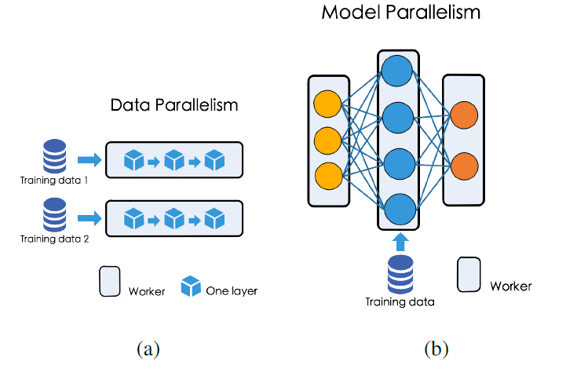

## 摘要

当下流行的深度神经网络具有非常复杂的结构，训练时需要消耗大量的内存和电源；在移动端和边缘设备等资源限制的情况下难以发挥作用，而量化则是解决上述问题的办法之一。原来的神经网络权重、激活和梯度都需要采用$32bit$精度的浮点表示，但是采用量化表示只需要整型或者二进制即可，大大减少了模型尺寸和资源消耗。这是一篇综述，从不同方面给出了量化神经网络的一些方法，同时也罗列了目前在这些方面遇到的挑战。

## 介绍

### 神经网络

本文介绍了下面几种神经网络，比较基础，这里就不做赘述

#### 前馈神经网络

#### 卷积神经网络

值得一提的是以下这些卷积神经网络结构：

- AlexNet[Krizhevsky et al., 2012[1](\#refer-anchor-1)]
- VGGNet[Simonyan and Zisserman, 2014[2](\#refer-anchor-2)]
- GoogleNet[Szegedy et al., 2015[3](\#refer-anchor-3)]
- ResNet[He et al., 2016a[4](\#refer-anchor-4)]

这四个架构非常广泛地用在比较不同压缩和量化方法性能比较实验过程中，常常作为基准（baseline）。

#### 循环神经网络和LSTM

### 量化神经网络

#### 术语介绍

- **低精度**（Low precision）：可能是最通用的概念。常规精度一般使用 FP32（32位浮点，单精度）存储模型权重；低精度则表示 FP16（半精度浮点），INT8（8位的定点整数）等等数值格式。不过目前低精度往往指代 INT8。
- **混合精度**（Mixed precision）在模型中使用 FP32 和 FP16 。 FP16 减少了一半的内存大小，但有些参数或操作符必须采用 FP32 格式才能保持准确度。如果您对该主题感兴趣，请查看 [Mixed-Precision Training of Deep Neural Networks](https://link.zhihu.com/?target=https%3A//devblogs.nvidia.com/mixed-precision-training-deep-neural-networks/) 。
- **量化**一般指 INT8 。不过，根据存储一个权重元素所需的位数，还可以包括：
  - [二值神经网络](https://link.zhihu.com/?target=https%3A//arxiv.org/abs/1602.02830)：在运行时权重和激活只取两种值（例如 +1，-1）的神经网络，以及在训练时计算参数的梯度。
  - [三元权重网络](https://link.zhihu.com/?target=https%3A//arxiv.org/abs/1605.04711)：权重约束为+1,0和-1的神经网络。
  - [XNOR网络](https://link.zhihu.com/?target=https%3A//arxiv.org/abs/1603.05279)：过滤器和卷积层的输入是二进制的。 XNOR 网络主要使用二进制运算来近似卷积。

#### 正文

目前，很多技术用在了量化神经网络方面。粗略地来看可以分成确定性量化和随机量化。在确定量化中，在量化值和真实值之间有一一对应的映射，而随机量化权重，激活和梯度则是离散分布。量化值是从离散分布中采样得到的。

在神经网络中有三个部分是可以进行量化的：权重、激活和梯度。量化这些部分的动机和方法是不同的。量化权重和激活层，我们得到更小的模型尺寸。在分布式训练的花镜中，我们能够通过量化梯度的方式节省通信消耗。一般来说，量化梯度比量化权重和激活更加困难，因为训练往往需要精度更高的梯度来保证算法的收敛。

我们通常采用编码本（codebook）来表示代表真实值的离散值。从密码本的表示来看，现有的工作可以将量化神经网络粗略的分成两类：固定编码本量化和自适应编码本量化。

在固定编码本量化中，权重经常被量化成提前定义好的编码，二自适应编码本是从数据中学习而来。一些普遍应用的密码本包括$\{-1,1\}$，$\{-1,0,1\}$或者二数幂或者二进制网络和三元权重网络等。

训练量化模型需要不断调整，而且量化网络并不容易理解，寻找新的量化方法以及配合理论分析是量化神经网络非常重要的一点。

## 量化技术

### 确定性量化

#### 取整（Rounding）

##### 主要内容

取证可能是对真实值最简单的量化，例如[Courbariaux et al., 2015]提出下面这种取整方法：
$$
x^{b}=\operatorname{sign}(x)=\left\{\begin{array}{ll}
+1 & x \geq 0 \\
-1 & \text { otherwise }
\end{array}\right.
$$
其中$x^b$表示二进制量，$x$是真实量。这个方法可以应用在量化权重，激活和梯度中。在前向传播中，真实值权重能够产生输出。然而，在反向传播过程中，我们不能够通过`Sign(x)`来进行，因为它是离散的，到处都是梯度为零。通常采用的方法是“直通估计（straight through estimator）”（STE）[Hinton et al., 2012b]，它采用启发式的方法估计随机神经元的梯度。假设$E$是损失函数，STE的前向和反向计算可以看成如下方式：
$$
\begin{array}{l}
\text { Forward: } \quad x^{b}=\operatorname{Sign}(x) \\
\text { Backward: } \frac{\partial E}{\partial x}=\frac{\partial E}{\partial x^{b}} \mathrm{I}_{|x| \leq 1}
\end{array}
$$
其中$\mathrm{I}_{|x| \leq 1}$是定义如下的指示函数：
$$
\mathrm{I}_{|x| \leq 1}=\left\{\begin{array}{ll}
1 & |x| \leq 1 \\
0 & \text { otherwise }
\end{array}\right.
$$
为了对双精度进行取整，[Gupta et al., 2015]作者提出了如下的取整方式：
$$
\operatorname{Round}(x,[\mathrm{IL}, \mathrm{FL}])=\left\{\begin{array}{ll}
\lfloor x\rfloor & \text { if }\lfloor x\rfloor \leq x \leq\lfloor x\rfloor+\frac{\epsilon}{2} \\
\lfloor x\rfloor+\epsilon & \text { if }\lfloor x\rfloor+\frac{\epsilon}{2}<x \leq\lfloor x\rfloor+\epsilon
\end{array}\right.
$$
在固定点表达中，IL代表整数位的个数，FL表示分数位的个数。$\epsilon$表示在固定点表达中能够表达的最小正数。$\lfloor x\rfloor$被定义为$\epsilon$的最大整数倍。对于超出此固定点格式范围的值，作者将它们规范化为固定点表示的下界或上界[Rastegari et al., 2016]。将上式扩展：
$$
\begin{array}{ll}
\text { Forward: } & x^{b}=\operatorname{Sign}(x) \times \mathrm{E}_{F}(|x|) \\
\text { Backward: } & \frac{\partial E}{\partial x}=\frac{\partial E}{\partial x^{b}}
\end{array}
$$
其中$\mathrm{E}_{F}(|x|)$表示每个输出通道的权值绝对值的平均值。

近期[Polino et al., 2018]提出了更加普遍的舍入函数：
$$
Q(x)=s c^{-1}(\hat{Q}(s c(x)))
$$
其中$sc(x)$是将值从任意范围缩放到$[0,1]$的缩放函数。$\hat{Q}(x)$是实际的量化函数。给出量化等级参数$s$，有$s+1$等级的统一量化函数可以定义为：
$$
\hat{Q}(x, s)=\frac{\lfloor x s\rfloor}{s}+\frac{\xi}{s}
$$
其中
$$
\xi=\left\{\begin{array}{ll}
1 & x s-\lfloor x s\rfloor>\frac{1}{2} \\
0 & \text { otherwise }
\end{array}\right.
$$
这个量化函数的直觉是将$x$分配到在$[0,1]$范围内$s-1$个等间隔最接近的量化点。这是符号$Sign(x)$函数的广义版本，能够将实值量化成多层。在[Shuang et al., 2018]中，作者提出了启发式摄入函数来量化一个市值为$k$位的整数。
$$
Q(x, k)=\operatorname{Clip}\left\{\sigma(k) \cdot \operatorname{round}\left[\frac{x}{\sigma(k)}\right],-1+\sigma(k), 1-\sigma(k)\right\}
$$
想法是将真实值利用统一的距离$\sigma(k)$进行量化，其中$\sigma(k)=2^{1-k}$。$Clip$将量化限制在$[-1+\sigma(k), 1-\sigma(k)]$范围内，$round$用最近的离散点替换连续值。

##### 挑战

挑战:使用四舍五入函数是将实值转换为量化值的简单方法。然而，每次四舍五入操作之后，网络性能可能会急剧下降。在训练过程中需要保持真实值作为参考，这会增加记忆开销。同时，由于使用离散值时参数空间要小得多，训练过程难以收敛。最后，舍入运算不能充分利用网络中权值的结构信息。

#### 向量量化

[Gong et al., 2014]是第一篇将向量量化考虑到神经网络压缩和量化中的。他主要的思想是将权重分组聚类，在推理时采用聚类中心代表每个组实际的权重。

[Han et al., 2015]，[Gong et al., 2014]等都对这种方式进行了改进，[Choi et al., 2016]指出这种方法有两个缺点，第一是不能够控制由于`k-means`算法造成的损失；第二是`k-means`算法不施加任何压缩比约束。为了解决这些问题，作者提出了一种Hessian加权k均值聚类方法。其基本思想是使用Hessian Weighted失真来测量因权值量化而导致的性能退化。这样可以防止那些对网络性能有较大影响的权值与原始值偏离太多。

有很多对向量量化的扩展方法，乘积量化[Gong et al., 2014]是一种将权重矩阵划分为许多不相交的子矩阵，并对每个子矩阵进行量化的方法。在[Wu et al., 2016]中，作者采用带误差修正的产品量化方法对网络参数进行量化，实现快速训练和测试。残差量化[Gong et al., 2014]将向量量化到k个聚类中，然后递归量化残差。在[Park et al., 2017]中，作者采用了类似于矢量量化的方法。他们使用了一个基于权重熵的想法[Guias¸u, 1971]来将权重分组到N个簇中。对于重要的权重范围有更多的簇。从而实现了自动灵活的多比特量化。

##### 挑战

由于网络中权值的数量，k-means聚类的计算量很大。与四舍五入法相比，用向量化方法来实现二值权值比较困难。向量量化通常用于对预先训练的模型进行量化。因此，如果任务是从头训练量化网络，最好使用精心设计的四舍五入函数。向量量化忽略了网络的局部信息。

#### 量化最优化

简单来说就是将量化作为最优化问题进行，此处暂时省略...

### 随机量化

#### 随机舍入法（Random Rounding）

在随机舍入法中，真实值和量化值有着一对一的对应。典型地，量化值的权重是从离散分布中采样而来，它是通过真实值进行参数化的。例如，[Courbariaux et al., 2015]提出了以下的随机近似方法：
$$
x^{b}=\left\{\begin{array}{ll}+1 & \text { with probability } p=\sigma(x) \\ -1 & \text { with probability } 1-p\end{array}\right.
$$
其中$\sigma$表示“hard sigmoid”函数
$$
\sigma(x)=\operatorname{clip}\left(\frac{x+1}{2}, 0,1\right)=\max \left(0, \min \left(1, \frac{x+1}{2}\right)\right)
$$
直观上来说，$x$是一个正值，我们将以很高的概率量化到$+1$，其他情况量化到$-1$。这就给我们更加灵活的量化模式。在[Muller and Indi-veri, 2015]中，作者在整数规划中使用了这种思想。提出的随机四舍五入函数将每个实值概率映射到最近的离散点或第二最近的离散点，这取决于到对应点的距离。在[Lin et al., 2015]中，将二进随机四舍五入扩展到三元情形。

##### 挑战

随机舍入提供了一种将噪声注入训练过程的方法。它可以作为一个正则化器和可提供条件计算。然而，使用随机的舍入方法，我们需要估计离散神经元的梯度。这样的估计往往有很高的方差。这一事实可能会导致训练过程中损失函数的振荡。[Bengio等人，2013]的工作提供了估计离散中性电子梯度的可能解决方案的概述。

#### 概率量化

暂无

#### 讨论

上述量化技术使我们能够从不同的角度对网络进行量化。这些技术的优缺点可以指导我们在不同的情况下选择合适的技术。一般来说，如果我们想为硬件加速量化神经网络，确定性量化应该是首选，因为我们可以预先指定适当的量化级别，以便在专用硬件上运行量化的网络工作。这可以提高硬件的预测性能。四舍五入使我们能够以数据依赖的方式量化权重。这导致了条件计算[Bengio et al.， 2013]，可以增加神经网络的容量。概率量化与确定性量化的不同之处在于量化后的权重更具有可解释性。我们可以用概率量化的方法来理解权值的分布，并对网络的工作原理有更深入的了解。在概率量化的情况下，由于贝叶斯方法的正则化效果，我们也可以得到更稀疏的模型。

## 量化对象分类

### 权重量化

在[Zhou et al., 2017a]中，作者提出了增量式网络量化(INQ)，它包括三个步骤：权重划分、分组量化和再训练。他们以组的方式对权重进行组化，以允许某些权重组补偿由于其他组的量化而造成的准确性损失。[Gudovskiy and Rigazio, 2017]的工作将这种方法扩展到2次幂设置。

在[Lin et al., 2016]中，作者试图找到最优的不动点位宽跨层分配。他们研究了通过量化不同的层可以引入多少噪音。[Lin et al., 2017]使用多个二进制基的线性组合近似全精度权重。结果表明，二值神经网络在ImageNet数据集上首次取得了与全精度神经网络相当的预测精度。在[Moons et al., 2017]中，作者研究了如何发展节能量化神经网络。在[Guo et al., 2017]的工作中引入了网络素描来量化预先训练好的模型。其思想是使用二进制基来近似预先训练过的滤波器。他们首先提出了一种启发式算法来寻找二进制基础，然后提供了一个改进版本，以更好的近似。在[Mohamed Amer, 2018]中，作者提出了一种端到端训练框架来同时优化原始损失函数、量化误差和总比特数。然而，其精度无法与其他量化神经网络相比。

### 梯度量化

梯度量化的应用场景一般是为了在分布式训练过程中减小通信消耗。如下图就是为神经网络的并行训练：

[Seide et al., 2014[5](\#refer-anchor-5)]提出了一种1-bit表示各个节点计算梯度。和常规的方法相比，它得到了10倍的加速比。[Strom, 2015[6](\#refer-anchor-6)]作者提出了一种阈值量化方法。提前选定一个阈值，如果梯度大于这个阈值就量化为$+1$，如果小于这个阈值就量化为$0$。[Alistarh et al., 2016[7](\#refer-anchor-7)]提出了QSGD方法，允许每个节点在精度、梯度和模型的精度之间进行权衡。QSGD利用随机四舍五入的思想将梯度量化为一组离散值，并利用无损编码产生高效的编码。[Dryden et al., 2016[8](\#refer-anchor-8)]]作者提出一种简单的自适应量化方法来选择合适的梯度进行量化并发送。

[Wen et al., 2017[9](\#refer-anchor-9)]]通过提出了TernGrad解决了并行过程中水平扩展的问题。他将梯度量化为$\{-1,0,1\}$。在发送给中心参数服务器之前，每个梯度都将被如下量化：
$$
\tilde{\Delta}_{t}=\operatorname{ternarize}\left(\Delta_{t}\right)=s_{t} \cdot \operatorname{sign}\left(\Delta_{t}\right) \circ b_{t}
$$
其中$s_{t}=\max \left(\operatorname{abs}\left(\Delta_{t}\right)\right)$，其中$\circ$是[哈达玛积](https://www.baidu.com/link?url=w-LVD0IIl4PbHY-Vzc-UEKgvX7_8m_uRUWXH56DVxRjY77fZbsptVsF2pO7Gmxx3cRBReXg7sz3JTvIakfzCprx8m2RSMUNzT_E2Ppx3wyfA6RMWuAA7E66zF4btnsYK&wd=&eqid=8509435200010e68000000055f216602)，$b_t$是遵循如下伯努利分布的随机二进制向量：
$$
\left\{\begin{array}{l}
P\left(b_{t k}=1 \mid \Delta_{t}\right)=\left|\Delta_{t k}\right| / s_{t} \\
P\left(b_{t k}=0 \mid \Delta_{t}\right)=1-\left|\Delta_{t k}\right| / s_{t}
\end{array}\right.
$$
采用这种方法，服务器和工作节点之间的通信开销可以降低接近20倍.

在单一节点的环境中，我们也能够通过量化梯度获得益处。为了减小反向传播的计算开销，[Rastegari et al., 2016[11](\#refer-anchor-11)]将梯度量化为2-bits来进行高性能通信。[Zhou et al., 2016[10](\#refer-anchor-10)]他还量化了反向传播过程中的梯度。他们发现使用随机四舍五入的方法是非常重要的，使量程梯度工作得很好。他们设计了如下的k比特量化函数，
$$
\tilde{f}_{\gamma}^{k}(d r)=2 \max _{0}(|d r|)\left[\text { quantize }_{k}\left(\frac{d r}{2 \max _{0}(|d r|)+\frac{1}{2}}\right)-\frac{1}{2}\right]
$$
其中$d r=\frac{\partial c}{\partial r}$是在某些层输出$r$的梯度，$quantize_k$被用于量化一个实数输入$r_{i} \in[0,1]$到k-bit输出值$r_{0} \in[0,1]$，
$$
r_{o}=\frac{1}{2^{k}-1} \operatorname{round}\left(\left(2^{k}-1\right) r_{i}\right)
$$
他们还在训练过程中加入额外的噪声，以弥补量化造成的准确性损失。

##### 挑战

- 梯度的大小和符号对于更新权重都很重要。为了量化梯度，我们必须解决如何将这两个因素纳入计算的问题。

- 一种简单的量化梯度的方法可能在实践中并不奏效，因为它可能违反随机梯度下降算法的收敛条件。在这种情况下需要更复杂的方法。

- [1] [Krizhevsky A, Sutskever I, Hinton G E. Imagenet classification with deep convolutional neural networks[C]//Advances in neural information processing systems. 2012: 1097-1105.](http://papers.nips.cc/paper/4824-imagenet-classification-with-deep-convolutional-neural-networks.pdf)

- [2] [Simonyan K, Zisserman A. Very deep convolutional networks for large-scale image recognition[J]. arXiv preprint arXiv:1409.1556, 2014.](https://arxiv.org/pdf/1409.1556)

- [3] [Szegedy C, Liu W, Jia Y, et al. Going deeper with convolutions[C]//Proceedings of the IEEE conference on computer vision and pattern recognition. 2015: 1-9.](https://www.cv-foundation.org/openaccess/content_cvpr_2015/html/Szegedy_Going_Deeper_With_2015_CVPR_paper.html)

- [4] [He K, Zhang X, Ren S, et al. Deep residual learning for image recognition[C]//Proceedings of the IEEE conference on computer vision and pattern recognition. 2016: 770-778.](https://openaccess.thecvf.com/content_cvpr_2016/html/He_Deep_Residual_Learning_CVPR_2016_paper.html)

- [5] [Seide F, Fu H, Droppo J, et al. 1-bit stochastic gradient descent and its application to data-parallel distributed training of speech dnns[C]//Fifteenth Annual Conference of the International Speech Communication Association. 2014.](https://www.microsoft.com/en-us/research/wp-content/uploads/2016/02/IS140694.pdf)

- [6] [Alistarh D, Grubic D, Li J, et al. QSGD: Communication-efficient SGD via gradient quantization and encoding[C]//Advances in Neural Information Processing Systems. 2017: 1709-1720.](http://papers.nips.cc/paper/6768-qsgd-communication-efficient-sgd-via-gradient-quantization-and-encoding.pdf)

- [7] [Strom N. Scalable distributed DNN training using commodity GPU cloud computing[C]//Sixteenth Annual Conference of the International Speech Communication Association. 2015.](https://www.isca-speech.org/archive/interspeech_2015/i15_1488.html)

- [8] [Dryden N, Moon T, Jacobs S A, et al. Communication quantization for data-parallel training of deep neural networks[C]//2016 2nd Workshop on Machine Learning in HPC Environments (MLHPC). IEEE, 2016: 1-8.](https://ieeexplore.ieee.org/abstract/document/7835789/)

- [9] [Wen W, Xu C, Yan F, et al. Terngrad: Ternary gradients to reduce communication in distributed deep learning[C]//Advances in neural information processing systems. 2017: 1509-1519.](http://papers.nips.cc/paper/6749-terngrad-ternary-gradients-to-reduce-communication-in-distributed-deep-learning.pdf)

- [10] [Zhou S, Wu Y, Ni Z, et al. Dorefa-net: Training low bitwidth convolutional neural networks with low bitwidth gradients[J]. arXiv preprint arXiv:1606.06160, 2016.](https://arxiv.org/pdf/1606.06160)

- [11] [Rastegari M, Ordonez V, Redmon J, et al. Xnor-net: Imagenet classification using binary convolutional neural networks[C]//European conference on computer vision. Springer, Cham, 2016: 525-542.](https://link.springer.com/chapter/10.1007/978-3-319-46493-0_32)