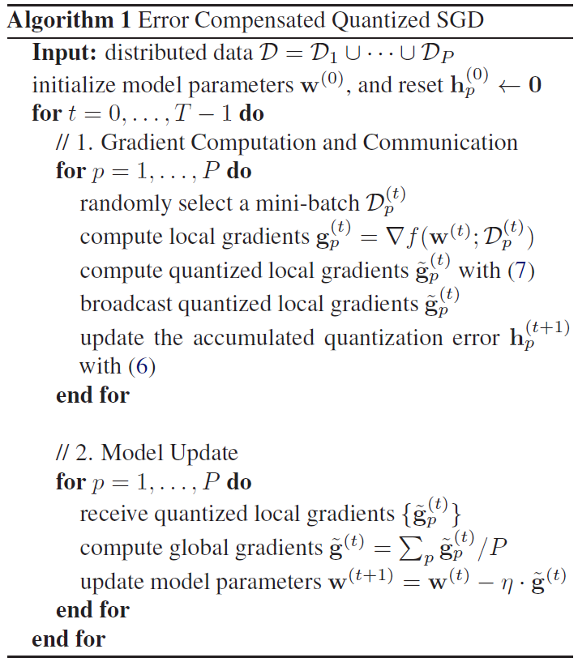
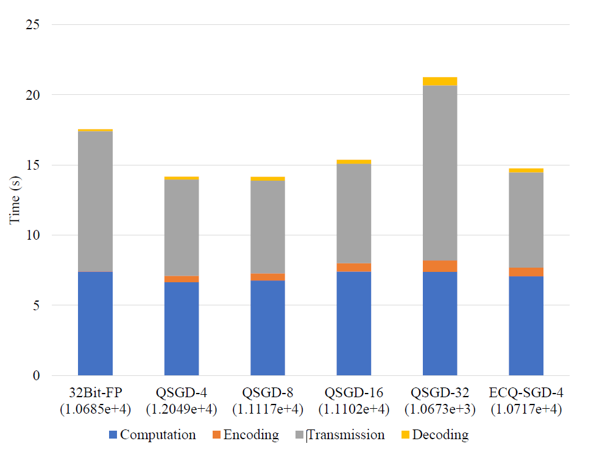
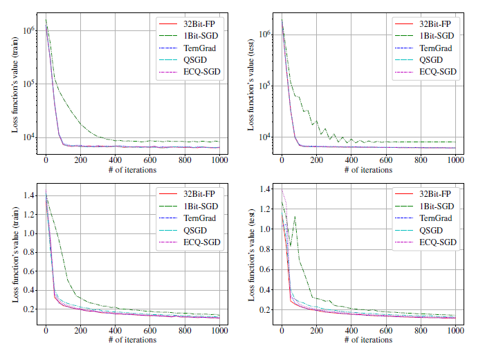
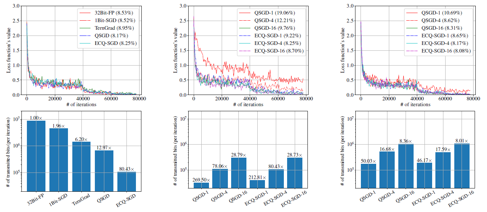
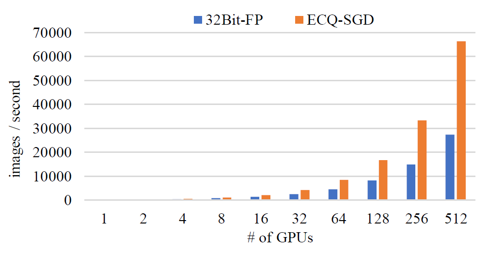

## 摘要

本文提出了一种错误补偿的随机梯度量化方法来提高训练效率。量化本地梯度来减小通信负担，但是累积的量化误差会影响收敛的速度。此外，本文对收敛行为进行了理论分析，并证明了其相对于其他算法的优势。实验表明该算法能够再不降级影响收敛性能的情况下，将梯度压缩两个数量级。

## 介绍

一些方法注重将梯度量化为固定值，这样可以用更少的bits来进行通信传输（Zhou et al 2016[1](\#refer-anchor-1)）；还有更加激进的方法，比如二进制或者三元组的表达（Seide et al., 2014[2](\#refer-anchor-2);Strom, 2015[3](\#refer-anchor-3); Wen et al., 2017[4](\#refer-anchor-4)）；其他方法是在通信的过程中进行稀疏化，其中，每次迭代只有梯度的一小部分在节点之间通信传输（Wangni et al., 2017[5](\#refer-anchor-5); Lin et al., 2018[6](\#refer-anchor-6)）

本文提出了误差补偿随机梯度量化方法，称为EC-SGD。该算法和$1Bits$算法[2](\#refer-anchor-2)不太相同，它将之前量化的所有梯度误差都考虑在内，并不只是使用最新一轮的量化误差。

在（Alistarh et al., 2017[8](\#refer-anchor-8)）中，作者证明了所提出的QSGD算法达到某次最优间隙所需的迭代次数与随机量化梯度的方差界成正比。然而这不能够解释我们方法的收敛行为，因为我们量化梯度是有偏估计，并不像QSGD那样。事实上，量化梯度的方差边界比在QSGD当中的更大，因为量化误差的累计会更大。为了解决这个问题，我们从另一个角度给出了收敛性分析，并且证明了我们的算法比QSGD算法有着更加严格的最坏情况的错误边界。结果表明，我们提出的误差反馈方案可以很好地抑制量化误差对误差界的影响，我们在实验中观察到，与QSGD相比，次最优性间隙更小。

## 相关工作

### 异步SGD

Hogwild!（Recht et al. 2011）（其他工作相对来说时间比较久远，这里就不罗列了）

### 梯度量化

（Seide et al., 2014[2](\#refer-anchor-2)）$1Bit-SGD$用于对梯度的量化，将$0$作为阈值，量化为$1$或者$-1$。在量化过程中引入上一轮的量化误差作为反馈。相似的想法在（Strom, 2015[3](\#refer-anchor-3)）中被采纳，它通过迭代累计局部梯度并且仅传输超过预先选择的阈值的梯度分量。（Wen et al., 2017[4](\#refer-anchor-4)）扩展了这一想法，并且将梯度压缩至了三元组来保证其无偏性。QSGD（Alistarh et al., 2017[8](\#refer-anchor-8)）采用均匀分布的方式随机量化梯度，更加细致地分析其收敛性。ZipML（Zhang et al., 2017[8](\#refer-anchor-8)）介绍了一种优化的量化策略，在分布式状态下动态选择量化节点。（Zhou et al 2016[1](\#refer-anchor-1)）提出了DoReFa-Net来训练卷积神经网络，将输入、权重和梯度都进行定点的量化。

### 梯度稀疏化

梯度丢弃方法是由（Aji & Heafield, 2017[10](\#refer-anchor-10)）将稀疏化方法引入到梯度当中，来减小通信误差。在（Wangni et al., 2017[11](\#refer-anchor-11)）将梯度量化抽象成了线性规划问题，目的就是最小化量化梯度的方差增长。（Lin et al., 2018[6](\#refer-anchor-6)）提出了深度梯度压缩算法，利用动量校正，梯度剪裁，动量因子掩饰，热身训练，以实现更高的稀疏性而不失去准确性。

## Preliminaries

（比较容易理解，暂时不翻译）

## 误差压缩量化SGD方法

在每一轮迭代，之前每一轮的累计的量化误差都会对当前本地梯度进行补偿，再通过随机量化函数进行压缩。

令$Q: \mathbb{R}^{d} \rightarrow \mathcal{C}^{d}$是一个无偏的随机量化函数，它将每部分的$d$个维度向量映射到量化密码本$\mathcal{C}$中。密码本通常只包含有限数量的元素，因此量化向量能够高效的编码。在每次迭代中，每个节点在广播之前量化他们的本地梯度：
$$
\tilde{\mathbf{g}}_{p}^{(t)}=Q\left(\mathbf{g}_{p}^{(t)}\right)
$$
其中$\mathbf{g}_{p}^{(t)}$是第$p$个节点和第$t$次迭代的本地梯度，$\tilde{\mathbf{g}}_{p}^{(t)}$表示他的量化产物。

当节点接收到所有从其他节点发送过来的本地梯度之后，它将计算全局梯度以及更新它本地的模型，采用以下式子：
$$
\mathbf{w}^{(t+1)}=\mathbf{w}^{(t)}-\eta \cdot \tilde{\mathbf{g}}^{(t)}=\mathbf{w}^{(t)}-\frac{\eta}{P} \sum_{p=1}^{P} \tilde{\mathbf{g}}_{p}^{(t)}
$$

其中$\eta>0$表示学习率。

ECQ-SGD的核心思想是当量化本地梯度时，当前梯度和之前累加的量化误差都会考虑在内。特别的，我们使用$\mathbf{h}_{p}^{(t)}$代表第$p$个节点的第$t$次迭代的累计量化误差：
$$
\mathbf{h}_{p}^{(t)}=\sum_{t^{\prime}=0}^{t-1} \beta^{t-1-t^{\prime}}\left(\mathbf{g}_{p}^{\left(t^{\prime}\right)}-\tilde{\mathbf{g}}_{p}^{\left(t^{\prime}\right)}\right)
$$
其中$\beta$是时间减弱因子。注意到累计量化误差的更新式如下：
$$
\mathbf{h}_{p}^{(t)}=\beta \mathbf{h}_{p}^{(t-1)}+\left(\mathbf{g}_{p}^{(t-1)}-\tilde{\mathbf{g}}_{p}^{(t-1)}\right)
$$
其中$\mathbf{h}_{p}^{(0)}=\mathbf{0}$。量化本地梯度将会通过量化函数计算出误差补偿梯度：
$$
\tilde{\mathbf{g}}_{p}^{(t)}=Q\left(\mathbf{g}_{p}^{(t)}+\alpha \mathbf{h}_{p}^{(t)}\right)
$$
其中$\alpha$代表补偿系数。

这里我们采用服从均匀分布的随机量化函数，类似于QSGD算法（Alistarh et al., 2017[8](\#refer-anchor-8)），其中第$i$个维度将会量化为：
$$
\tilde{g}_{i}=\|\mathbf{g}\| \cdot \operatorname{sgn}\left(g_{i}\right) \cdot \xi\left(\left|g_{i}\right| ;\|\mathbf{g}\|\right)
$$
其中$\|\mathbf{g}\| $表示扩展因子（可以选择$l_2$或者$l_{\infty}$这两种方式），$\xi(\cdot)$是随机函数，是映射到如下元素中$\left\{0, \frac{1}{s}, \ldots, 1\right\}$：
$$
\xi\left(\left|g_{i}\right| ;\|\mathbf{g}\|\right)=\left\{\begin{array}{ll}
\frac{l}{s}, & \text { with probability } l+1-s \cdot \frac{\left|g_{i}\right|}{\|\mathbf{g}\|} \\
\frac{l+1}{s}, & \text { otherwise }
\end{array}\right.
$$
其中$\left|g_{i}\right| /\|\mathbf{g}\|$是落在$\left[\frac{l}{s}, \frac{l+1}{s}\right)$范围之内。超参数$s$表示非零量化等级：更大的$s$会导致更加细粒度的量化，同时导致更多的通信消耗。我们采用$Q_{s}(\cdot)$代表量化函数，$s$表示非零量化等级。

在量化之后，我们只需要使用$r=\left\lceil\log _{2}(2 s+1)\right\rceil$bits来编码每个梯度$\tilde{g}_{i}$，一个完整的精度表示扩展因子$ \|\mathbf{g}\|$。全部的通信需要花费$32+d$bits（$r \ll 32$）,原始的梯度需要每个维度32-bit的全精度来表示。更加有效的编码模式，例如Huffman编码，能够进一步地减小通信量。令$d_k$表示分配各$k$个量化级别的维数，之后整个编码长度最多只需要$\sum_{k=1}^{2 s+1} d_{k} \log _{2} \frac{d}{d_{k}}$个bits。

算法1概括了上述的整个过程：

## 理论分析

（暂时省略）

## 实验分析

### 线性模型

使用三个人造数据集：Syn-256、Syn-512和Syn-1024。每个数据集包含10k个训练样本，后缀表示特征维度$d$。训练样本通过$y_{i}=\mathbf{w}^{* T} \mathbf{x}_{i}+\epsilon_{i}$生成，其中$\mathbf{w}^{*} \in \mathbb{R}^{d}$是我们希望获得的潜在模型参数，$\left\{\epsilon_{i}\right\}$是服从独立同分布的随机噪声。学习率是0.02，QSGD和ECQ-SGD都采用$l_2$作为扩展因子，采用$4$作为量化等级。

下图我们比较了损失函数值（上方）和距离最优解的距离（下方）。对于这三个数据集，ECQ-SGD损失函数的收敛性更加接近于$32-bit$全精度的SGD算法，比$QSGD$的训练速度明显更快。另一方面，QSGD(或ECQ-SGD)与32Bit-FP在最优解距离上的差距度量了量化误差对(21)中定义的误差界的贡献。ECQ-SGD的距离差明显小于QSGD，说明量化误差对误差界的贡献得到了很好的抑制。

下面我们比较了在大数据集上，QSGD和ECQ-SGD运行时训练速率，Syn-20k，它包括了50k训练样本和20k维度的特征。在图三中，我们多维度展示了在1k轮迭代之后各种方法的时间消耗和测试误差。我们发现ECQ-SGD达到和32Bit-FP相似的测试误差，比32Bit-FP和QSGD所用的时间更短。虽然ECQ-SGD需要额外的编码好解码时间，由于通信量的降低，整个训练速度依然得到了提高：

其次，本文还对两个公开的数据集`YearPredictionMSD`（回归）和`gisette`分类。在不同的量化方法下对这两个数据集的逻辑回归和线性回归做了测评：

### 卷积神经网络

本文还在卷积神经网络上做了测试。CIFAR-10和ResNet-20模型，采用不同的量化方法，结果如图所示：

在第一列中，比较了各种方法的整体通信负担和损失函数值的情况。与32位全精度基准方法相比，每个模型的超参数被分离，以达到可以忽略的精度损失。我们发现所有的方法都以相似的速度收敛，但ECQ-SGD在通信成本上降低了80倍以上，并且显著优于其他梯度量化方法。

在第二列和第三列中，我们比较了它和QSGD的细节，因为它和我们的方法最为相关。我们采用了不同的扩展因子：第二列是$l_2$，第三列是$l_{\infty}$。我们发现我们观察到，ECQ-SGD在收敛速度和分类精度方面始终优于QSGD，而在相同的超参数设置下，这两种方法在降低通信成本方面是相似的。

### 性能模型

我们采用（Yan et al., 2015）提出的性能评估模型对ECQ-SGD算法进行评估。对计算量和通信时间进行轻量级分析，以估计较大集群的学习效率。主要硬件规格如下:Intel Xeon E5-2680 CPU, Nvidia Tesla P40 GPU(每个节点8个单元)，Mellanox ConnectX-3 Pro网卡(40Gb/s连通性)。

下图中，我们展示了采用ResNet-50模型训练ILSVRC-12数据集。训练512个GPU，ECQ-SGD先比于普通的SGD达到了143.5%的加速比。

## 结论

为了提高大规模分布式优化的学习效率，本文提出了误差补偿量化SGD算法。通过引入误差反馈机制，ECQ-SGD算法可以有效地抑制量化误差对误差界的贡献。我们从理论的角度分析了它的收敛行为，并证明了它比最先进的QSGD算法的优势。在线性模型和非凸卷积神经网络上的实验证明了该算法的有效性。

## 部分参考文献

- [1] [Zhou S, Wu Y, Ni Z, et al. Dorefa-net: Training low bitwidth convolutional neural networks with low bitwidth gradients[J]. arXiv preprint arXiv:1606.06160, 2016.](https://arxiv.org/pdf/1606.06160)

- [2] [Seide F, Fu H, Droppo J, et al. 1-bit stochastic gradient descent and its application to data-parallel distributed training of speech dnns[C]//Fifteenth Annual Conference of the International Speech Communication Association. 2014.](https://www.microsoft.com/en-us/research/wp-content/uploads/2016/02/IS140694.pdf)

- [3] [Strom N. Scalable distributed DNN training using commodity GPU cloud computing[C]//Sixteenth Annual Conference of the International Speech Communication Association. 2015.](https://www.isca-speech.org/archive/interspeech_2015/papers/i15_1488.pdf)

- [4] [Wen W, Xu C, Yan F, et al. Terngrad: Ternary gradients to reduce communication in distributed deep learning[C]//Advances in neural information processing systems. 2017: 1509-1519.](http://papers.nips.cc/paper/6749-terngrad-ternary-gradients-to-reduce-communication-in-distributed-deep-learning.pdf)

- [5] [Wangni J, Wang J, Liu J, et al. Gradient sparsification for communication-efficient distributed optimization[C]//Advances in Neural Information Processing Systems. 2018: 1299-1309.](http://papers.nips.cc/paper/7405-gradient-sparsification-for-communication-efficient-distributed-optimization.pdf)

- [6] [Lin Y, Han S, Mao H, et al. Deep gradient compression: Reducing the communication bandwidth for distributed training[J]. arXiv preprint arXiv:1712.01887, 2017.](https://arxiv.org/pdf/1712.01887)

- [7] [Recht B, Re C, Wright S, et al. Hogwild: A lock-free approach to parallelizing stochastic gradient descent[C]//Advances in neural information processing systems. 2011: 693-701.](http://papers.nips.cc/paper/4390-hogwild-a-lock-free-approach-to-parallelizing-stochastic-gradient-descent.pdf)

- [8] [Alistarh D, Grubic D, Li J, et al. QSGD: Communication-efficient SGD via gradient quantization and encoding[C]//Advances in Neural Information Processing Systems. 2017: 1709-1720.](http://papers.nips.cc/paper/6768-qsgd-communication-efficient-sgd-via-gradient-quantization-and-encoding.pdf)

- [9] [Zhang H, Li J, Kara K, et al. ZipML: Training linear models with end-to-end low precision, and a little bit of deep learning[C]//International Conference on Machine Learning. 2017: 4035-4043.](http://proceedings.mlr.press/v70/zhang17e.html)

- [10] [Aji A F, Heafield K. Sparse communication for distributed gradient descent[J]. arXiv preprint arXiv:1704.05021, 2017.](https://arxiv.org/pdf/1704.05021)

- [11] [Wangni J, Wang J, Liu J, et al. Gradient sparsification for communication-efficient distributed optimization[C]//Advances in Neural Information Processing Systems. 2018: 1299-1309.](http://papers.nips.cc/paper/7405-gradient-sparsification-for-communication-efficient-distributed-optimization.pdf)

