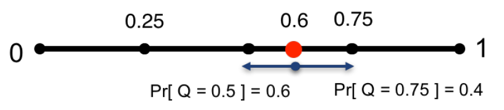

## 摘要

本文提出了量化SGD（QSGD）方法，可以帮助使用者平滑地权衡通信带宽和收敛时间：在方差成本可能较高的情况下，节点可以调节每轮迭代发送的比特数。本文证明了这种权衡是内在的，某种意义上，提高它超过某个阈值将违反信息理论的下界。QSGD保证了在凸和非凸目标函数上的收敛性，在异步条件下，能够使用随机方差减小的方法进行拓展。

## 简介

比较流行的减少通信量通常采用有损压缩的方法[1](\#refer-anchor-1)[2](\#refer-anchor-2)[3](\#refer-anchor-3)。一种方式是简单地降低表示精度，在凸和稀疏的条件下证明了收敛性[4](\#refer-anchor-4)。$1BitSGD$量化方法为梯度的量化压缩奠定了基础。

### 本文贡献

本文重点关注数据并行SGD算法的通信开销和收敛速率保证。我们提出有损的梯度压缩方法：QSGD算法，它可以在每一次迭代中在通信量和方差之间做平衡。

QSGD建立在两种算法思想上。第一种是直观的随机量化模式：在某进程中给出一个梯度向量，我们通过四舍五入到一组离散的值来量化每个部分，有原则地保持原始数据的统计性质。第二种是量化梯度的有效无损代码，利用他们的统计属性来生成有效的编码。我们分析给出了QSGD引起的精度-方差权衡的严格界限。

QSGD非常普遍，在假设条件下，对于非凸目标和异步迭代，能够收敛到局部最小。在非平凡扩展的情况下，我们创新了一种随机方差减小的QSGD算法，称为QSVRG，它具有指数级的收敛速率。

一个关键的问题是QSGD的压缩方差平衡是否是固有的：例如，任何算法保证最多恒定方差放大每次迭代需要传输$\Omega(n)$bits。回答是肯定的：在此基础上的渐近改进将打破分布式平均估计的通信复杂度下限（不是很懂这块内容）。

与1BitSGD相比，QSGD具有渐近高压缩性能，在标准假设下可证明收敛性，在某些情况下具有较好的实际性能。

## Preliminaries

（暂时省略）

## 量化随机梯度下降（QSGD）

### 一般性的随机量化和编码

#### 随机量化

我们现在思考随机梯度向量一般参数有损压缩方案。压缩函数用$Q_s(v)$表示，其中$s \geq 1$调节参数，代表我们所要实现的量化的程度。直观上来看，我们定义$s$服从$0-1$的均匀分布，每个值都以一种保持预期值并引入最小方差的方式进行量化，例如下图：

上图是5级的广义随机量化的示例

对于任意的$\boldsymbol{v} \in \mathbb{R}^{n} \text { with } \boldsymbol{v} \neq \mathbf{0})$，$Q_{s}(\boldsymbol{v})$定义如下：
$$
Q_{s}\left(v_{i}\right)=\|\boldsymbol{v}\|_{2} \cdot \operatorname{sgn}\left(v_{i}\right) \cdot \xi_{i}(\boldsymbol{v}, s)
$$
其中$\xi_{i}(\boldsymbol{v}, s)$是一个独立随机变量，定义如下。令$0 \leq \ell<s$是一个整数，例如$\left|v_{i}\right| /\|\boldsymbol{v}\|_{2} \in[\ell / s,(\ell+1) / s]$。$[\ell / s,(\ell+1) / s]$是与$\left|v_{i}\right| /\|\boldsymbol{v}\|_{2} $相符的量化间隔。定义：
$$
\xi_{i}(\boldsymbol{v}, s)=\left\{\begin{array}{ll}
\ell / s & \text { 以如下概率 } 1-p\left(\frac{\left|v_{i}\right|}{\|\boldsymbol{v}\|_{2}}, s\right) \\
(\ell+1) / s & \text { 其他情况. }
\end{array}\right.
$$
这里$p(a, s)=a s-\ell$对于任何的$a \in[0,1]$。如果$v=0$，我们定义$Q(v,s)=0$。

$\xi_{i}(\boldsymbol{v}, s)$的分布具有最小的方差，它的期望满足$\mathbb{E}\left[\xi_{i}(\boldsymbol{v}, s)\right]=\left|v_{i}\right| /\|\boldsymbol{v}\|_{2}$。我们可以证明如下：

**引理** 对于任意$\boldsymbol{v} \in \mathbb{R}^{n}$，我们有（1）$\mathbb{E}\left[Q_{s}(\boldsymbol{v})\right]=\boldsymbol{v} \text { (无偏) }$；（2）$\mathbb{E}\left[\left\|Q_{s}(\boldsymbol{v})-\boldsymbol{v}\right\|_{2}^{2}\right] \leq \min \left(n / s^{2}, \sqrt{n} / s\right)\|\boldsymbol{v}\|_{2}^{2}$（方差最小边界）；（3）$\mathbb{E}\left[\left\|Q_{s}(\boldsymbol{v})\right\|_{0}\right] \leq s(s+\sqrt{n})$稀疏性

#### 梯度的高效编码

对于任意的向量$v$，输出$Q_s(v)$可以表达为三元组$\left(\|v\|_{2}, \sigma, \zeta\right)$，其中$\sigma$是向量中$v_i$的符号，$\zeta$是整数$s \cdot \xi_{i}(\boldsymbol{v}, s)$的向量。我们可以发现，大的整数出现的频率很低。我们将通过专门的`Eilias`整数编码来利用这一点。

直觉上，对于任何正整数$k$，他的编码用$Elias(k)$表示$k$的二进制，并且在它的前面加上长度表示。然后递归地编码这个前缀。我们发现对于任何整数$k$，结果编码的长度为$\operatorname{Elias}(k) \mid=\log k+\log \log k+\ldots+1 \leq(1+o(1)) \log k+1$。编码和解码过程非常高效。

给定的梯度向量可以表示为三元组$\left(\|\boldsymbol{v}\|_{2}, \boldsymbol{\sigma}, \boldsymbol{\zeta}\right)$，具有$s$压缩等级，我们的编码输出为字符串$S$，定义如下：第一使用$32bits$编码$\|\boldsymbol{v}\|_{2}$。它继续使用$Elias$递归编码读第一个非零项$\boldsymbol{\zeta}$的位置进行编码。接下来附加一个bit代表$\boldsymbol{\sigma}_i$，遵循$s \cdot \xi_{i}(\boldsymbol{v}, s)$。迭代进行，它继续从当前的写入坐标到下一个非零的距离，并以同样的方式对坐标的$\boldsymbol{\sigma}_i$和$\boldsymbol{\zeta}_i$进行编码。解码方案很简单：我们首先读取$32bits$来构建$\|\boldsymbol{v}\|_{2}$，接下来，迭代使用$Elias$递归编码的译码方案读取非零项$\boldsymbol{\zeta}$和$\boldsymbol{\sigma}$的位置和值。

- [1] [Dean J, Corrado G, Monga R, et al. Large scale distributed deep networks[C]//Advances in neural information processing systems. 2012: 1223-1231.](http://papers.nips.cc/paper/4687-large-scale-distributed-deep-networks.pdf)

- [2] [Abadi M, Agarwal A, Barham P, et al. Tensorflow: Large-scale machine learning on heterogeneous distributed systems[J]. arXiv preprint arXiv:1603.04467, 2016.](https://arxiv.org/pdf/1603.04467.pdf)

- [3] [Wen W, Xu C, Yan F, et al. Terngrad: Ternary gradients to reduce communication in distributed deep learning[C]//Advances in neural information processing systems. 2017: 1509-1519.](http://papers.nips.cc/paper/6749-terngrad-ternary-gradients-to-reduce-communication-in-distributed-deep-learning.pdf)

- [4] [De Sa C M, Zhang C, Olukotun K, et al. Taming the wild: A unified analysis of hogwild-style algorithms[C]//Advances in neural information processing systems. 2015: 2674-2682.](http://papers.nips.cc/paper/5717-taming-the-wild-a-unified-analysis-of-hogwild-style-algorithms.pdf)

