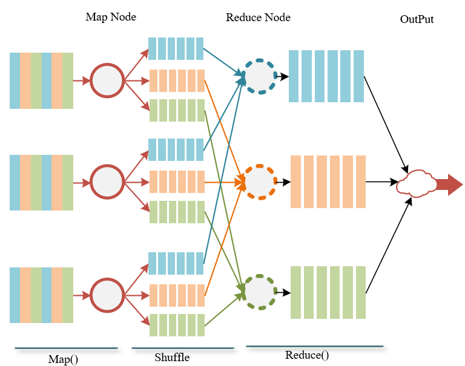
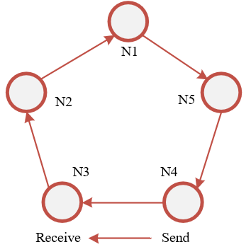
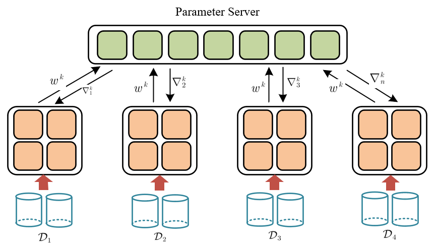
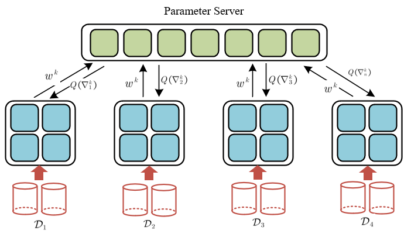

# 摘要

随着物联网技术和边缘计算的发展，人工智能的应用场景不断朝着去中心化、边缘化和异构化的方向发展，使得分布式机器学习的设计需要适应异构环境，满足边缘移动环境设备性能较弱，网络通信较差的情况[[1]](\#refer-anchor-1)[[2]](\#refer-anchor-2)[[3]](\#refer-anchor-3)。因此越来越多的研究开始对分布式学习以及联邦学习的通信进行优化，其优化方向主要可以分为以下三方面：（1）优化分布式拓扑结构和通信步调；（2）减少通信带宽消耗（3）减少通信次数。
		本文将主要针对第二个方向：从减少通信带宽消耗角度，对现有研究中通信量化和稀疏化的相关技术做了梳理，总结各类方法在研究和实际应用过程中所遇到的机遇和挑战。

# 第一章：背景介绍

## 1.1 分布式学习

随着机器学习和深度学习模型复杂程度和规模的扩大，单一部件和单一节点以无法满足机器学习算法的最低要求，我们以分布式环境下，最简单的最优化损失函数为例[[4]](\#refer-anchor-4)：
$$
\min_w\frac{1}{n}\sum_{i=1}^n{\mathbb{E}_{\boldsymbol{\zeta }\sim \mathcal{D}_i}F_i}\left( w;\boldsymbol{\zeta } \right) \
$$
其中，$F\left( \cdot \right) $是以$w$作为模型参数的损失函数，$n$为节点数量，$i$是节点的索引，$\mathcal{D}_i$是本地节点$i$的数据分布。以大规模的深度神经网络为例，学习过程可能会遇到如下问题：（1）$\mathcal{D}$数据量过大，单一节点无法存储，因此$\mathcal{D}_i$的分布式存储是解决方式之一；（2）$w$过于复杂，模型无法在单一节点进行存储，因此需要对模型进行划分，可以采用模型并行的方式进行分布式训练；（3）训练过程中速度较慢，单节点训练复杂模型可能需要几周的时间，因此也需要集合多节点的算力资源，实现算法的并行化。

机器学习模型的分布式训练各个节点之间需要进行通讯，通信的拓扑结构会对训练的精度和性能会产生非常大的影响，目前主流拓扑结构主要分为：MapReduce[[5]](\#refer-anchor-5)[[6]](\#refer-anchor-6)[[7]](\#refer-anchor-7)（例如Hadoop[[8]](\#refer-anchor-8)）、AllReduce、参数服务器[[9]](\#refer-anchor-)[[10]](\#refer-anchor-10)[[11]](\#refer-anchor-11)[[12]](\#refer-anchor-12)、数据流以及去中心化[[13]](\#refer-anchor-13)[[14]](\#refer-anchor-14)架构等，下文将对这几种拓扑模型做简单介绍。

### 1.1.1 MapReduce

MapReduce是较为传统的大数据并行计算方法，下图是MapReduce框架下分布式机器学习的计算流程，其操作主要可以抽象称为三个部分：（1）Map操作，Map节点主要完成数据的分发拆解和并行计算；（2）Shuffle操作完成分类过程；（3）Reduce节点完成左中数据的全局同步和聚合操作。MapReduce支持大规模的数据并行计算，在机器学习领域是较为经典的同步并行框架。受限于其同步的通信拓扑结构，MapReduce方法无法进行异步的分布式训练。

在实际研究和应用中，Spark MLlib[[15]](\#refer-anchor-15)、SystemML[[16]](\#refer-anchor-16)以及REEF[[17]](\#refer-anchor-17)等机器学习框架都是基于MapReduce架构的同步并行框架。

### 1.1.2 AllReduce

MPI消息通信接口是高性能计算领域最为主流的框架，机器学习中梯度、模型的聚合方法可以采用Reduce的各类操作进行，因此AllReduce也可以较为方便的实现分布式学习。AllReduce具有统一的标准接口，具有多种拓扑的拓展形式，例如：星型拓扑、去中心化拓扑和树形结构等。由于其结构的差别，通信方式和通信量大小也不尽相同。

下图以简单的Ring-AllReduce拓扑结构为例，每一个节点都可以和下一个相邻节点进行通信，形成环状。这是一种去中心化的拓扑结构，没有中心节点对梯度进行聚合，每个工作节点完成自身训练后，将计算完成的梯度传递给下一个相邻节点，同时接受上一个相邻节点的梯度。

由于通信的限制，该拓扑结构的最大缺陷是可扩展性较差，通信量和通信时间会随着节点数量的增加而呈线性增长。

百度的DeepSpeech正是采用了上述环形AllReduce进行实现，其他还包括Caffe2的gloo通信和Nvidia的NCCL也支持AllReduce。

对于去中心化的架构而言，又可以从拓扑结构是否固定，分成固定拓扑[Jin et al., 2016] [[51]](\#refer-anchor-51)， [Lain et al., 2017] [[52]](\#refer-anchor-52)，[Shen et al., 2018] [[53]](\#refer-anchor-53)以及[Tang et al., 2018] [[54]](\#refer-anchor-54)和会实时变化的随机拓扑[Lian et al, 2018] [[55]](\#refer-anchor-55)，[Nedic et al., 2014] [[56]](\#refer-anchor-56)以及[Nedic et al., 2017] [[57]](\#refer-anchor-57)

### 1.1.3 参数服务器架构

由于MapReduce和AllReduce框架都只支持同步并行算法，如果伴随性能异构节点的不断增加，同步并行的方式只取决于系统中计算速率最慢的节点，严重影响分布式系统的可扩展性。在容错性方面，如果系统中存在节点硬盘故障或者网络通信问题，导致节点无法响应，整个系统将无法正常工作，因此，同步并行的方式存在一定弊端。

[Li M et al., 2014] [[9]](\#refer-anchor-)[[10]](\#refer-anchor-10)提出了参数服务器架构模式，分布式系统在逻辑上分成Master参数服务器和Worker工作节点，各工作节点训练本地任务，且相互之间不通信，训练完成后将结果上传至参数服务器聚合，参数服务器将聚合结果再广播至各工作节点完成一轮迭代。参数服务器可以是一个或多个服务器组成。

## 1.2 通信优化

### 1.2.1 步调优化

### 1.2.2 量化压缩

### 1.2.3 稀疏化方法

# 第二章：通信压缩方法

在参数服务器架构中，参数服务器和工作节点之间需要进行频繁通信，但是在带宽受限的边缘环境中，无法负担深度神经网络训练过程中庞大的梯度和带宽通信和传输，因此[Seide et al., 2014]   [[41]](\#refer-anchor-41)首次将量化的概念引入分布式机器学习当中，该研究采用AllReduce的拓扑结构。但其思想和方法对于参数服务器架构依然适用。

现在考虑以下最优化问题：
$$
\min_{\boldsymbol{\theta }\in \mathbb{R}^d}\mathcal{L}\left( \boldsymbol{\theta } \right)
$$
其中
$$
\mathcal{L}\left( \boldsymbol{\theta } \right) :=\sum_{m\in \mathcal{M}}{\mathcal{L}_m}\left( \boldsymbol{\theta } \right)
$$
上式中$\theta \in \mathbb{R}^{d}$为需要通过学习得到的参数向量，$\mathcal{L}$和$\left\{\mathcal{L}_{m}, m \in \mathcal{M}\right\}$是损$\mathcal{M}:=\{1, \ldots, M\}$个工作节点上对应的损失函数。

以参数服务器下SGD数据并行算法的第$k$轮迭代为例：（1）每个工作节点本地采样得到数据集$\mathcal{D}_i$计算本地损失函数梯度，将第$m$个节点计算所得梯度记为$\nabla \mathcal{L}_{m}\left(\boldsymbol{\theta}^{k}\right)$；（2）当所有工作节点计算完成后，需要将所有本地计算所得梯度$\nabla \mathcal{L}_{m}\left(\boldsymbol{\theta}^{k}\right)$上传参数服务器，通过梯度聚合算法计算得到全局聚合梯度$\nabla_{\mathrm{GD}}^{k}$。在此过程中会涉及到$m$次通信，通信内容为局部梯度$\nabla_{m}^{k}$，假设梯度总共有$p$维，每个维度通常采用$32$位浮点数表示，此次通信量为$\sum_{m\in \mathcal{M}}{\nabla _{m}^{k}}:=32mp$bits。（3）参数服务器接收来自工作节点梯度后，将其聚合，获得全局梯度$\nabla_{\mathrm{GD}}^{k}:=\sum_{m \in \mathcal{M}} \nabla \mathcal{L}_{m}\left(\theta^{k}\right)$；（4）参数服务器将全局梯度或更新后模型（取决于聚合策略）重新发送给工作节点。此过程会涉及到模型权重参数的通信，假设模型大小为$B(\theta)$bits，对于$m$个工作节点，通信量为$mB(\theta)$bits。最后当工作节点接收到模型权重后，从头开始新一轮迭代。

从上述过程我们不难发现，第$k$轮迭代所需要的通信量记为$Com_k:=(\sum_{m\in \mathcal{M}}{\nabla _{m}^{k}}+mB(\theta))$bits，如果最终迭代$I$轮，总共的通信量为：
$$
\sum_{k=1}^I{Com_k}=\sum_{k=1}^I{\left( \sum_{m\in \mathcal{M}}{\nabla _{m}^{k}}+mB\left( \theta \right) \right)}
$$
它会随着模型、迭代次数和工作节点数量的增加而呈现线性增长。为了适应边缘环境下通信带宽的问题，我们可以采用量化压缩或稀疏化的方式，对模型权重、激活层输出和梯度进行量化压缩或者稀疏化操作，记为：$Q(\cdot )$，目的是为了使得$Q\left( Com \right) \ll Com$。

到目前为止，大量学者对$Q(\cdot )$方法做了非常多的研究，大致可以分成量化和稀疏化两类：（1）量化主要通过压缩和编码的方式降低梯度和权重精度，改变其存储和表示方法；而稀疏化的方式则是将矩阵的部分维度置为$0$，从而降低整个矩阵向量的存储大小，下文将对这两种方式的研究做详细介绍。

## 2.1 量化压缩

目前，很多技术研究量化分布式学习通信相关内容。粗略地来看可以分成确定性量化（Deterministic quantization）和随机量化（Stochastic Quantization）。确定量化是指在量化值和真实值之间有一一对应的映射，相反随机量化则是采用离散分布的形式[[18]](\#refer-anchor-18)，量化值是从离散分布中采样得到的。

在神经网络中，可以从三方面对算法进行量化：权重（weight）、激活（activation）以及梯度（gradient）。量化这些部分的动机和方法是不同的。量化权重和激活层，是为了在不影响准确率的情况下得到更小的模型尺寸，这样的量化方式和分布式学习的关系并不密切。二在分布式训练的环境中，我们通常采用量化梯度的方式节省通信消耗。一般来说，量化梯度比量化权重和激活更加困难，因为训练模型往往需要精度更高的梯度来保证算法的收敛。

在量化研究中，编码本（codebook）常常用于表示代表真实值的离散表示。从密码本的表达方式来看，可以将现有的量化研究工作粗略的分成两类：固定编码本量化（fixed codebook quantization）和自适应编码本量化（adaptive codebook quantization）。

在固定编码本量化中，权重经常被量化成提前定义好的编码。一些普遍应用的密码本包括$\{-1,1\}$，$\{-1,0,1\}$或者二数幂或者二进制网络和三元权重网络等。

量化模型的训练过程需要不断调整，而且量化网络并不容易理解，因此寻找新的量化方法以及配合理论分析是量化神经网络非常重要的，本文主要介绍和分布式学习相关的量化方法，因此不会对模型量化的内容进行介绍。

### 2.1.1 确定性量化

#### 舍入法（Rounding）

##### 主要内容

舍入法是对真实值最为简单的量化方式，例如[Courbariaux et al., 2015] [[19]](\#refer-anchor-19)提出了如下的舍入方法：
$$
Q_b(x)=\operatorname{Sign}(x)=\left\{\begin{array}{ll}
+1 & x \geq 0 \\
-1 & \text { otherwise }
\end{array}\right.
$$
其中$Q_b(x)$表示二进制向量，$x$为真实值，该方法可以在量化权重和梯度中使用。但是在反向传播过程中，由于$\operatorname{Sign}(x)$是离散值的缘故，会使梯度处处为零。对此[Hinton et al., 2012b] [[20]](\#refer-anchor-20)提出了一种启发式的方法，可以估计随机神经元的梯度，被称为直通估计（straight through estimator, STE）。假设$E$是损失函数，STE的前向传播和反向计算可以看成如下方式：

$$
\begin{array}{l}
\text { Forward: } \quad Q_b(x)=\operatorname{Sign}(x) \\
\text { Backward: } \frac{\partial E}{\partial x}=\frac{\partial E}{\partial Q_b(x)} \mathrm{I}_{|x| \leq 1}
\end{array}
$$
其中$\mathrm{I}_{|x| \leq 1}$是定义如下的指示函数：
$$
\mathrm{I}_{|x| \leq 1}=\left\{\begin{array}{ll}
1 & |x| \leq 1 \\
0 & \text { otherwise }
\end{array}\right.
$$
为了对双精度进行舍入，[Gupta et al., 2015] [[21]](\#refer-anchor-21)作者提出了如下的取整方式：
$$
\operatorname{Round}(x,[\mathrm{IL}, \mathrm{FL}])=\left\{\begin{array}{ll}
\lfloor x\rfloor & \text { if }\lfloor x\rfloor \leq x \leq\lfloor x\rfloor+\frac{\epsilon}{2} \\
\lfloor x\rfloor+\epsilon & \text { if }\lfloor x\rfloor+\frac{\epsilon}{2}<x \leq\lfloor x\rfloor+\epsilon
\end{array}\right.
$$
在固定点表达中，IL代表整数位的个数，FL表示分数位的个数。$\epsilon$表示在固定点表达中能够表达的最小正数。$\lfloor x\rfloor$被定义为$\epsilon$的最大整数倍。对于超出此固定点格式范围的值，作者将它们规范化为固定点表示的下界或上界[Rastegari et al., 2016] [[22]](\#refer-anchor-22)。将上式扩展：
$$
\begin{array}{ll}
\text { Forward: } & Q_b(x)=\operatorname{Sign}(x) \times \mathrm{E}_{F}(|x|) \\
\text { Backward: } & \frac{\partial E}{\partial x}=\frac{\partial E}{\partial Q_b(x)}
\end{array}
$$
其中$\mathrm{E}_{F}(|x|)$表示每个输出通道的权值绝对值的平均值。

近期[Polino et al., 2018] [[23]](\#refer-anchor-23)提出了更加普遍的舍入函数：
$$
Q(x)=s c^{-1}(\hat{Q}(s c(x)))
$$

其中$sc(x)$是将值从任意范围缩放到$[0,1]$的缩放函数。$\hat{Q}(x)$是实际的量化函数。给出量化等级参数$s$，有$s+1$等级的统一量化函数可以定义为：
$$
\hat{Q}(x, s)=\frac{\lfloor x s\rfloor}{s}+\frac{\xi}{s}
$$
其中
$$
\xi=\left\{\begin{array}{ll}
1 & x s-\lfloor x s\rfloor>\frac{1}{2} \\
0 & \text { otherwise }
\end{array}\right.
$$
这个量化函数的直觉是将$x$分配到在$[0,1]$范围内$s-1$个等间隔最接近的量化点。这是符号$Sign(x)$函数的广义版本，能够将实值量化成多层。在[Shuang et al., 2018] [[38]](\#refer-anchor-38)中，作者提出了启发式摄入函数来量化一个市值为$k$位的整数。
$$
Q(x, k)=\operatorname{Clip}\left\{\sigma(k) \cdot \operatorname{round}\left[\frac{x}{\sigma(k)}\right],-1+\sigma(k), 1-\sigma(k)\right\}
$$
想法是将真实值利用统一的距离$\sigma(k)$进行量化，其中$\sigma(k)=2^{1-k}$。$Clip$将量化限制在$[-1+\sigma(k), 1-\sigma(k)]$范围内，$round$用最近的离散点替换连续值。

##### 存在问题

使用舍入函数是将实值转换为量化值的简单方法。然而，每次舍入操作之后，，模型性能可能会急剧下降。在训练过程中需要保持真实值作为参考，这会增加存储开销。

同时，由于使用离散值时参数空间要小得多，训练过程难以收敛。而且，舍入运算不能充分利用网络中权值的结构信息。

### 2.1.2 向量量化（Vector Quantization）

##### 主要内容

[Gong et al., 2014] [[25]](\#refer-anchor-25)是第一篇将向量量化运用于神经网络压缩和量化中的。他主要的思想是将网络权重进行分组聚类，在推理时采用聚类中心代表每个组实际的权重。

例如：对于权重矩阵$W \in R^{m \times n}$，可以将其建模成为`k-means`聚类算法将其进行向量压缩：
$$
\min \sum_{i}^{m} \sum_{j}^{n} \sum_{k}^{l}\left\|w_{i j}-c_{k}\right\|_{2}^{2}
$$
其中$c_k$是质心，完成聚类后，每个权重都指向质心索引。

[Han et al., 2015] [[26]](\#refer-anchor-26)，[Gong et al., 2014] [[27]](\#refer-anchor-27)等沿用聚类的方式，对上述方法进行了改进，[Choi et al., 2016] [[28]](\#refer-anchor-28)指出这种方法有两个缺点，第一是不能够人为控制`k-means`算法造成的损失；第二是`k-means`算法不具有任何压缩比约束。为了解决上述问题，作者提出了一种Hessian加权的`k-means`方法，以防止那些对网络性能有较大影响的权值与原始值偏离过大。

该领域已有很多向量量化的扩展方法，乘积量化[Gong et al., 2014] [[27]](\#refer-anchor-27)是一种将权重矩阵划分为许多不相交的子矩阵，并对每个子矩阵进行量化的方法。在[Wu et al., 2016] [[29]](\#refer-anchor-29)中，作者采用带误差修正的方法对网络参数进行量化，并实现了快速训练和测试。残差量化[Gong et al., 2014] [[27]](\#refer-anchor-27)将向量量化到k个聚类中，然后递归量化残差。在[Park et al., 2017] [[30]](\#refer-anchor-30)中，作者采用了类似于矢量量化的方法。他们采用基于权重熵的方法[Guias¸u, 1971] [[31]](\#refer-anchor-31)来将权重分组到N个簇中，对于重要的权重范围有更多的簇，从而实现了自动灵活的多比特量化。

###### 存在问题

由于网络中权值的数量，k-means聚类的计算量很大。与四舍五入法相比，用向量化方法来实现二值权值比较困难。向量量化通常用于对预先训练的模型进行量化。因此，如果任务是从头训练量化网络，最好使用精心设计的四舍五入函数。向量量化忽略了网络的局部信息。

### 2.1.3 量化最优化

简单来说就是将量化作为最优化问题进行，例如[Rastegari et al., 2016] [[32]](\#refer-anchor-32)，作者将真实值过滤器的量化转化如下优化问题：
$$
J(B, \alpha)=\|W-\alpha B\|^{2}
$$
其中$W$代表真实值过滤器，$B$是二进制过滤器，$\alpha$是一个正扩展因子，最优化$B$和$\alpha$通过下式给出：
$$
B^{*}=\operatorname{Sign}(W), \quad \alpha^{*}=\frac{1}{n}\|W\|_{l_{1}}
$$
$n$表示过滤器中元素数量。

将量化作为最优化问题成果还包括如下研究[Li et al., 2016] [[33]](\#refer-anchor-33)，它改变了约束条件，将二元约束放宽为三元约束；[Zhu et al., 2016] [[34]](\#refer-anchor-34)，[Hou et al., 2016] [[35]](\#refer-anchor-35)，[Carreira-Perpin´an and Idelbayev, 2017] [[36]](\#refer-anchor-36)，[Hou et al., 2016] [[37]](\#refer-anchor-37)也都展开了这方面的研究。

### 2.1.4 随机量化（Stochastic Quantization）

随机量化又可以分为随机舍入和可能性量化，此处我们只针对随机舍入量化方法做简单介绍。

##### 主要内容

随机舍入量化中，真实值和量化值并不是一一对应的关系。最为简单的随机舍入量化方法(Alistarh et al., 2017 [[39]](\#refer-anchor-39); Zhang et al., 2017a [[40]](\#refer-anchor-40))两位学者提出的，对于任意真实值$z \in[a, b]$，其中$(a,b)$是定义好的低bit数值，置$z$会有$\frac{b-z}{b-a}$的概率被压缩到$a$,有$\frac{z-a}{b-a}$的概率压缩到$b$，从中可以看出这种压缩操作是无偏的。

[Alistarh et al., 2017] [[39]](\#refer-anchor-39)提出了一种QSGD方法，可以帮助使用者平滑地权衡通信带宽和收敛时间。压缩函数用$Q_s(v)$表示，其中$s \geq 1$用于调节参数，代表我们所要实现的量化的程度。直观上来看，我们定义$s$服从$0-1$的均匀分布，每个值都以一种保持预期值并引入最小方差的方式进行量化，例如下图：

上图是$s=5$的广义随机量化示例

对于任意的$\boldsymbol{v} \in \mathbb{R}^{n} \text { with } \boldsymbol{v} \neq \mathbf{0})$，$Q_{s}(\boldsymbol{v})$定义如下：
$$
Q_{s}\left(v_{i}\right)=\|\boldsymbol{v}\|_{2} \cdot \operatorname{sgn}\left(v_{i}\right) \cdot \xi_{i}(\boldsymbol{v}, s)
$$
其中$\xi_{i}(\boldsymbol{v}, s)$是一个独立随机变量，定义如下：令$0 \leq \ell<s$是一个整数，例如$\left|v_{i}\right| /\|\boldsymbol{v}\|_{2} \in[\ell / s,(\ell+1) / s]$。$[\ell / s,(\ell+1) / s]$是与$\left|v_{i}\right| /\|\boldsymbol{v}\|_{2} $相符的量化间隔。定义：
$$
\xi_{i}(\boldsymbol{v}, s)=\left\{\begin{array}{ll}
\ell / s & \text { 以如下概率 } 1-p\left(\frac{\left|v_{i}\right|}{\|\boldsymbol{v}\|_{2}}, s\right) \\
(\ell+1) / s & \text { 其他情况. }
\end{array}\right.
$$
这里$p(a, s)=a s-\ell$对于任何的$a \in[0,1]$。如果$v=0$，我们定义$Q(v,s)=0$。

$\xi_{i}(\boldsymbol{v}, s)$的分布具有最小的方差，它的期望满足$\mathbb{E}\left[\xi_{i}(\boldsymbol{v}, s)\right]=\left|v_{i}\right| /\|\boldsymbol{v}\|_{2}$。

##### 存在问题

随机舍入的方法往往会导致量化后的值具有较高的方差，影响收敛的速度。

### 2.1.5 误差补偿量化

错误补偿量化方法是一种较为激进的量化方式，该领域最为经典的量化方法是[Seide et al., 2014]   [[41]](\#refer-anchor-41)提出的1Bits量化方法，其主要思想是将梯度压缩至1bit进行表示，并在每一次量化过程中叠加前一次量化的误差进行补偿，假设$Q_{\omega}[\cdot]$代表压缩操作，以1Bits方法为例，利用递归的方法更新压缩误差：
$$
\boldsymbol{\delta}^{(i)}=\boldsymbol{g}^{(i)}+\boldsymbol{\delta}^{(i)}-Q_{\omega}\left[\boldsymbol{g}^{(i)}+\boldsymbol{\delta}^{(i)}\right]
$$
其中$\left[\boldsymbol{g}^{(i)}+\boldsymbol{\delta}^{(i)}\right]$表示本轮计算得到的梯度$g^{(i)}$和上一轮压缩误差$\boldsymbol{\delta}^{(i)}$的和，上式子是对本轮量化误差的重新计算，这也是误差补偿的由来。

[Seide et al., 2014]  [[41]](\#refer-anchor-41)将该种方式运用于AllReduce框架中，利用实验证明了其有效性。

[Wu et al., 2018]  [[42]](\#refer-anchor-42)通过添加两个超参数来进行误差补偿的计算，研究出了一种用于二次优化的误差补偿SGD算法，通过实验证明了其有效性，但是依然没有成功地从理论上证明该方法的优越性。[Stich et al., 2018]  [[43]](\#refer-anchor-43)提出了误差补偿的梯度压缩方法并且理论证明了误差补偿过程中可以极大降低量化对非并行和强凸损失函数的影响。但是他们的理论结果局限于压缩操作符的期望压缩误差不能够大于原始向量的大小，对此，[Bernstein et al, 2018]  [[45]](\#refer-anchor-45)提出的有偏压缩则不适用。[Alistarh et al., 2018]  [[44]](\#refer-anchor-44)研究了在非凸损失函数下的误差补偿SGD方法。以上所有的这些工作，都没有从理论证明在$n$个工作节点下能够达到线性加速。

[Hanlin Tang et al., 2019] [[47]](\#refer-anchor-47)在误差补偿量化的模式下，针对参数服务器架构的数据并行场景，提出了两倍压缩方法，同时对工作节点上传的梯度和参数服务器广播的梯度进行量化，并且该方法不像当前存在的方法，并不需要无偏压缩的限制（也就是$\mathbb{E}_{\omega} Q_{\omega}[\boldsymbol{x}]=\boldsymbol{x}$）。所以选择压缩的方法是非常灵活的。并对比了随机量化、1bit量化、Clipping、Top-k稀疏化和随机稀疏化，证明了该方法的有效性。

### 2.1.6 其他量化方法

[Dan Alistarh et al., 2017]  [[44]](\#refer-anchor-44)和[Sindri et al., 2019] [[48]](\#refer-anchor-48)提出了多比特量化方法，针对量化过程中的方差问题，[Hantian et al., 2017]  [[40]](\#refer-anchor-40)提出了方差减小的量化方法。[Konstantin et al., 2019]  [[49]](\#refer-anchor-49)针对分布式机器学习领域提出了梯度差的量化方法。[Jun Sun et al., 2019]  [[50]](\#refer-anchor-50)在LAG分布式框架的基础上，利用上一轮得到的量化梯度$Q_{m}\left(\boldsymbol{\theta}^{k-1}\right)$对本轮的$\nabla f_{m}\left(\boldsymbol{\theta}^{k}\right)$进行量化表达，如果$Q$代表量化操作，该过程可以表达为：
$$
Q_{m}\left(\boldsymbol{\theta}^{k}\right)=\mathcal{Q}\left(\nabla f_{m}\left(\boldsymbol{\theta}^{k}\right), Q_{m}\left(\widehat{\boldsymbol{\theta}}_{m}^{k-1}\right)\right)
$$
采用该种方式，通信大小从原来的$32p$bits变为了$(32+bp)bits$，极大减小了通信成本。

# 第三章：稀疏化方法

- [1] [McMahan B, Ramage D. Federated learning: Collaborative machine learning without centralized training data[J]. Google Research Blog, 2017, 3.](https://arxiv.org/abs/1610.05492)

- [2] [Chen T, Shen Y, Ling Q, et al. Online learning for “thing-adaptive” fog computing in IoT[C]//2017 51st Asilomar Conference on Signals, Systems, and Computers. IEEE, 2017: 664-668.]

- [3] [Chen T, Barbarossa S, Wang X, et al. Learning and management for internet of things: Accounting for adaptivity and scalability[J]. Proceedings of the IEEE, 2019, 107(4): 778-796.](https://ieeexplore.ieee.org/abstract/document/8648462/)

- [4] [Tang H, Yu C, Lian X, et al. Doublesqueeze: Parallel stochastic gradient descent with double-pass error-compensated compression[C]//International Conference on Machine Learning. 2019: 6155-6165.](http://proceedings.mlr.press/v97/tang19d.html)

- [5] [Dean J, Ghemawat S. MapReduce: simplified data processing on large clusters[J]. Communications of the ACM, 2008, 51(1): 107-113.](https://dl.acm.org/doi/abs/10.1145/1327452.1327492)

- [6] [Chu C T, Kim S K, Lin Y A, et al. Map-reduce for machine learning on multicore[C]//Advances in neural information processing systems. 2007: 281-288.](http://papers.nips.cc/paper/3150-map-reduce-for-machine-learning-on-multicore.pdf)

- [7] [Gillick D, Faria A, DeNero J. Mapreduce: Distributed computing for machine learning[J]. Berkley, Dec, 2006, 18.](https://pdfs.semanticscholar.org/20b8/77e96201a08332b5dcd4e73a1a30c9ac5a9e.pdf)

- [8] [White T. Hadoop: The definitive guide[M]. " O'Reilly Media, Inc.", 2012.](https://www.google.com/books?hl=zh-CN&lr=&id=drbI_aro20oC&oi=fnd&pg=PR5&dq=Hadoop:+The+Definitive+Gu+id+e%5B&ots=t-FkveiUf6&sig=IAyIYHX8wlBEjMkkJDeS3RV-0Gs)

- [9] [Li M, Andersen D G, Park J W, et al. Scaling distributed machine learning with the parameter server[C]//11th {USENIX} Symposium on Operating Systems Design and Implementation ({OSDI} 14). 2014: 583-598.](https://www.usenix.org/conference/osdi14/technical-sessions/presentation/li_mu)

- [10] [Li M, Zhou L, Yang Z, et al. Parameter server for distributed machine learning[C]//Big Learning NIPS Workshop. 2013, 6: 2.](http://www.cs.cmu.edu/~feixia/files/ps.pdf)

- [11] [Dai W, Wei J, Zheng X, et al. Petuum: A framework for iterative-convergent distributed ml[J]. arXiv preprint arXiv:1312.7651, 2013, 1(2.1).](https://kilthub.cmu.edu/ndownloader/files/11907653)

- [12] [Dean J, Corrado G, Monga R, et al. Large scale distributed deep networks[C]//Advances in neural information processing systems. 2012: 1223-1231.](http://papers.nips.cc/paper/4687-large-scale-distributed-)

- [13] [He L, Bian A, Jaggi M. Cola: Decentralized linear learning[C]//Advances in Neural Information Processing Systems. 2018: 4536-4546.](http://papers.nips.cc/paper/7705-cola-decentralized-linear-learning)

- [14] [Lian X, Zhang C, Zhang H, et al. Can decentralized algorithms outperform centralized algorithms? a case study for decentralized parallel stochastic gradient descent[C]//Advances in Neural Information Processing Systems.2017: 5330-5340.](http://papers.nips.cc/paper/7117-can-decentralized-algorithms-outperform-centralized-algorithms-a-case-study-for-decentralized-parallel-stochastic-gradient-descent)

- [15] [Meng X, Bradley J, Yavuz B, et al. Mllib: Machine learning in apache spark[J]. The Journal of Machine Learning Research, 2016, 17(1): 1235-1241.](https://dl.acm.org/doi/abs/10.5555/2946645.2946679)

- [16] [Ghoting A, Krishnamurthy R, Pednault E, et al. SystemML: Declarative machine learning on MapReduce[C]//2011 IEEE 27th International Conference on Data Engineering. IEEE, 2011: 231-242.](https://ieeexplore.ieee.org/abstract/document/5767930/)

- [17] [Weimer M, Chen Y, Chun B G, et al. Reef: Retainable evaluator execution framework[C]//Proceedings of the 2015 ACM SIGMOD International Conference on Management of Data. 2015: 1343-1355.](https://dl.acm.org/doi/abs/10.1145/2723372.2742793)

- [18] [Guo Y. A survey on methods and theories of quantized neural networks[J]. arXiv preprint arXiv:1808.04752, 2018.](https://arxiv.org/abs/1808.04752)

- [19] [Courbariaux M, Bengio Y, David J P. Binaryconnect: Training deep neural networks with binary weights during propagations[C]//Advances in neural information processing systems. 2015: 3123-3131.](http://papers.nips.cc/paper/5647-binaryconnect-training-deep-neural-networks-with-b)

- [20] [Hinton G. Neural networks for machine learning. Coursera,[video lectures][J]. 2012.](https://scholar.google.com.hk/scholar?q=related:FqnJzuZKgmoJ:scholar.google.com/&scioq=Hinton+G.+Neural+networks+for+machine+learning.+Coursera,%5Bvideo+lectures%5D%5BJ%5D.+2012.&hl=zh-CN&as_sdt=0,5)

- [21] [Gupta S, Agrawal A, Gopalakrishnan K, et al. Deep learning with limited numerical precision[C]//International Conference on Machine Learning. 2015: 1737-1746.](http://www.jmlr.org/proceedings/papers/v37/gupta15.pdf?source=post_page---------------------------)

- [22] [Rastegari M, Ordonez V, Redmon J, et al. Xnor-net: Imagenet classification using binary convolutional neural networks[C]//European conference on computer vision. Springer, Cham, 2016: 525-542.](https://link.springer.com/chapter/10.1007/978-3-319-46493-0_32)

- [23] [Polino A, Pascanu R, Alistarh D. Model compression via distillation and quantization[J]. arXiv preprint arXiv:1802.05668, 2018.](https://arxiv.org/abs/1802.05668)

- [24] [Wu S, Li G, Chen F, et al. Training and inference with integers in deep neural networks[J]. arXiv preprint arXiv:1802.04680, 2018.](https://arxiv.org/abs/1802.04680)

- [25] [Gong Y, Liu L, Yang M, et al. Compressing deep convolutional networks using vector quantization[J]. arXiv preprint arXiv:1412.6115, 2014.](https://arxiv.org/abs/1412.6115)

- [26] [Han S, Mao H, Dally W J. Deep compression: Compressing deep neural networks with pruning, trained quantization and huffman coding[J]. arXiv preprint arXiv:1510.00149, 2015.](https://arxiv.org/abs/1510.00149)

- [27] [Gong Y, Liu L, Yang M, et al. Compressing deep convolutional networks using vector quantization[J]. arXiv preprint arXiv:1412.6115, 2014.](https://arxiv.org/abs/1412.6115)

- [28] [Choi Y, El-Khamy M, Lee J. Towards the limit of network quantization[J]. arXiv preprint arXiv:1612.01543, 2016.](https://arxiv.org/abs/1612.01543)

- [29] [Wu J, Leng C, Wang Y, et al. Quantized convolutional neural networks for mobile devices[C]//Proceedings of the IEEE Conference on Computer Vision and Pattern Recognition. 2016: 4820-4828.](https://www.cv-foundation.org/openaccess/content_cvpr_2016/html/Wu_Quantized_Convolutional_Neural_CVPR_2016_paper.html)

- [30] [Park E, Ahn J, Yoo S. Weighted-entropy-based quantization for deep neural networks[C]//Proceedings of the IEEE Conference on Computer Vision and Pattern Recognition. 2017: 5456-5464.](http://openaccess.thecvf.com/content_cvpr_2017/html/Park_Weighted-Entropy-Based_Quantization_for_CVPR_2017_paper.html)

- [31] [Guiaşu S. Weighted entropy[J]. Reports on Mathematical Physics, 1971, 2(3): 165-179.]

(https://www.sciencedirect.com/science/article/pii/0034487771900024)
- [32] [Rastegari M, Ordonez V, Redmon J, et al. Xnor-net: Imagenet classification using binary convolutional neural networks[C]//European conference on computer vision. Springer, Cham, 2016: 525-542.](https://link.springer.com/chapter/10.1007/978-3-319-46493-0_32)

- [33] [Li F, Zhang B, Liu B. Ternary weight networks[J]. arXiv preprint arXiv:1605.04711, 2016.](https://arxiv.org/abs/1605.04711)

- [34] [Zhu C, Han S, Mao H, et al. Trained ternary quantization[J]. arXiv preprint arXiv:1612.01064, 2016.](https://arxiv.org/abs/1612.01064)

- [35] [Zhou S, Wu Y, Ni Z, et al. Dorefa-net: Training low bitwidth convolutional neural networks with low bitwidth gradients[J]. arXiv preprint arXiv:1606.06160, 2016.](https://arxiv.org/abs/1606.06160)

- [36] [Carreira-Perpinán M A. Model compression as constrained optimization, with application to neural nets. Part I: General framework[J]. arXiv preprint arXiv:1707.01209, 2017.](https://arxiv.org/abs/1707.01209)

- [37] [Hou L, Yao Q, Kwok J T. Loss-aware binarization of deep networks[J]. arXiv preprint arXiv:1611.01600, 2016.](https://arxiv.org/abs/1611.01600)

- [38] [Wu S, Li G, Chen F, et al. Training and inference with integers in deep neural networks[J]. arXiv preprint arXiv:1802.04680, 2018.](https://arxiv.org/abs/1802.04680)

- [39] [Alistarh D, Li J, Tomioka R, et al. Qsgd: Randomized quantization for communication-optimal stochastic gradient descent[J]. arXiv preprint arXiv:1610.02132, 2016.](https://papers.nips.cc/paper/6768-qsgd-communication-efficient-sgd-via-gradient-quantization-and-encoding.pdf)

- [40] [Zhang H, Li J, Kara K, et al. ZipML: Training linear models with end-to-end low precision, and a little bit of deep learning[C]//International Conference on Machine Learning. 2017: 4035-4043.](http://proceedings.mlr.press/v70/zhang17e.html)

- [41] [Seide F, Fu H, Droppo J, et al. 1-bit stochastic gradient descent and its application to data-parallel distributed training of speech dnns[C]//Fifteenth Annual Conference of the International Speech Communication Association. 2014.](https://www.microsoft.com/en-us/research/wp-content/uploads/2016/02/IS140694.pdf)

- [42] [Wu J, Huang W, Huang J, et al. Error compensated quantized SGD and its applications to large-scale distributed optimization[J]. arXiv preprint arXiv:1806.08054, 2018.](https://arxiv.org/abs/1806.08054)

- [43] [Stich S U, Cordonnier J B, Jaggi M. Sparsified SGD with memory[C]//Advances in Neural Information Processing Systems. 2018: 4447-4458.](http://papers.nips.cc/paper/7697-sparsified-sgd-with-memory)

- [44] [Alistarh D, Hoefler T, Johansson M, et al. The convergence of sparsified gradient methods[C]//Advances in Neural Information Processing Systems. 2018: 5973-5983.](http://papers.nips.cc/paper/7837-the-convergence-of-sparsified-gradient-methods)

- [45] [Bernstein J, Wang Y X, Azizzadenesheli K, et al. signSGD: Compressed optimisation for non-convex problems[J]. arXiv preprint arXiv:1802.04434, 2018.](https://arxiv.org/abs/1802.04434)

- [46] [Bernstein J, Zhao J, Azizzadenesheli K, et al. signSGD with majority vote is communication efficient and fault tolerant[J]. arXiv preprint arXiv:1810.05291, 2018.](https://arxiv.org/abs/1810.05291)

- [47] [Tang H, Yu C, Lian X, et al. Doublesqueeze: Parallel stochastic gradient descent with double-pass error-compensated compression[C]//International Conference on Machine Learning. 2019: 6155-6165.](http://proceedings.mlr.press/v97/tang19d.html)

- [48] [Magnússon S, Shokri-Ghadikolaei H, Li N. On maintaining linear convergence of distributed learning and optimization under limited communication[C]//2019 53rd Asilomar Conference on Signals, Systems, and Computers. IEEE, 2019: 432-436.](https://ieeexplore.ieee.org/abstract/document/9049052/)

- [49] [Mishchenko K, Gorbunov E, Takáč M, et al. Distributed learning with compressed gradient differences[J]. arXiv preprint arXiv:1901.09269, 2019.](https://arxiv.org/abs/1901.09269)

- [50] [Sun J, Chen T, Giannakis G, et al. Communication-efficient distributed learning via lazily aggregated quantized gradients[C]//Advances in Neural Information Processing Systems. 2019: 3370-3380.](http://papers.nips.cc/paper/8598-communication-efficient-distributed-learning-via-lazily-aggregated-quantified-grades)

- [51] [Jin P H, Yuan Q, Iandola F, et al. How to scale distributed deep learning?[J]. arXiv preprint arXiv:1611.04581, 2016.](https://arxiv.org/abs/1611.04581)

- [52] [Lian X, Zhang C, Zhang H, et al. Can decentralized algorithms outperform centralized algorithms? a case study for decentralized parallel stochastic gradient descent[C]//Advances in Neural Information Processing Systems. 2017: 5330-5340.](http://papers.nips.cc/paper/7117-can-decentralized-algorithms-outperform-centralized-algorithms-a-case-study-for-decentralized-parallel-stochastic-gradient-descent)

- [53] [Shen Z, Mokhtari A, Zhou T, et al. Towards more efficient stochastic decentralized learning: Faster convergence and sparse communication[J]. arXiv preprint arXiv:1805.09969, 2018.](https://arxiv.org/abs/1805.09969)

- [54] [Tang H, Lian X, Yan M, et al. D $^ 2$: Decentralized Training over Decentralized Data[J]. arXiv preprint arXiv:1803.07068, 2018.](https://arxiv.org/abs/1803.07068)

- [55] [Lian X, Zhang W, Zhang C, et al. Asynchronous decentralized parallel stochastic gradient descent[C]//International Conference on Machine Learning. 2018: 3043-3052.](http://proceedings.mlr.press/v80/lian18a.html)

- [56] [Nedić A, Olshevsky A. Distributed optimization over time-varying directed graphs[J]. IEEE Transactions on Automatic Control, 2014, 60(3): 601-615.](Nedić A, Olshevsky A. Distributed optimization over time-varying directed graphs[J]. IEEE Transactions on Automatic Control, 2014, 60(3): 601-615.)

- [57] [Nedic A, Olshevsky A, Shi W. Achieving geometric convergence for distributed optimization over time-varying graphs[J]. SIAM Journal on Optimization, 2017, 27(4): 2597-2633.](Nedic A, Olshevsky A, Shi W. Achieving geometric convergence for distributed optimization over time-varying graphs[J]. SIAM Journal on Optimization, 2017, 27(4): 2597-2633.)

