## 判断推理题型

- 图形推理
- 类比推理
- 定义判断
- 逻辑判断

## 图形推理

### 命题形式

#### 一组图

大多数：从左到右整体去看

有时候：跳着看，考地相对较少

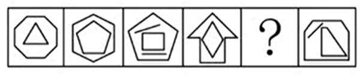

#### 两组图

第一组用于找规律，第二组用规律（模仿第一组的规律即可，细节变化以第二组图为准）

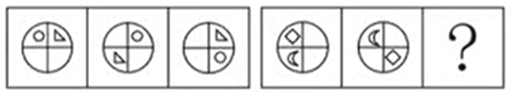

#### 九宫格

优先横着看，其次再是竖着看（很少斜着、S型和米子型）

#### 分组分类

一般分成两组，在组内找出各自的规律（找出两个规律）

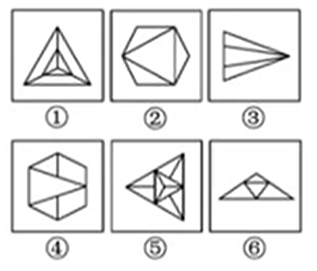

#### 空间类：折纸盒

六面体为主，转化成平面

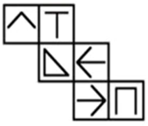

##### 特殊题型

- 截面图
- 三视图
- 立体拼合

## 六大规律

重点通过识别图形特征，来识别考察什么规律

1. 位置规律
2. 样式规律
3. 属性规律
4. 特殊规律
5. 数量规律
6. 空间规律

### 位置规律

#### 特征

位置类识别特征：各图元素组成相同

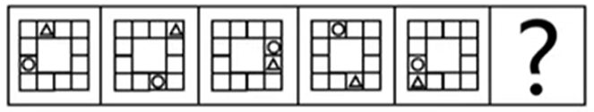

#### 考点

- 平移
- 旋转、翻转（常结合考察）

##### 考点一：平移

1. 方向：直线（上下、左右、对角线）、绕圈（顺/逆时针）

   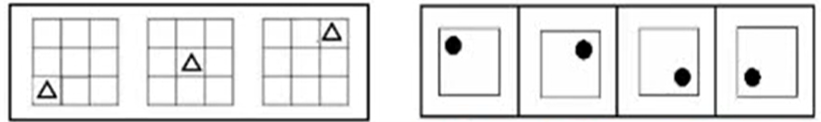

2. 步数：恒定、递增（等差）、周期（考的少）

###### 宫格形黑块平移

1. 个别黑块重合
   - 题干和选项大部分元素组成完全一致，个别一两副图少黑块
   - 题干第一幅图的黑块一般不会重合

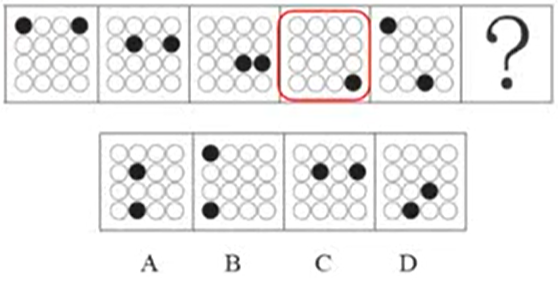

2. 黑块走到头后

   - 循环走：从头开始

     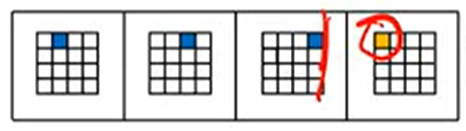

   - 折返走：直接弹回

     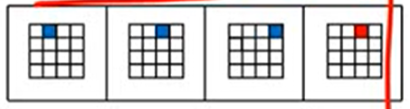

   - “双胞胎”黑块如何分辨：就近走原则

     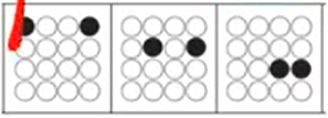

###### 多宫格方向判定

题型特征：16宫格图形多个黑块平移

1. 直线走：

   - 横行黑块数量相同（左右走）
   - 竖行黑块数量相同（上下走）

   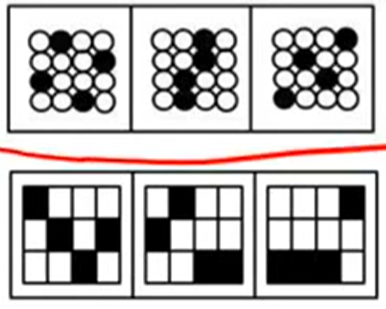

2. 绕圈走：

   - 中间颜色数量相同，有限考虑内外圈分开看

   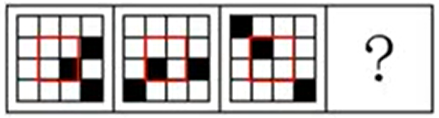

##### 考点二：旋转与翻转

###### 旋转

1. 方向：顺时针、逆时针
2. 常见角度：45°、60°、90°、180°等

> TIPS：难题可以采用两两相邻比较
>
> 钟表类：麦面一个框，中间有一个点，饶了一圈线——常考旋转

###### 翻转

1. 左右翻转
2. 上下翻转（可能存在视觉误差，需要警觉）

> TIPS：先看容易看懂的

这道题目需要注意上下翻转，很难看出来（第二张图到第三张图）

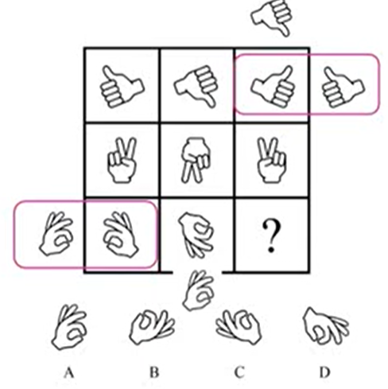

###### 区分旋转和翻转

- 只有左右互换（上下不变）——左右翻

  

- 只有上下互换（左右不变）——上下翻

  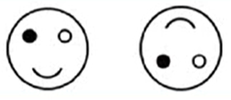

- 上下、左右都互换——旋转180°

  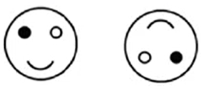

### 样式规律

#### 特征

样式识别特征：元素组成相似

#### 考点

1. 遍历
2. 加减同异
3. 黑白运算

##### 考点一：遍历

图形特征：小元素重复出现

解题思路：缺啥补啥（遍历包括空白/阴影等很多方面）

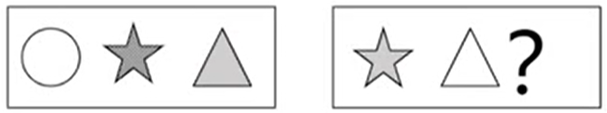

##### **考点二：加减同异**

识别特征：相同线条重复出现

1. 相加、相减
2. 求异（保留不同）
3. 求同（保留相同）

> 对比选项，从特殊线条入手（横线、竖线、最长最短线）