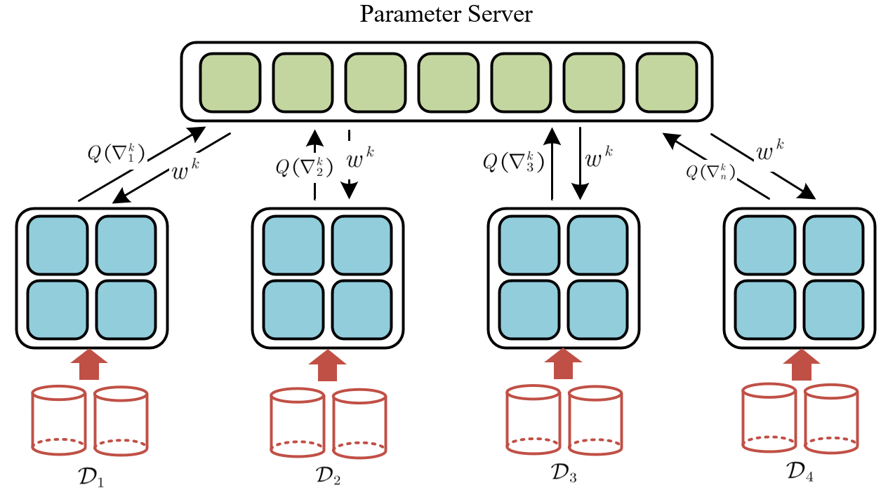
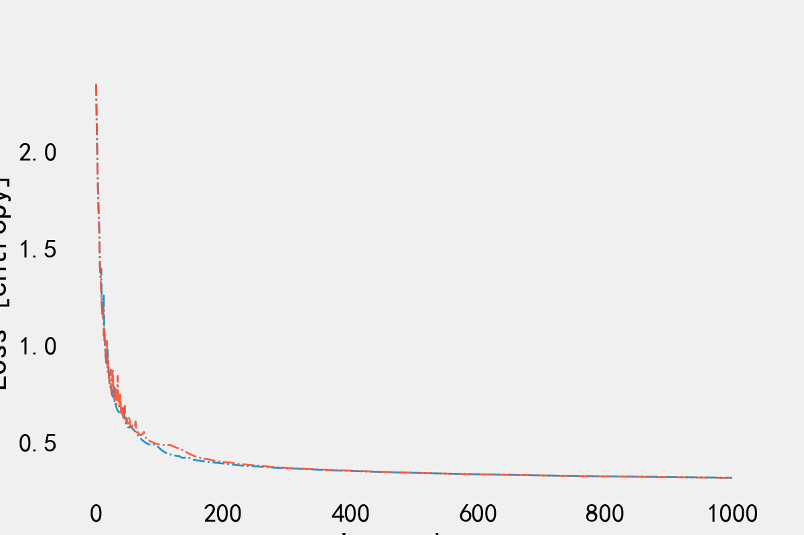
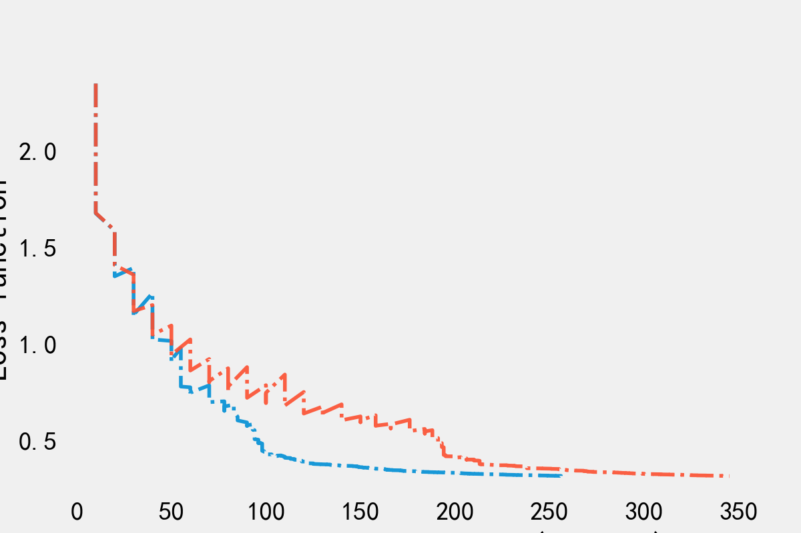

# Ray性能测试和实验复现

## 主要内容

1. 对[Ray的参数服务器架构的性能进行测评](https://wjykl22.github.io/archives/d05bdbcf.html)
2. $LAQ$算法的简单复现和思考

## [Ray参数服务器性能测评实验](https://wjykl22.github.io/archives/d05bdbcf.html)

## 实验复现

可以进一步实验的点：

1. 压缩bit的自适应

   - 论文中将$bits$固定为$4$或者$8$进行实验

   - 想法是刚开始用较小的$bits$，随着不断地收敛，将$bits$不断变大

     > 我用它论文中的mnist数据集（数据集很小），从$4$增大到$16$，收敛效果的改善不明显
     >
     > `可能由于数据集太小，收敛太快的原因`

2. 将模型参数的通信也进行压缩（最有可能有效果的）Double Squeeze

   - 但需要放宽它的通信条件（用一定的通信次数换取收敛效率）

1. 改变其量化压缩方法，使其在不影响收敛的情况下具有更低的精度

   - 实验中最少的bit数是4，但很多压缩方法都可以达到2
2. 带有补偿的量化压缩方法
   ​     
