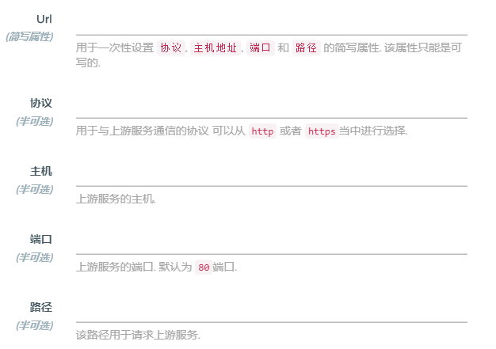

## 控制台

控制台依然沿用Konga控制台，显示主要信息，明确信息的内容，检索有关节点通用的详细信息。

## 主要信息

沿用Konga控制台，对Json解析以表格的方式进行显示可以沿用

## 应用接入（Service）

名称下方显示对该接口的主要描述

| 名称             | 描述     | 协议 | 主机            | 端口 | 创建时间  | DELETE |
| ---------------- | -------- | ---- | --------------- | ---- | --------- | ------ |
| 查询企业信用信息 | 描述信息 | HTTP | 192.168.105.197 | 8080 | 2020/8/12 | 按钮   |

Kong当中只支持英文名，所以这里新增加一列支持中文表示（因为Kong当中的名称可以为空，所以这里可以直接在Konga数据库中增加一列存储表示中文名），可以在中文名后面跟着英文名。

其他内容可以保持不变。

（英文名称可以用正则表达式固定采用_或者.号将地址/进行连接）

前面部分折叠按钮，点击之后显示该服务所有的路由会比较方便。

### 新建应用

这里部分逻辑是二选一，填写了URL下面部分就空着，不填写URL，就填写下面部分。这里的设计可以更好一些？

### 应用详情

应用详情、接管路由、插件、可访问的角色（查询可以访问该路由的角色，点击角色可以查看该角色下的所有用户）

#### 接管路由

| 名称/英文名/ID   | 描述     | 协议 | 路径                 | 方法 | 创建时间  | DELETE/EDIT |
| ---------------- | -------- | ---- | -------------------- | ---- | --------- | ----------- |
| 查询企业信用信息 | 描述信息 | HTTP | /breedtailwater/list | GET  | 2020/8/12 | 按钮        |

#### 插件

这里最好有个按钮能够支持一键开关所有该服务下面的插件

方案：1、只能通过Kong官方API控制：http://192.168.105.197:1337/kong/plugins/3e29dc4f-fcca-461f-a57e-07c8b4104c83（缺点是多次请求，无法回滚）。2、开发一键开关插件的插件

| 名称/英文名/ID | 适用角色 | 适用角色 | 创建角色 | 按钮 |
| -------------- | -------- | -------- | -------- | ---- |
|                |          |          |          |      |

#### 可访问的角色

（暂时没有想到解决方法）

## API发布

这块内容不要了，全放在应用接入当中，现在的逻辑不容易理解。

## 角色权限

两块内容：所有用户+所有权限组

### 用户

| 用户名   | 所属权限组 | ...  |
| -------- | ---------- | ---- |
| fishfarm |            |      |

这里也可以在Konga表中增加对于用户的描述

点击每个用户，进入之后大致保留其所有布局，点击组之后显示所有可以访问路由的脉络。

### 权限组

将权限组单独列出来，点击权限组显示所有该权限组中的用户信息（还没想到如何实现），如果通过数据库查询，这样的方式会导致KONGA和KONG的耦合度非常高，无法分离了。

隐藏负载均衡和HTTPS证书

