## 实验目的

测试Ray参数服务器架构下分布式机器学习的可用性和性能。

## 实验环境

### 系统配置

曙光先进计算华东先进计算中心CPU集群

- CPU：32核心2.5GHz处理器
- 存储：24GB内存
- 通信网络：全线速、无阻塞的200Gb HDR Infiniband专用计算网络
- 作业调度：SLURM

### 软件配置

本实验主要针对Ray分布式机器学习框架[1](\#refer-anchor-1)的简单参数服务器架构[2](\#refer-anchor-2)进行测评，配合使用Pytorch机器学习工具。

Ray的参数服务器架构主要参考：[Ray官方文档](https://docs.ray.io/en/latest/auto_examples/plot_parameter_server.html)

### 数据集和网络

#### 数据集

数据集采用标准CIFAR-10分类数据集，CIFAR10是由60000张$32*32$彩色图像组成，每个类别具有6000张样本图像。每个类别5000张作为训练图像（训练数据总计50000张），其余1000张作为测试图像（测试数据总计10000张）

#### 神经网络

用于测试的神经网络从简单到复杂的三个：简单卷积神经网络、ResNet-18残差神经网络以及VGG16卷积网络

##### 单层卷积网络

- RGB通道数为3，输出通道数为3，卷积核大小为3，步长为1的卷积层

- 池化层+全连接层

##### ResNet残差网络

残差神经网络在VGG等深度神经网络的基础上，解决增加网络深度导致模型退化的问题，使得残差网络更易优化。残差块实现部分如下图，输入数据分厂两条路，一条路经过两个$3*3$卷积，另一条路直接短接，两者相加经过激活函数Relu进行输出：

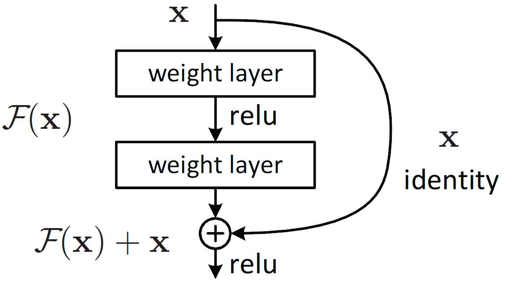

其主要有五种形式Res18、34、50、101以及152，其主要差异在于网络之间的不同主要在于中间卷积部分的block参数和个数。本实验采用ResNet-18进行测试。

##### VGG深度神经网络

VGG是由若干卷积层和池化层堆叠而成，其卷积层和池化层划分成了不同的块（Block），从前到后依次编号为Block1~block5，每一个块内包含若干卷积层和一个池化层。

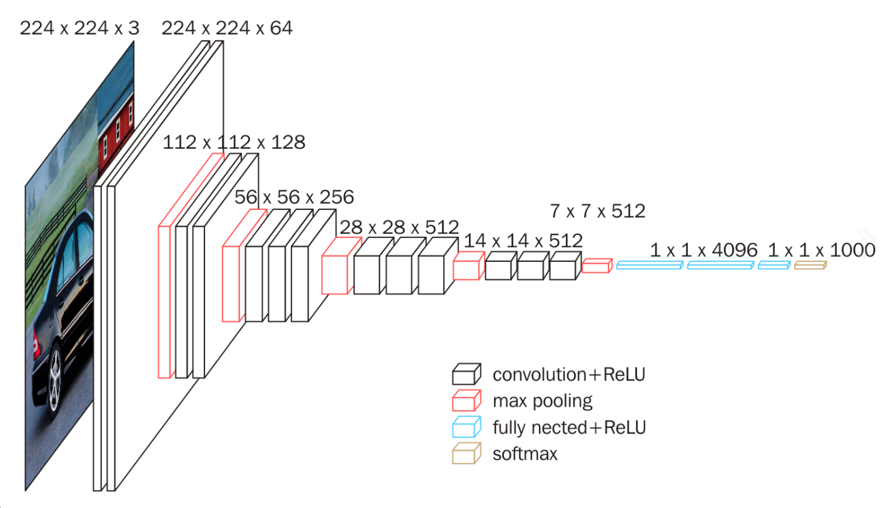

可以结合下图进行理解：

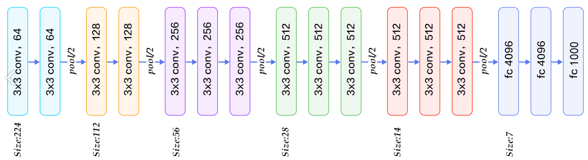

## 实验内容

### 单层卷积网络

CIFAR-10在单层的卷积网络下，受限于其模型结构，所能达到的最高准确率只有50%。实验中，我们分别使用Ray参数服务器架构，在CPU数量为1,2,5,10,15,20的六种情况下，从准确率，迭代收敛速率和加速比等角度，在无任何通信优化的条件下对Ray参数服务器架构下同步并行模型（SGD）的训练性能进行分析。

训练过程中统一采用批量大小为100的随机梯度下降算法，设置学习率为0.0001，迭代次数为10000次，每10轮迭代测试一次准确率（测试准确率的时间排除在实验测试之外）。

#### 同步随机梯度下降

##### 收敛速率

收敛速率的考虑随着迭代过程的不断进行，迭代次数和准确率之间的关系，实验结果如下图所示，横坐标为迭代次数，纵坐标为准确率：

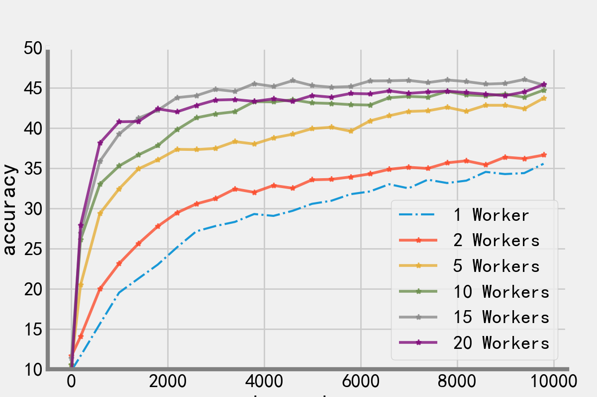

实验结果和预想一致，当工作节点数量越多，其收敛速率越快。原因在于$n$个节点100批量的同步随机梯度下降算法，其收敛速率相当于批量大小为$100n$的随机梯度下降算法，因此在一定范围内，批量大小越大，单次迭代所得到的梯度越准确。

> 15个工作节点和20个工作节点的曲线问题可能是由于批量大小的原因，因为并不是批量大小越大越好。

##### 训练速率

训练速率考虑时间和准确率的关系，实验结果如下图所示，横坐标为时间，纵坐标为准确率：

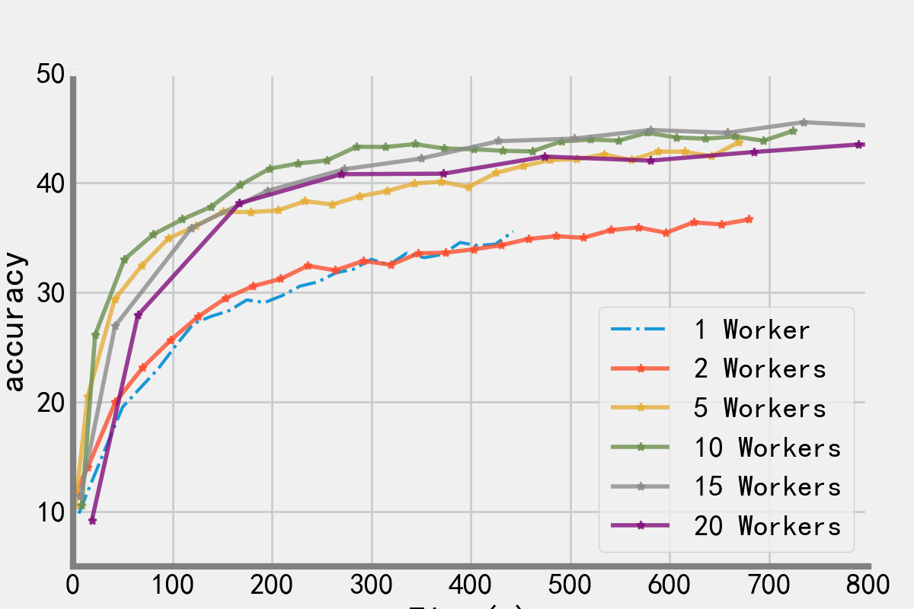

从实验中发现，一个工作节点到五个工作节点在训练速率和准确率上的跃升是比较大的，但是继续随着工作节点数量的不断增长，训练速率的提升并不是非常明显。分析此处的原因可能和模型过于简单，导致其可扩展性不好有关。

> 在1-5个工作节点中间再设置几组实验效果可能更加明显

##### 迭代速率

迭代速率是指单位时间迭代的次数，因为同步并行训练取决于所有工作节点当中最慢的节点，因此随着工作节点的不断增加，迭代速率是会不断下降的（即，迭代一次所需时间更多），实验也验证了这一情况。

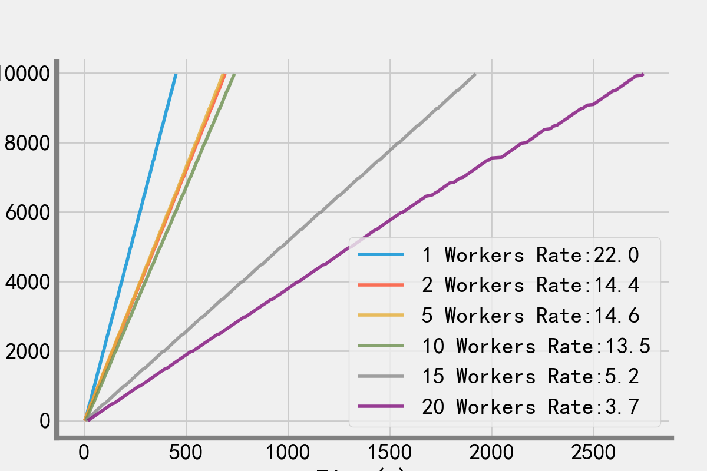

从迭代速率上来看，选用5个节点同步并行训练简单神经网络的性价比是比较高的。

##### 加速比分析

加速比分析采用到达相同准确率（本实验取40）所需时间之比，以单个节点训练为基准，实验结果如下，横坐标表示节点数量，纵坐标表示加速比：

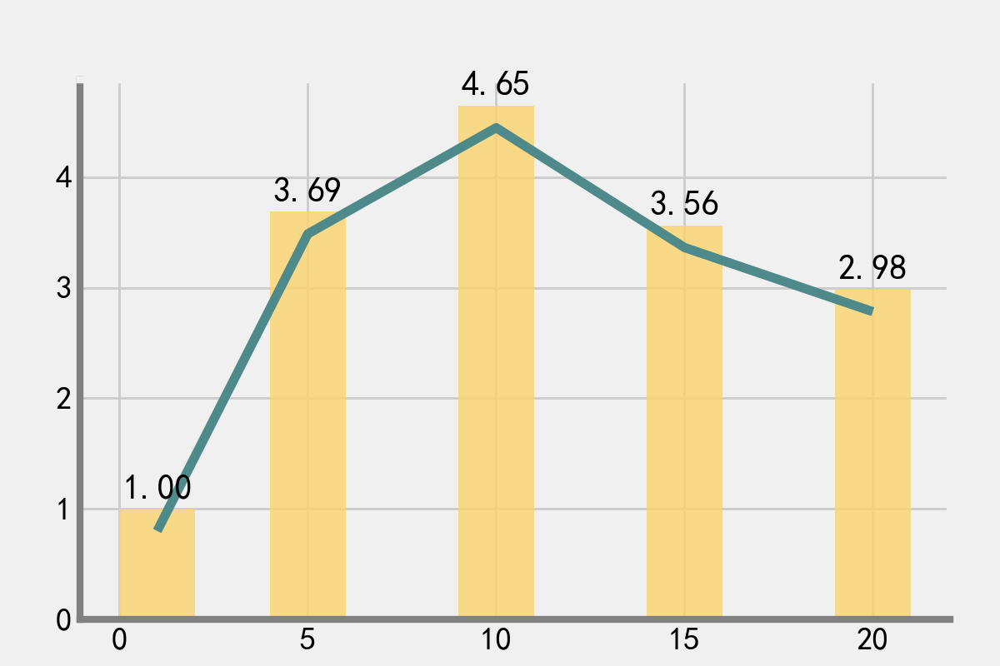

从实验中可以看到10个工作节点具有最高的加速比。

> 由于单层卷积网络太过于简单，因此不再测试异步随机梯度下降

### ResNet-18残差网络

ResNet-18在单个节点上的准确率可以达到80%，实验中，我们分别使用Ray参数服务器架构，在CPU数量为1,5,10,15,20的五种情况下，从准确率，迭代收敛速率和加速比等角度，在无任何通信优化的条件下对Ray参数服务器架构下同步并行模型（SGD）和异步并行模型（ASGD）的训练性能进行分析。

#### 同步随机梯度下降

##### 收敛速率

收敛速率的考虑随着迭代过程的不断进行，迭代次数和准确率之间的关系，实验结果如下图所示，横坐标为迭代次数，纵坐标为准确率：

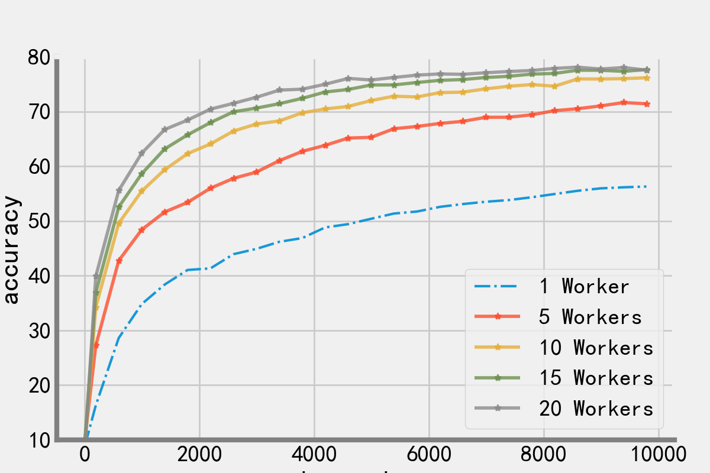

实验结果和预想一致，当工作节点数量越多，其收敛速率越快。其原因和在单层网络中的原因是一直的。

>  该实验中没有出现前一次20个节点的迭代速率反而更低的情况，所以初步断定，单层卷积网络模型太小，过大的批量大小反而会导致收敛速率变慢。

##### 训练速率

训练速率考虑时间和准确率的关系，实验结果如下图所示，横坐标为时间，纵坐标为准确率：

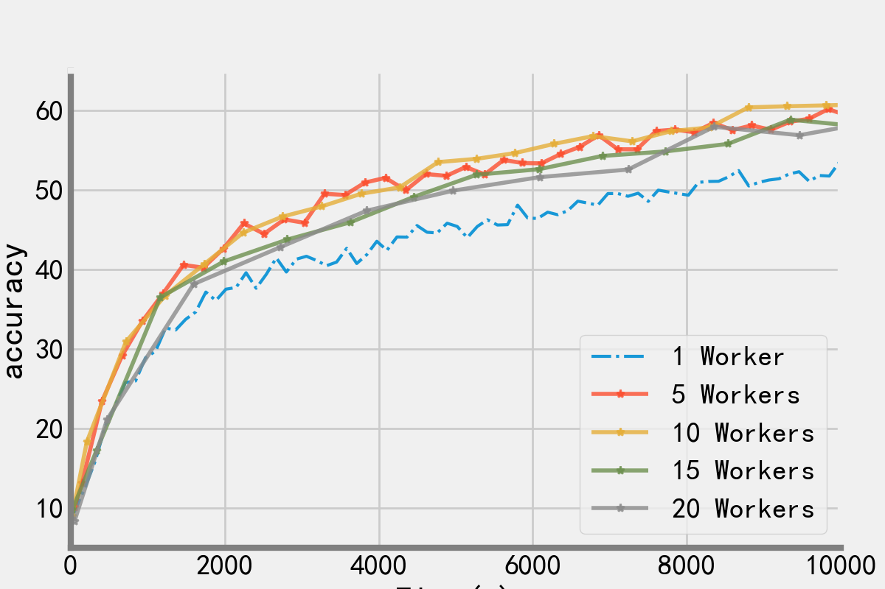

从中可以看出五个节点的同步并行训练是较优的，和单个节点相比提升较为明显，但是超过十个节点之后，训练速率反而会有所降低。原因应该和梯度、模型权重的通信和聚合的复杂程度有关，而且同步并行性的单次迭代会取决于所有节点中最慢的，多种原因都会影响其可扩展性。

##### 迭代速率

迭代速率是指单位时间迭代的次数，因为同步并行训练取决于所有工作节点当中最慢的节点，因此随着工作节点的不断增加，迭代速率是会不断下降的（即，迭代一次所需时间更多），实验也验证了这一情况。

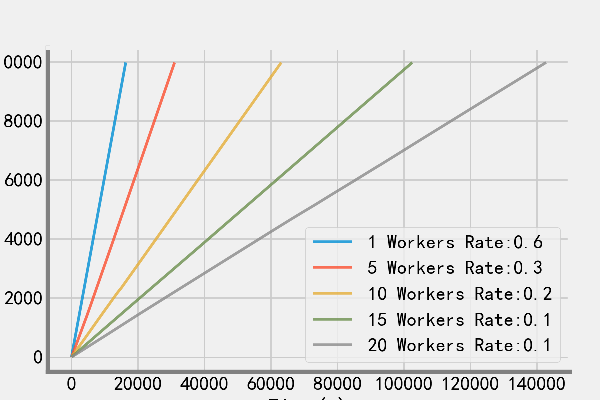

> 查看迭代速率的原因也是验证程序真的有在并行执行。

##### 加速比分析

加速比分析采用到达相同准确率（本实验取60）所需时间之比，以单个节点训练为基准，实验结果如下，横坐标表示节点数量，纵坐标表示加速比：

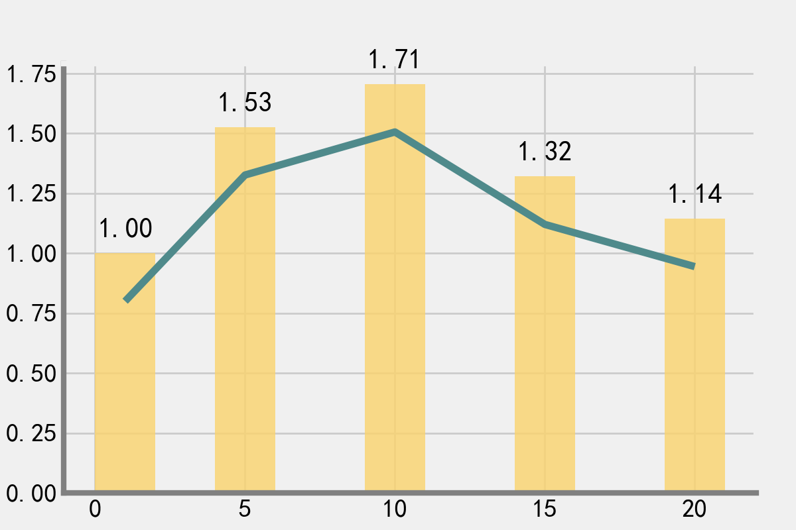

ResNet-18实验的加速比和单层卷积网络的加速比相比之下要差很多，原因应该还是和梯度、模型权重的通信和聚合的复杂程度有关，受限于同步并行模型的自身弊端。

从中可以看出，10个工作节点的加速比是最大的。

#### 异步随机梯度下降

异步随机梯度下降过程迭代次数变为20000次，我们将一台工作节点上传一次梯度并更新就记为一次迭代（即如果有10台工作节点，平均下来每台工作节点只训练了2000次）

##### 收敛速率

收敛速率的考虑随着迭代过程的不断进行，迭代次数和准确率之间的关系，实验结果如下图所示，横坐标为迭代次数，纵坐标为准确率：

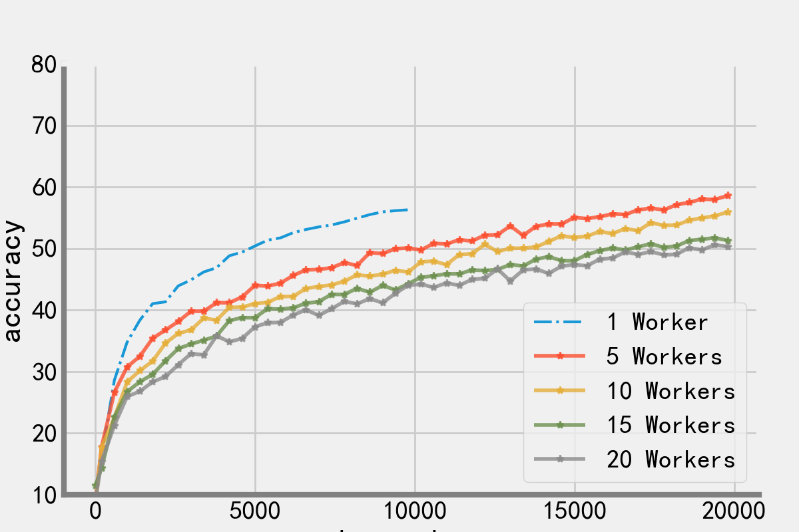

随着工作节点的增加，异步的收敛速率会不断降低，因为异步训练存在梯度滞后问题，会很大程度上会影响模型的收敛，而且工作节点数量越多，影响越大。

##### 训练速率

训练速率考虑时间和准确率的关系，实验结果如下图所示，横坐标为时间，纵坐标为准确率：

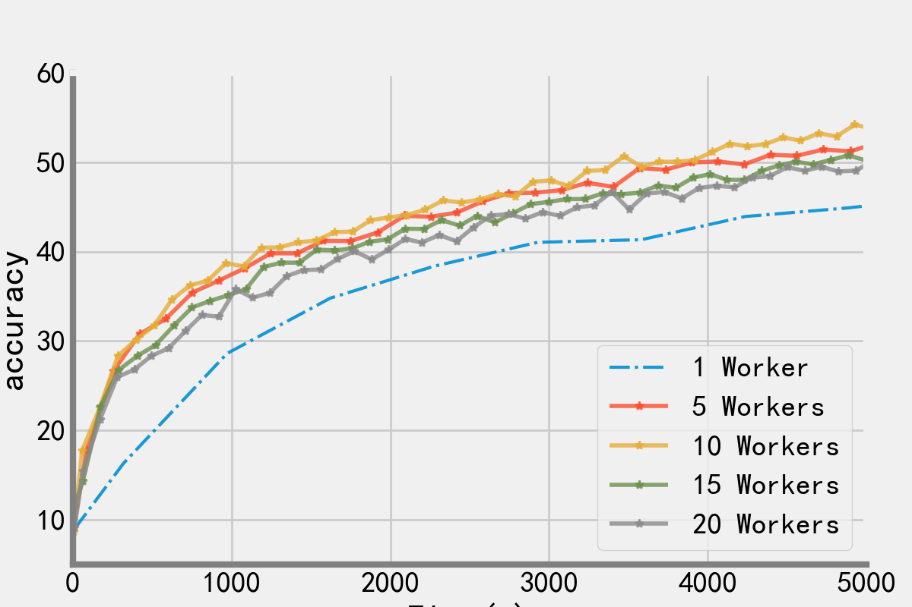

异步并行的最大优势在于一开始的准确率提升，它能够在开始的很短时间内快速替身模型精度。

##### 迭代速率

迭代速率是指单位时间迭代的次数，异步并行和同步并行不同，工作节点数量越多，其单次迭代所要花费的时间越少，因为它完全避免了等待。

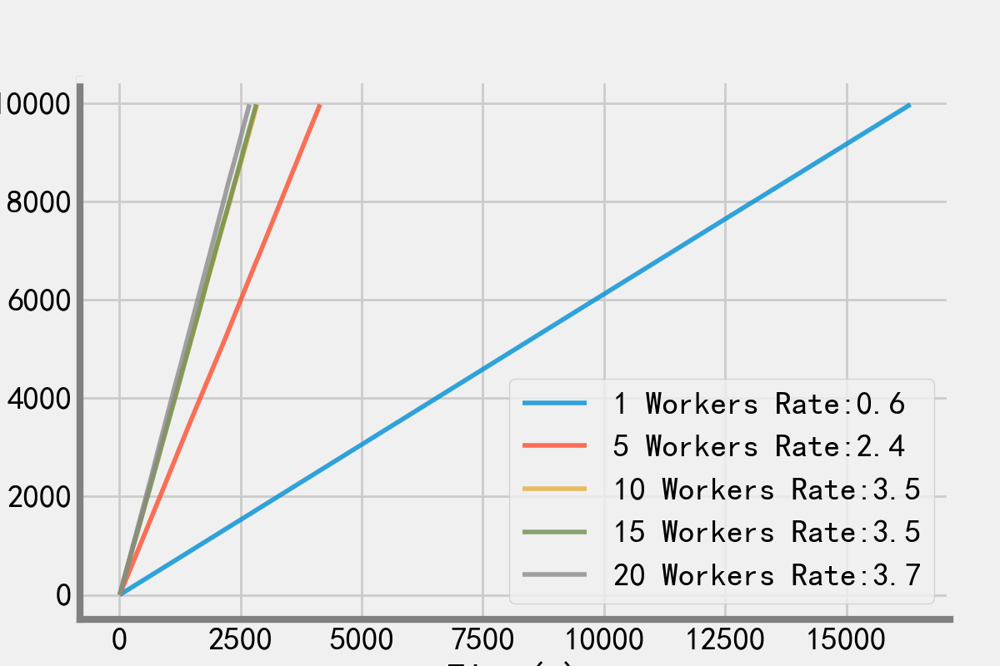

##### 加速比分析

加速比分析采用到达相同准确率（本实验取55）所需时间之比，以单个节点训练为基准，实验结果如下，横坐标表示节点数量，纵坐标表示加速比：

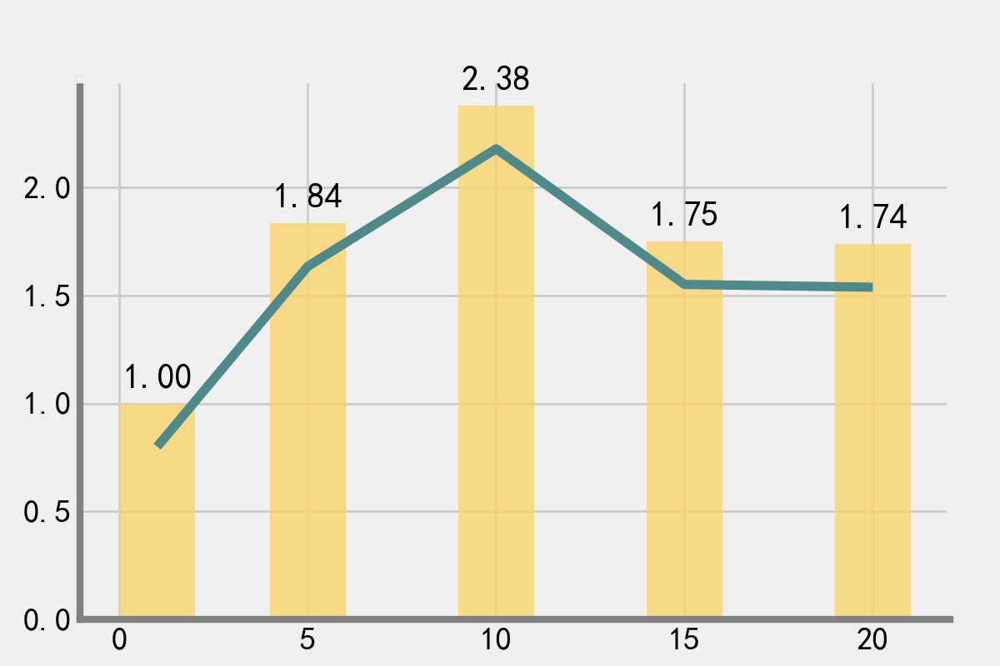

10个工作节点时的加速比最高。

#### 同步和异步比较

本实验选用加速比最大的10个工作节点对同步随机梯度下降算法（SGD）和异步随机梯度下降算法（ASGD）进行比较，比较结果如下图所示：

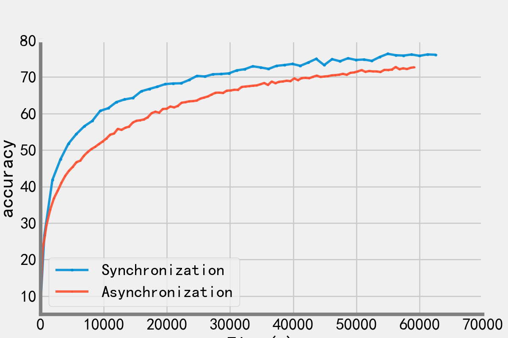

出了一开始异步方法的训练速率要快于同步方法之外，其余时间，同步随机梯度下降算法的训练速率都要优于异步方法。

## 结论总结

对于相对简单的神经网络来说，Ray在参数服务器架构下完成简单的并行训练的效果是比较好的，最高加速比可以达到4.0以上，对于较为复杂的神经网络来说，可能受限于通信带宽和模型大小的制约，使得整体的并行效果会有所下降。

同时通过实验也发现，并不是工作节点数量越多，训练效果越好，简单和复杂网络实验中，无论异步还是同步算法，其最合适的工作节点数量是10左右。

总得来说，Ray的简单参数服务器方法能够满足基本的训练要求，也具有较强的可扩展性。对于复杂模型或复杂网络的训练上，需要通信和其他方面的优化。