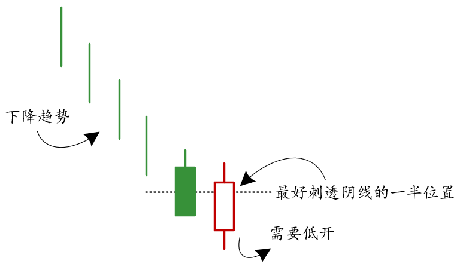
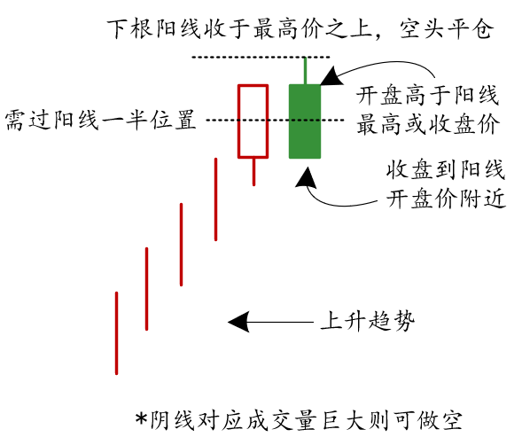
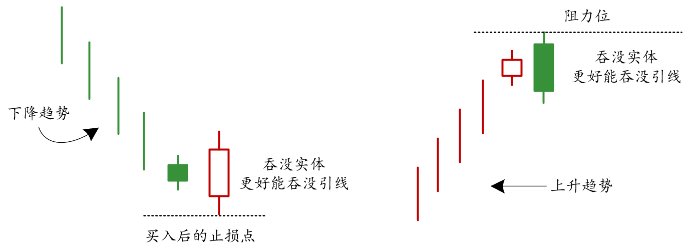
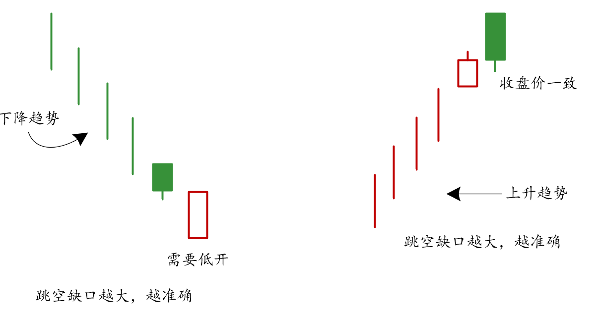
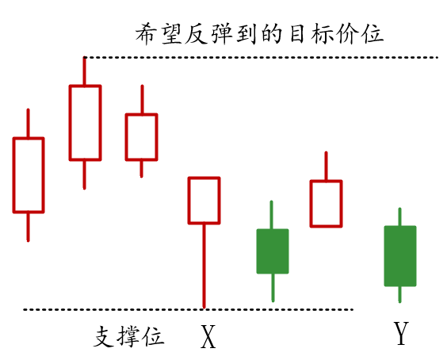

两根蜡烛图会比一根蜡烛传达的信息更加准确：

- 第一根蜡说明市场达到顶部或者底部
- 第二根蜡烛进行确认

三根蜡烛会更加准确

- 第一根说明之前的趋势正在继续
- 第二根蜡烛传达见顶或者触底的信息
- 第三根蜡烛对反转信号的有效性进行确认

## 刺透形态

### 形态条件

1. 处于下降趋势，超卖过程中
2. 下降趋势中，第一根蜡烛是一个绿色实体
3. 第二根红色蜡烛低开，向上穿入黑色实体内部超过$1/2$位置处

## 乌云盖形态

1. 处于上涨趋势中，超买状态
2. 第一根蜡烛红色实体，第二根蜡烛绿色实体
3. 第二根蜡烛开盘高于前一根红色实体最高或收盘价，收盘到前一根红色实体开盘价附近

## 吞没形态

- 蜡烛的颜色需要被区分

只需要吞没前一根线的实体部分，并不必须吞没影线

## 反击线形态

反击线会稍微弱于乌云盖和吞没形态，但是同样会起到预示作用

## 实战例题

说明：上方虚线部分是我们需要反弹到的目标价位，我们需要寻找较为合适的买点，对比收盘价，X的收盘价不适合买入，来到Y收盘价后适合买入。

原因：

- X处出现了长下影线的锤子线，其最低价形成了一个局部的支撑位
- 考察X收盘距离目标价位和支撑位的距离，交易的收益和风险并不具有吸引力
  - 支撑位变成了买入之后的止损位
  - 而目标价位到止损位之间的距离差不多，所以综合衡量之下，并不诱人
- Y处的收盘价再非常接近局部支撑位附近
  - 将支撑位设置为止损位
  - 距离目标价位的距离显然大于止损位的距离，收益和风险比较好，适合买入

