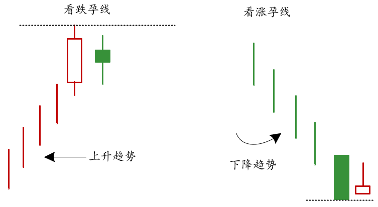
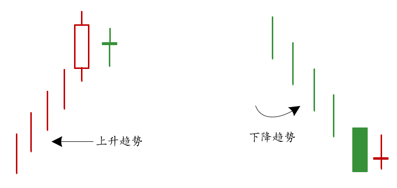
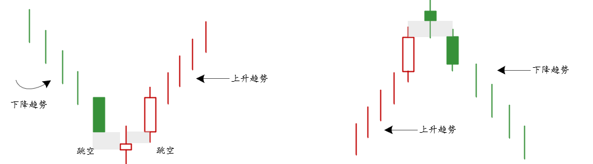
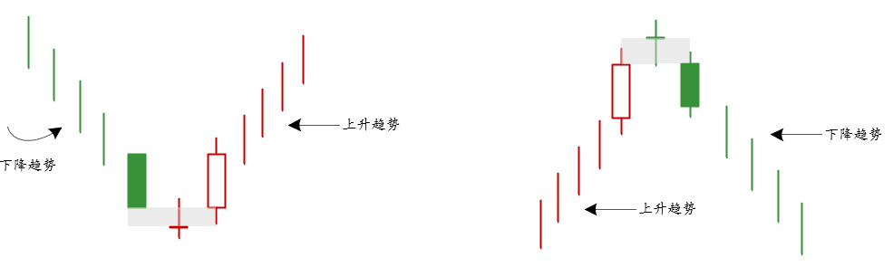

## 孕线

- 第一根蜡烛是一个远超一般长度的红色和绿色实体
- 第二根蜡烛实体被第一根蜡烛包裹

## 十字孕线

被包裹的蜡烛是一个十字星形态

> 该种形态可以和锤子线，流星线和十字星线等单根蜡烛形态结合来看

## 启明星

- 三根实体形成（中间一根是小实体，称为`星线`）
- 上升和下降趋势中，星线和第一根实体形成跳空缺口
- 第三根和星线之间也出现跳空缺口
- 使得星线实体孤立出现在趋势的末尾位置

> 理想状况下实体之间没有重叠，影线和中间蜡烛颜色无所谓

## 十字启明星

上方的星形蜡烛是一个十字星形态

> 启明星形态可以配合成交量，以底部形态为例，第一根阴线配合较小成交量，第三根阳线突然放出较大成交量，说明市场力量正在激起一波新的市场走势。