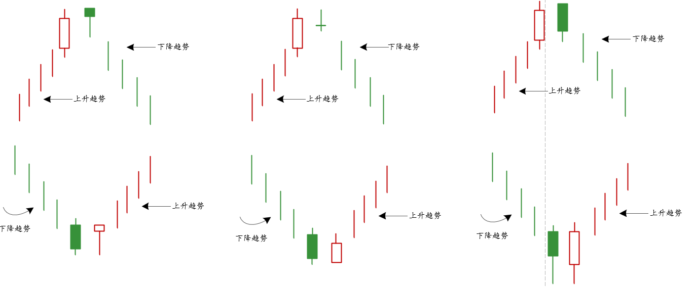
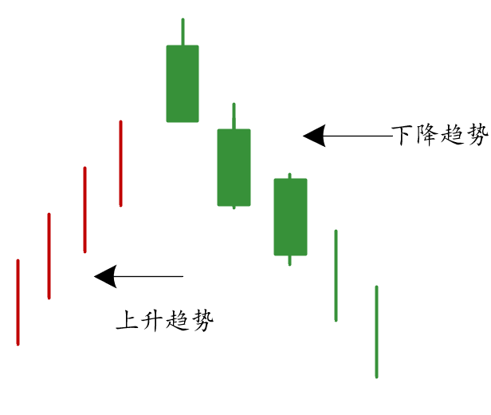
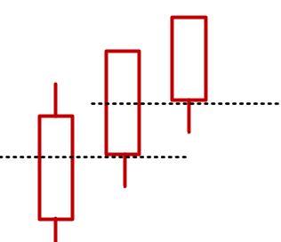

## 平头形态

- 两根或者多根相同最高价和相同最低价的蜡烛线形成
- 理想情况
  - 第一根蜡烛线是一个较长实体
  - 第二交易日实体较小
    - 可以是纺锤线，流星线，上吊线，乌云盖等极具变化的形态组合

> `注意：`平头形态在日线和日内分时并不重要（除非与其他指标相配合），但是在周线和月线级别需要引起重视

## 黑乌鸦

该形态出现在一波上涨的高位处，预示着下跌还将继续

- 组成：三根收盘价在当天最低点或者接近当天最低点的阴线构成
- 显示出现于上升趋势中，作为顶部的反转信号

> 立项情况下，每根黑色蜡烛线的开盘价位于前一根蜡烛实体的内部

### 红色三兵

- 当天的收盘价都处于当天高点的附近

和黑乌鸦相似，预示着上涨还将继续，最佳情况是开盘价都位于每根蜡烛的实体内部

> 要注意以上两种形态并不是买入和卖出信号，只是意味着状态的持续，建仓需要格外小心，需要等待回落到支撑位、
>
> 它出现在上涨还是下跌行情中并不重要