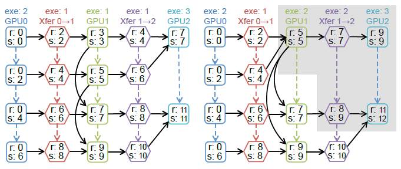

# Beyond Data and Model Parallelism for Deep Neural Networks

- 题目：深度神经网络的数据和模型并行性

  英文：[Beyond Data and Model Parallelism for Deep Neural Networks](https://arxiv.org/pdf/1807.05358)

- 作者：贾志豪 斯坦福大学

## 摘要

现有的深度网络的并行主要是通过数据和模型并行实现，这些方法往往是次优的，而且考虑并行的维度比较少。本文定义了一种更宽泛的DNN并行搜索策略，称为SOAP，它将从样本（Sample），操作（Opration）、属性（Attribute）以及参数（Parameter）这四个维度对最优的并行策略进行探索和优化。同时本文还提出了FlexFlow，在SOAP范围内随机搜索并行策略的方法。为了加速搜索，FlexFlow提出了一种新的执行模拟器（Execution Optimizer），模拟执行比真实环境运行的吞吐量提高了3.8倍。

## 主要贡献

1. 为并行DNN应用定义了SOAP搜索空间，它包括了样本（Sample），操作（Opration）、属性（Attribute）以及参数（Parameter）这四个维度下的并行策略。
2. 在合理假设下，DNN的并行仿真所用时间比DNN直接在真实硬件系统下运行时间少三个数量级
3. 描述了FlexFlow框架，能够从SOAP空间寻找并行执行策略，从而加速DNN训练
4. FlewFlow与现有框架相比，能够提升3.8倍的训练吞吐量，并且提升了可扩展性。

## 简介和背景

神经网络并行最常用的方法是数据和模型并行，但是数据并行和模型并行都有如下特点和弊端：

1. 数据并行（Data Parallelism）

适用于参数较少，且计算集中的DNN，但是对于具有大量参数的操作性能不佳（例如：矩阵乘法）。

数据并行[[1]](\#refer-anchor-1)广泛应用于现有的深度学习系统（例如：Tensorflow、Caffe2以及Pytorch），但数据并行需要在每个工作节点上都复制一份完整网络，在参数量较大的情况下将成为性能瓶颈。

2. 模型并行（model parallelism）

模型并行[15]消除了参数在设备之间同步的开销，但是需要在操作时的数据转换，并且不允许内部操作的并行化。

3. 专家设计策略（expert-desgned strategies）

根据专家的经验和知识手动优化并行策略，例如[[3]](\#refer-anchor-3) [[4]](\#refer-anchor-4)对`卷积层`和`池化层`采用`数据并行`，对`全连接层`转换为`模型并行`加速训练卷积神经网络。这样的方法相比于数据和模型并行提高了性能，但是依然是次优的。

4. 自动并行化策略（automated frameworks）

在特定的搜索域内自动化寻找最优的并行策略.

- REINFORCE [[6]](\#refer-anchor-6)

采用强化学习模型在实际设备上运行不同策略来为模型并行学习得到高效操作策略。但是该方法通过对每种并行策略执行真实迭代来衡量执行时间的方式依然非常低效，而且所需硬件要求非常高。

- OptCNN [[5]](\#refer-anchor-5)

OptCNN也是本文作者所提出，是一种基于线性计算图的CNN逐层并行化方法。它使用动态编程的方法联合优化每种算法，考虑了运算内部的并行，但没有考虑运算操作之间的并行。

现有的自动化框架只是探究了不同操作的并行化（例如REINFORCE[33]）或者在单个操作中的并行（例如OptCNN），忽略了在两个维度上都使用并行性的更快策略。

> 除了数据并行和模型并行之外的并行维度可以进一步替身DNN的训练效率。因此作者首先提出了SOAP的概念。

## SOAP并行搜索空间

SOAP表示样本（Sample），操作（Opration）、属性（Attribute）以及参数（Parameter）这四个维度：在SOAP空间中搜索可能的并行策略。

- Sample 划分训练样本（数据并行）

- Operators 划分DNN操作（模型并行）

- Attributs 划分样本的特征（数据并行）

  

- Parameter 划分操作中的参数

  

混合并行的模型如下图所示：

下表展示了现有并行技术所涉及的到的一些的并行维度：

> 接下来的任务就是如何从SOAP这几个维度对复杂DNN的并行策略进行搜索，找到最佳的并行策略。

## 架构概述

实现了FlexFlow框架，如下图所示，将两个图作为输入，操作图（Operator Graph），描述了操作之间的通信情况；设备结构图（Device Topology），描述了设备之间的内在联系和结构。这两个图将作为输入传入执行优化器（Execution Optimizer）中，在该执行器中，将采用MCMC马尔科夫蒙特卡罗采样生成候选的并行策略，并将该并行策略传入执行模拟器（Execution Smulator）（本质上是一个Cost Model）模拟产生在该并行策略下的执行性能（时间），并传回到MCMC采样，用于后续生成候选策略。

这个迭代过程完成后，最佳的并行策略将发送至分布式执行引擎中，完成分布式训练。

FlexFlow采用操作图$\mathcal{G}$描述所有的DNN操作和状态。每个节点$o_{i} \in \mathcal{G}$都表示一个操作（例如：矩阵乘法和卷积等），每个边$(o_i, o_j) \in \mathcal{G}$表示 输出$o_i$和输入$o_j$的张量。FlexFlow将设备拓扑结构记为$\mathcal{D} = \left(\mathcal{D}_{N}, \mathcal{D}_{E}\right)$，描述了所有可能的硬件设备和它们的内在联系，每个节点$d_{i} \in \mathcal{D}_{N}$代表设备（例如CPU或者是GPU），每条边$\left(d_{i}, d_{j}\right) \in \mathcal{D}_{E}$代表硬件之间的连接（例如NVLink, PCI-e或者是网络连接）。每条边都标注有带宽或者延迟。FlexFlow会为操作图和设备拓扑找到一个并行策略，对比现有的框架，FlexFlow具有如下优点：

1. 可编程性：对于在拓扑结构非常深的集群上运行的复杂操作图，设计高效的操作是非常困难的，FlexFlow可以找到高效的并行策略，并提供更加丰富的可编程接口。
2. 可移植性，一种并行策略在一个集群中适用，但在别的集群中是不适用的，而然，FlewFlow可以自动根据集群中硬件的配置，根据应用特点自动寻找适合的并行策略。

### 采样方法（马尔科夫链蒙特卡罗采样）

对于MCMC采样本本身不再赘述，主要针对该应用场景下，论文的描述：

MCMC采样技术是为了在已有的概率分布下获得样本。一种通用的方法是将该策略所要花费的时间转换为概率分布：
$$
p(\mathcal{S}) \propto \exp (-\beta \cdot \operatorname{cost}(\mathcal{S}))
$$
MCMC开始时（随机或其他初始化方法）生成初始策略，然后生成一系列能够保证所采样得到的样本点在极限状况下接近$p(.)$所给定的分布。在本文中，从$\mathcal{S}_0$这个策略开始生成一系列策略$\mathcal{S}_{0}, \mathcal{S}_{1}, \ldots$。

这里采用MH算法（MCMC采样方法的一个变种）来生成马尔科夫链，它包含了当前策略$\mathcal{S}_0$和新提出的另一种策略$\mathcal{S}$。并且使得分布式满足$q\left(\mathcal{S} \mid \mathcal{S}^{*}\right)=q\left(\mathcal{S}^{*} \mid \mathcal{S}\right)$。从而可以将接受率变为：
$$
\begin{array}{l}
\alpha\left(\mathcal{S} \rightarrow \mathcal{S}^{*}\right)=\min \left(1, p\left(\mathcal{S}^{*}\right) / p(\mathcal{S})\right) \\
=\min \left(1, \exp \left(\beta \cdot\left(\operatorname{cost}(\mathcal{S})-\operatorname{cost}\left(\mathcal{S}^{*}\right)\right)\right)\right.
\end{array}
$$
如果$\mathcal{S}^{*}$的成本比$\mathcal{S}$低，那么$\mathcal{S}^{*}$总是被接收；如果$\mathcal{S}^{*}$的成本比$\mathcal{S}$高，那么$\mathcal{S}^{*}$也有可能被接受，接受概率如上。

该搜索不会自动停止，我们设置满足下面两个条件之一可自动停止：（1）当前初始策略搜索时间预算耗尽（在本方法中不至于到达该条件）；（2）在当前搜索时间一半时间内，搜索过程不能进一步改进发现的最佳策略则停止。

### Cost Model

由于在真实的硬件设备上执行候选并行策略非常缓慢，而且需要耗费大量的物理硬件。所以采用仿真的方式，在研究过程中，DNN具有如下两个特性：

1. DNN操作的计算性能具有高度的可预测性
2. 几乎大量的操作都是类似的重复操作，只有少部分是特有的操作

所以执行模拟（Execution Simulator）将会衡量每个特有的操作，并将得到结果去模拟不同的并行策略

#### 例子

下图是比较简单的循环神经网络的执行拓扑，包括了Embedding层，Recurrent层和Linear层，图a下方展示了某种并行策略的例子，对于前四个操作，分别采用两个任务的数据并行（Sample维度）策略。

右侧是任务图，其中四边形代表计算任务，六边形的代表通信任务，任务的运行时间使用操作模拟的值，数据通信转换的时间采用张量的尺寸/通道带宽进行表示（这里的假设是，通信带宽能够被完全使用，达到最佳）。

### Delta模拟算法（Delta Simulation）

在有新的并行候选策略生成时，并不完全重构任务图模型，而只是做拒不修改，所以大部分的图模型是不发生改变的，所以可以采用增量更新的方式重用之前的仿真模拟，这样的方法被称为Delta仿真算法。还是以上述例子为例，

假设此时并行策略此时发生了改变，第五个操作从原来的分派两个任务进行执行，变为单任务执行，那此时只需要对灰色部分进行重新模拟仿真即可，而不需要重构真个计算图模型。

#### Delta模拟的性能表现

作者做了实验，对比了是否使用Delta模拟算法的计算性能

横坐标表示时间，纵坐标表示找到的最好的并行策略，可以发现，采用Delta Simulation的时间可以缩短2.3倍，具有极大的提升。

从图中我们还可以发现FlexFlow找到最佳并行策略的时间只需要几分钟，在单个节点上就能完成。这就和REINFORCE方法形成了强烈的反差，REINFORCE方法在策略的寻找上就需要分布式的环境，并需要耗费几个小时的时间。

## 实验性能

该实验主要针对以下两种GPU架构体系，图中箭头表示NVLink连接。实线表示PCI-e连接，虚线表示跨不同节点的无线带宽连接。

左边第一个集群包含了四个计算节点，每个计算节点配备了两个Intel 10-core E5-2600 CPU, 256GB内存，以及四个NVIDIA Tesla P100 GPU，GPU之间都通过VNLink进行连接。节点通过100GB/s EDR的无线带宽技术。

右边的集群包含了16个节点，每个节点配备两个Intel 10-core E5-2600 CPU, 256GB内存，以及四个NVIDIA Tesla K80 GPU。GPU之间通过PCI-e连接，集群中的计算节点连接超过56GB/s EDR的无线带宽技术。

从实验的角度来说，GPU之间都是同构的设备，但我感觉是从算法的角度考虑，如果在异构的环境下，他可以通过计算时间这个reward去衡量那种策略更优，感觉它已经将异构的情况考虑在内了，选择最优策略的参数会偏向于将更复杂的内容交给性能更好的GPU，这样最后的时间会更快。

- 与数据并行，人为设计的并行策略在单次迭代执行时间的对比

- 训练吞吐量上和REINFORCE和OptCNN等自动并行策略的现有方法做对比

  

可以发现在吞吐量上有明显的提升。

- Simulated Execution仿真模拟的准确率

可以看到在各种设备拓扑结构下，结果基本是准确的。

## 总结

本文定义了一种更宽泛的DNN并行搜索策略，称为SOAP，它将从样本（Sample），操作（Opration）、属性（Attribute）以及参数（Parameter）这四个维度对最优的并行策略进行探索和优化。并提出了FlexFlow自动搜索并行方案的框架，能在时间性能上比Google的REINFORCE方法提高了3.8倍。

- [1] [Krizhevsky A, Sutskever I, Hinton G E. Imagenet classification with deep convolutional neural networks[C]//Advances in neural information processing systems. 2012: 1097-1105.](http://papers.nips.cc/paper/4824-imagenet-classification-with-deep-convolutional-neural-networks.pdf)

- [2] [Dean J, Corrado G, Monga R, et al. Large scale distributed deep networks[C]//Advances in neural information processing systems. 2012: 1223-1231.](http://papers.nips.cc/paper/4687-large-scale-distributed-deep-networks.pdf)

- [3] [Krizhevsky A. One weird trick for parallelizing convolutional neural networks[J]. arXiv preprint arXiv:1404.5997, 2014.](https://arxiv.org/pdf/1404.5997)

- [4] [Wu Y, Schuster M, Chen Z, et al. Google's neural machine translation system: Bridging the gap between human and machine translation[J]. arXiv preprint arXiv:1609.08144, 2016.](https://arxiv.org/pdf/1609.08144.pdf%20(7))

- [5] [Jia Z, Lin S, Qi C R, et al. Exploring hidden dimensions in parallelizing convolutional neural networks[J]. arXiv preprint arXiv:1802.04924, 2018.](https://arxiv.org/abs/1802.04924)

- [6] [Mirhoseini A, Pham H, Le Q V, et al. Device placement optimization with reinforcement learning[J]. arXiv preprint arXiv:1706.04972, 2017.](https://patentimages.storage.googleapis.com/2b/03/41/324a4ae429b203/US10692003.pdf)
