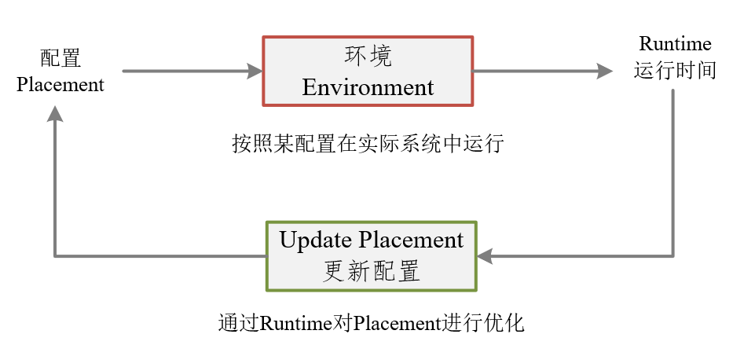
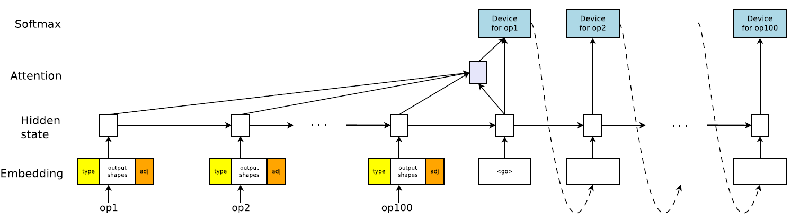
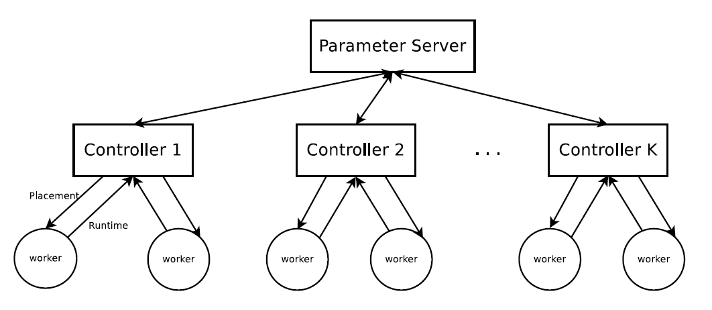
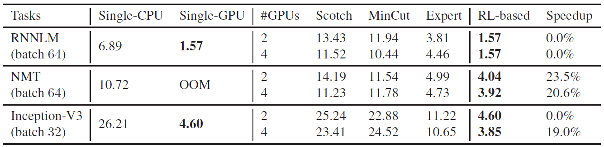
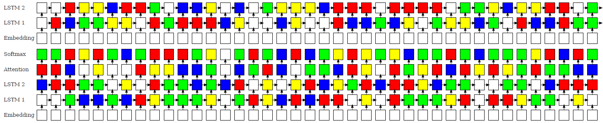
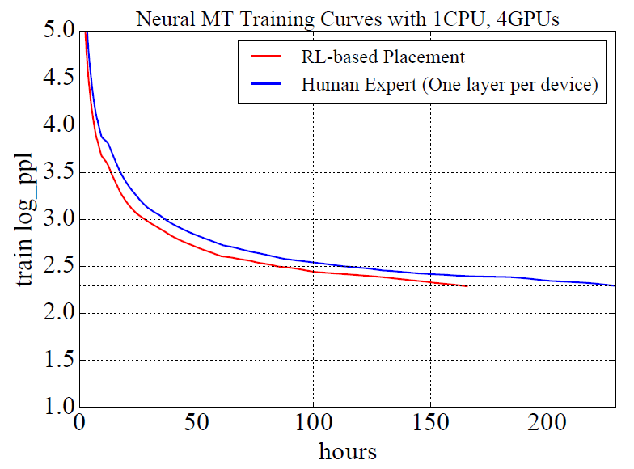

- 题目：使用强化学习进行设备配置

  英文：[Device Placement Optimization with Reinforcement Learning](https://arxiv.org/abs/1706.04972) ACM

- 作者Azalia Mirhoseini

## 摘要

将神经网络模型的不同部分放置在不同设备上进行分布式训练的决策问题，通常是由专业人员主观设计。本文提出了一种方法，能够优化Tensorflow计算图模型在不同设备上的配置，解决该问的关键是采用序列到序列的模型来预测TensorFlow图模型应该运行在哪个可用设备上，在预测设备上的执行时间作为反馈信号更新序列到序列的模型参数。

该方法在Inception-V3模型的Image-Net分类上做了实验，在RNN LSTM上对语言模型和机器翻译做了测试，并找到了重要的设备配置方案，这些方案要比人工划分配置有着更好的性能表现。

## 介绍

改模型如下图所示，简单的说就是系统自动进行一系列的性能试验，考虑各种环境因素，最终得到模型的那个部分应该安排在哪个设备上进行训练，同时优化通信效率。改模型的关键是采用Seq2Seq模型，读取操作的有关信息和他们之间的关联。每一个提议都会在硬件环境下执行并测算执行时间，执行时间作为反馈信号更新序列到序列的模型参数。

## 相关工作

文章首先介绍了强化学习在系统性能优化上的一些工作，包括[Mao et al., 2016]提出的采用策略梯度进行资管调度管理的优化方法。这类方法需要依赖回报的手工目标函数的期望值，而本文直接优化配置的运行时间，减去了设计中间成本模型所需的时间。

其次介绍了图分割的相关应用，利用谱分析和图的矩阵表示进行划分。图划分算法可以应用于计算图的划分，但是计算非常昂贵，原因在于为了应用这些算法，需要为图构建代价模型，这样的模型构建要模拟各种情况，非常昂贵，并不现实。

一种非常著名的开源图划分算法是Scotch优化方法（Pellegrini 2009），该方法作为本论文的基准测试。Scotch试图在一组连接的处理节点之间平衡任务集合的计算负载，同时通过在附近的节点上保持密集的通信任务来降低通信成本。

该方法需要两个图，第一张图被称为目标架构图，它的顶点表示硬件资源，例如CPU或者GPU，它们的边表示可用的通信路径，例如PCIe总线和网络通信。第二张图是源图，它将计算映射到目标架构图进行建模。在TensorFlow的实例中，程序的计算被建模成图，改图的顶点表示操作，边表示他们之间的张量通信。Scotch用户必须选择如何以及何时图应该划分。然而，本篇论文的实验中，依赖于Scotch中软件的默认策略实现，这些策略已经被广泛调整过了。

## 框架方法

思考TensorFlow的计算图$\mathcal{G}$ ，它是由M个操作$\left\{O_{1}, O_{2}, \ldots, O_{M}\right\}$以及一系列$D$个可用设备资源组成。配置方法    $\mathcal{P}=\left\{p_{1}, p_{2}, \ldots, p_{M}\right\}$是将操作 $o_{i} \in \mathcal{G}$分配到设备$p_i$，其中$p_{i} \in\{1, \ldots, D\}$。令$r(\mathcal{P})$表示完整执行$\mathcal{P}$配置下计算图$\mathcal{G}$所需要的花费的时间。我们的目标是找到$\mathcal{P}$使得$r(\mathcal{P})$最小。

如果直接对$r(\mathcal{P})$并不是很合适，存在如下两个问题：（1）刚开始训练的时候，由于不好的采样，导致$r(\mathcal{P})$会有很多噪音，导致不好的学习信号；（2）快要达到瘦脸之后，采样变得非常相似，微笑的变化导致学习信号的可识别性比较差。所以这里采用$R(\mathcal{P})=\sqrt{r(\mathcal{P})}$代替，鲁棒性更好。

首先是该方法的整体框架

配置（Placement）是该框架的输入，Environment是Tensorflow按照这种配置在实际系统中的运行，Runtime作为运行时间进行输出。该输出经过处理（和Baseline）得到Loss，根据Loss进一步优化Placement配置。

其中的Placement是由序列到序列模型（Seq2Seq）也就是LSTM模型预测得到，该模型框架如下：

### 步骤一：Placement由来

- 模型输入

  先收集计算图中的所有操作（operations），该模型输入是有关操作（operations）的属性，图中可以看到计算图一共是有100个operations，也就会有100个operations的属性输入进来。

  每个操作（operations）有三个部分组成：

  1. type：类型，例如矩阵乘法（MatMul）或者Conv2d（卷积操作），对操作的类型进行embedding操作，它是可以通过参数调整改变embedding之后向量长度的，所以是可变长（tunable）向量

     > 论文中并没有说明是如何进行embedding 的

  2. outputshape：定长向量，该操作输出的形状，拼接shape的时候按照output中shape维度最高的分配空间，就是论文中称为：`fixed-size zero-padded`.

     > 例如：有两个输出，其中一个形状是四维的[20. 40, 20, 30]，另一个形状是二维的[20, 30]，拼接在一起之后就是[20, 40, 20, 30, 0, 20, 30, 0]。

  3. adj：one-hot编码的属性，定长向量统计计算图中一共有多少个操作，并分别编号。然后对某op的输入输出进行one-hot编码

- 模型输出

  每个操作所对应的设备，计算图中有多少个操作（operations），这里就有多少个输出，图中有100个，这里的输出就是100个。

### 步骤二：运行得到Runtime并计算Loss

$$
J(\theta)=\mathbf{E}_{\mathcal{P} \sim \pi(\mathcal{P} \mid \mathcal{G} ; \theta)}[R(\mathcal{P}) \mid \mathcal{G}]
$$

最小化上述式子，其中$\pi(\mathcal{P} \mid \mathcal{G} ; \theta)$表示策略就是第一步中的Placement，策略梯度下降方法计算如下：
$$
\nabla_{\theta} J(\theta)=\mathbf{E}_{\mathcal{P} \sim \pi(\mathcal{P} \mid \mathcal{G} ; \theta)}\left[R(\mathcal{P}) \cdot \nabla_{\theta} \log p(\mathcal{P} \mid \mathcal{G} ; \theta)\right]
$$
实际上，论文中采用了均值的方法代替公式中的期望：
$$
\nabla_{\theta} J(\theta) \approx \frac{1}{K} \sum_{i=1}^{K}\left(R\left(\mathcal{P}_{i}\right)-B\right) \cdot \nabla_{\theta} \log p\left(\mathcal{P}_{i} \mid \mathcal{G} ; \theta\right)
$$

> 含义：根据误差改变参数$\theta$, 再根据新的$\theta$修改LSTM模型得到新的配置（Placement），其中B表示历史平均的运行时间，作为基准（BaseLine）。

- 特殊情况：

  1. 某个配置（Placement）使得太多的操作放在同一个设备上导致内存不足，将该配置的runtime设置为很大的常数，可以带来巨大的Loss。
  2. 上述解决方案又会导致$R(\mathcal{P}_i)$和$B$的差距很大，特别在训练最后阶段导致局部最小范围内的剧烈抖动，解决方式是在5000步之后，采用硬编码方式，只有策略执行成功后，才作更新。

### 分布式训练

上述过程需要将其异步分布式运行，运行结构如下图所示：

有多个Controller，每个Conctroller执行LSTM模型，生成Placement，并且他们与参数服务器通信。所有的参数服务器存储全局的LSTM模型参数。执行过程如下：

1. 每个Controller按照公式（3）生成$K$个Placement策略，同时$K$也对应这$K$个工作节点，Controller将K个Placement发给工作节点运行，每个工作节点运行一个Placement
2. 运行完成后工作节点回传运行时间Runtime给Controller，也就是公式（3）中的$R(\mathcal{P}_i)$。
3. Controller的参数$\theta$会在参数服务器中做聚合操作，得到新模型后，Controller又会根据新的到的参数做MCMC采样，得到K个Placement策略继续迭代运行。

## 实验结果

### 单步运行时间

下表提供了该方法和其他基准方法单步运行时间的对比：

对于每个模型来说，第一行表示1个CPU和2个GPU的结果；第二行表示1个CPU和4个GPU的结果。最后一列表示基于RL的配置方法和其他基准测试方法时间性能上的提升。

同时，作者还扩展了实验，将RNNLM和NMT的批量大小提高到了256，这两个模型中的LSTM提高到了4096和2048.这使得即使模型的单层都无法在单台设备中存储。从而排除了人为设计并行方案的可能。但是通过RL方法却能够找到可执行的分布式配置方案。

配置方案如下图所示:

### 整体测试

下图中，人为最佳配置达到了229.57个小时的训练时间，采用RL方法达到了165.73的训练时间，速度上提升了27.8%。

下图展示了三种不同模式下的Inception-V3训练曲线，从图中可以看到，与同步的模式相比，基于RL的配置方式可以将训练时间加速19.7%。然而，异步的方法每步的执行时间更少，同步方法的收敛速率更快。基于RL的方法在刚开始时候的收敛速率比较慢，但是最终可以赶超异步的方法。

## 总结

优点：

1. 具有可一致性和普遍性，如果人为的根据异构的设备结构和网络结构设计并行策略，只能用于特定的环境，可移植性较差。

2. 提供了用机器学习的方法来制定并行策略的方式，提供了这种新思路。
3. 速度上有20%的提升

缺点：

1. 结果的提升只有20%多一点，效果可能不是非常明显
2. 寻找并行策略的过程本身需要投入大量的资源进行运算，例如本论文中需要20个Controller节点，每个Controller节点又要分配4-8个Worker进行计算，其投入量相当巨大，只为了计算出较为合适的并行策略，有一些不值当。