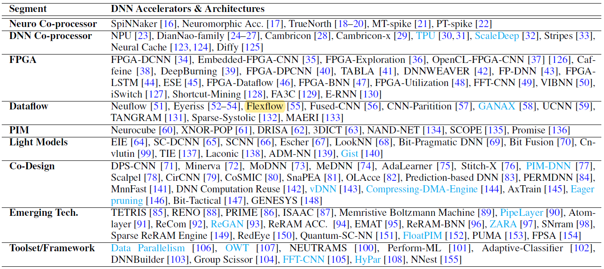
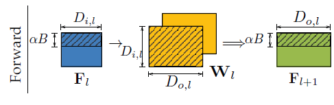
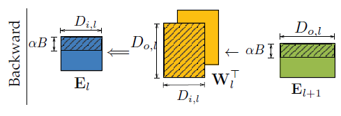
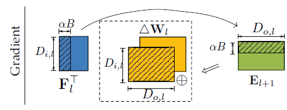
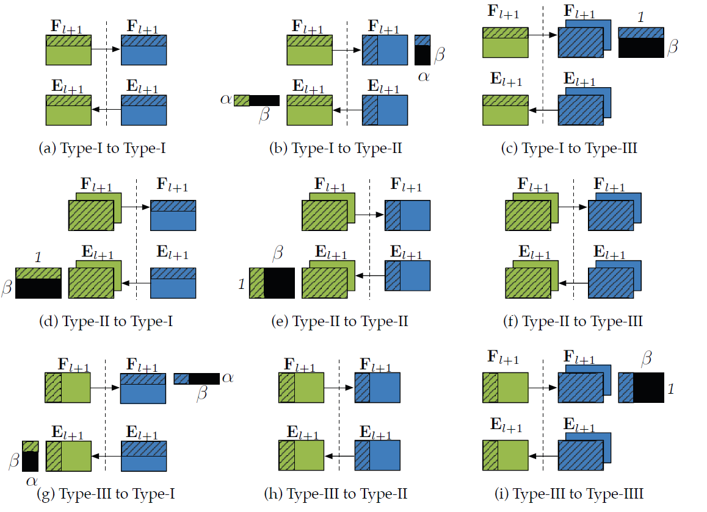
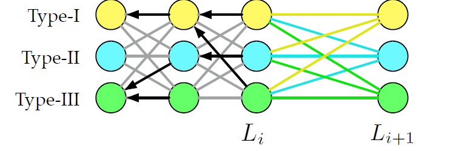
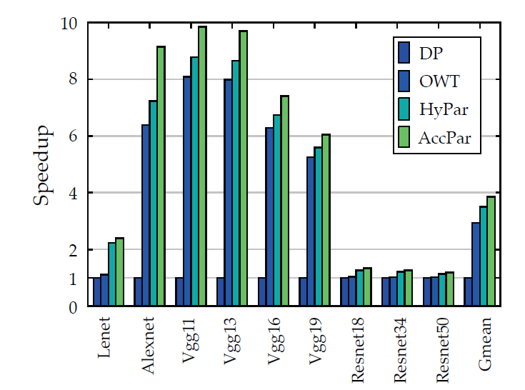
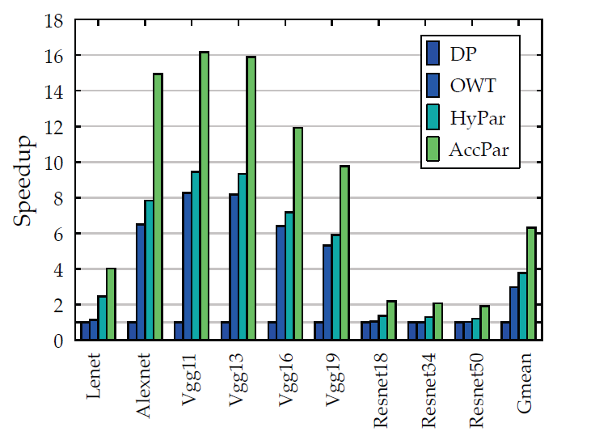

## AccPar：针对异构深度学习加速器的张量划分方法

- 作者：Linghao Song 南加利福尼亚大学 杜克大学
- IEEE HPCA（High Performance Computer Architecture）

### 概括

提出了AccPar，在异构加速阵列上划分张量的方法，和其他方法相比，AccPar有着更加完备的张量划分空间（tensor partition space）同时能够产生其他方法未知的并行策略。

AccPar依赖于异构环境下，计算和通信消耗（computation and communication costs）。而且AccPar可以根据加速器的异构情况，使用灵活的划分比率来适应异构环境。

相比于OWT（one weird trick）方法、HYPAR方法以及传统的数据并行方法，分别提升了2.98倍、3.78倍和6.30倍。

### 背景介绍

##### 现有方法

###### One Weird Trick（OWT）

对于卷积层采用数据并行，对于全连接层采用模型并行

###### HYPAR

提出了一种最小化数据通信的并行方法，能够比OWT拥有更好的效果。

这些方法存在如下问题：

1. 并行方法的搜索基于不完备的设计空间
2. 只能处理线性结构的DNN体系结构
3. 它们只考虑了通信而没有考虑计算
4. 假设是在设备同构的环境下

##### AccPar方法

1. 提出了完备的张量划分空间
   - 批量（batch size）
   - 数据数据尺寸（imput data size）
   - 输出数据尺寸（output data size）
2. 提出了异构环境下communication cost和computation cost
3. 灵活变化划分比率

> 总的来说，该方法能够感知计算资源的异构性和网络带宽能力，从而实现张量的划分。

作者先对现有DNN加速器和加速框架和它们不同的细分领域做了梳理：

> 包括FPGA加速、数据流处理（Dataflow）、PIM（Processing-in-memory）以及其他新型的并行框架

### 张量划分空间

- 批量（batch size）
- 数据数据尺寸（imput data size）
- 输出数据尺寸（output data size）

符号简要介绍：

#### 问题阐述

一个DNN网络涉及下列三个重要环节：

1. 前传：Forward $\mathbf{F}_{l+1}=f\left(\mathbf{F}_{l} \times \mathbf{W}_{l}\right)$
2. 后传：Backward $\mathbf{E}_{l}=\left(\mathbf{E}_{l+1} \times \mathbf{W}_{l}^{\top}\right) \odot f^{\prime}\left(\mathbf{F}_{l}\right)$
3. 求梯度：Gradient $\Delta \mathbf{W}_{l}=\mathbf{F}_{l}^{\top} \times \mathbf{E}_{l+1}$

用数据尺寸可表示为：

1. 前传：Forward $\left(B, D_{o, l}\right) \leftarrow\left(B, D_{i, l}\right) \times\left(D_{i, l}, D_{o, l}\right)$
2. 后传：Backward $\left(B, D_{i, l}\right) \leftarrow\left(B, D_{o, l}\right) \times\left(D_{o, l}, D_{i, l}\right)$
3. 求梯度：Gradient $\left(D_{i, l}, D_{o, l}\right) \leftarrow\left(D_{i, l}, B\right) \times\left(B, D_{o, l}\right)$

#### 划分维度

假设1：$\mathbf{F}_{l}$和$\mathbf{E}_{l}$采用相同的划分方式

> 原因：如果采用不相同的划分方式，会导致引入额外的通信，这和最小化communication costs相悖。

假设2：这几个维度并不是独立的，所以每次只有一个维度能够划分

> 举例：以前传：Forward为例$\left(B, D_{o, l}\right) \leftarrow\left(B, D_{i, l}\right) \times\left(D_{i, l}, D_{o, l}\right)$，如果我们选定要划分$B$这个维度
>
> 1. 其中$\mathbf{D}_{i,l}$不能划分，如果划分了矩阵乘法就无法进行了。
> 2. $D_{o, l}$也不能划分，如果划分，最后得到的矩阵只有左上右下或者右上左下的部分矩阵计算

以下内容只以Type-1作为例子进行详细阐述，其余的划分方法原理相同。（假设两块加速卡）

##### Type-1：划分B维度

###### 前传：Forward

$$
\mathbf{F}_{l+1}[b, q o]=\sum_{q i \in\left\{1, \cdots, D_{i, l}\right\}} \mathbf{F}_{l}[b, q i] \times \mathbf{W}_{l}[q i, q o]
$$

其中一块数据划分$\mathbf{F}_{l}[1: \alpha B,:]$，另一块$\mathbf{F}_{l}[\alpha B+1: B,:]$

###### 后传：Backward

$$
\mathbf{E}_{l}[b, q i]=\sum_{q o \in\left\{1, \cdots, D_{o, l}\right\}} \mathbf{E}_{l+1}[b, q o] \times \mathbf{W}_{l}^{\top}[q o, q i]
$$

其中一块误差划分$\mathbf{E}_{l+1}[1: \alpha B,:]$，另一块：$\mathbf{E}_{l}[\alpha B+1: B,:]$

###### 梯度计算

$$
\Delta \mathbf{W}_{l}[q i, q o]=\sum_{b \in\{1, \cdots, B\}} \mathbf{F}_{l}^{\top}[q i, b] \times \mathbf{E}_{l+1}[b, q o]
$$

$$
\begin{aligned}
\Delta \mathbf{W}_{l}[q i, q o]=& \sum_{b \in\{1, \cdots, \alpha B\}} \mathbf{F}_{l}^{\top}[q i, b] \times \mathbf{E}_{l+1}[b, q o] \\
&+\sum_{b \in\{\alpha B+1, \cdots, B\}} \mathbf{F}_{l}^{\top}[q i, b] \times \mathbf{E}_{l+1}[b, q o]
\end{aligned}
$$

> 这里将产生层内通信（intra-layer），因为最后的结果必须将两块加速卡上计算出的部分梯度相加得到梯度结果。

##### Type-2：划分$\mathbf{D}_{i,l}$维度

同样的分析方式，只不过划分$\mathbf{D}_{i,l}$维度的层内（intra-layer）通信是在前传：Forward过程中产生，因为：
$$
\begin{aligned}
\mathbf{F}_{l+1}[b, q o]=& \sum_{q i \in\left\{1, \cdots, \alpha D_{i, l}\right\}} \mathbf{F}_{l}[b, q i] \times \mathbf{W}_{l}[q i, q o] \\
&+\sum_{q i \in\left\{\alpha D_{i, l}+1, \cdots, D_{i, l}\right\}} \mathbf{F}_{l}[b, q i] \times \mathbf{W}_{l}[q i, q o]
\end{aligned}
$$

##### Type-3：划分$\mathbf{D}_{o,l}$维度

在后传：Backward的过程中产生层内（intra-layer）通信
$$
\begin{aligned}
\mathbf{E}_{l}[b, q i] &=\sum_{q o \in\left\{1, \cdots, \alpha D_{o, l}\right\}} \mathbf{E}_{l+1}[b, q o] \times \mathbf{W}_{l}^{\top}[q o, q i] \\
&+\sum_{q o \in\left\{\alpha D_{o, l}+1, \cdots, D_{o, l}\right\}} \mathbf{E}_{l+1}[b, q o] \times \mathbf{W}_{l}^{\top}[q o, q i]
\end{aligned}
$$

#### 和Hypar以及OWT对比

OWT是特殊的数据和模型并行

HyPar是不完备的搜索空间，只考虑了Type-1和Type-2

### AccPar的COST MODEL

##### Communication Cost Model

$$
E_{\mathrm{cm}}=\frac{\mathbb{A}(\mathbf{T})}{b_{i}}
$$

$\mathbb{A}(\mathbf{T})$是虽有维度的长度，例如：shape是（2,2,4,4）的张量，其$\mathbb{A}(\mathbf{T})$就是为$2*2*4*4$，$b_i$代表加速器$i$的带宽。

###### 层内通信（Intra-layer）

以Type-1中的梯度计算为例：如果划分比例是$\alpha$；

对于每个$b \in\{1, \cdots, \alpha B\}$，都有$\mathbb{A}\left(\mathbf{F}_{l}^{\top}[:, b] \times \mathbf{E}_{l+1}[b,:]\right)=D_{i, l} \cdot D_{o, l}=\mathbb{A}\left(\triangle \mathbf{W}_{l}\right)=\mathbb{A}\left(\mathbf{W}_{l}\right)$

###### 层间通信（Inter-layer）

总共有Type1-3种划分方式，这一层到下一层排列组合就有9种层间通信的方式，举例来说：

1. （a）Type1 到 2；（f）Type2 到 3 以及 （h）Type 3 到 2

   层间的通信为0，由于从$l$（绿）到$l+1$层（蓝）的划分是完全相同的，所以不需要额外的通信。

2. （c）Type1 到 3；（d）Type2 到 1；（e）Type 2 到 2 以及（i）Type 3 到 3

   以（c）图为例，在前传的过程中，加速器$i$的划分比率是$\alpha$，它具有绿色阴影部分的张量，但是下一层这个加速器采用Type4的划分方式，需要完整的蓝色的张量，他们之间相差了黑色部分，需要进行通信，该通信称为层间通信，$(\beta B) \times D_{o, l}=\beta \mathbb{A}\left(\mathbf{F}_{l+1}\right)$。

3. （b）Type1 到 2；（g）Type3 到 1

   同理，此处不再赘述。

##### Computation Cost Model

$$
E_{\mathrm{cp}}=\frac{\alpha \cdot \mathbb{C}\left(\mathbf{T}_{1} \times \mathbf{T}_{2}\right)}{c_{i}}
$$

分子是划分后张量所需的精度位数（bits），分母是加速器计算密度（tensor computation density）

并不难理解

> 以上都是以全连接层举例的，同样的可以扩展到卷积层，只不过卷积层采用4维的张量进行表示，分析方法相同，此处不再赘述。

### AccPar的划分算法

采用动态规划的方法，采用递归定义的方式，定义第$L_i$层的累计cost，公式如下：
$$
c\left(L_{i+1}, t\right)=\min _{t t \in \mathscr{T}}\left\{c\left(L_{i}, t t\right)+E_{\mathrm{cp}}(t)+E_{\mathrm{cm}}(t t, t)\right\}
$$
其中$t \in \mathscr{T}=\{\text { Type-I, Type-II, Type-III }\}$，$E_{\mathrm{cp}}(t)$表示当前层$L_{i+1}$采用$t$这种划分方式产生的computation cost，$E_{\mathrm{cm}}(t t, t)$表示层间和层内的cost和。

最小化通信代价和计算代价即可

对于每个基本的分区类型，在算法执行期间，我们需要记录到前一层的路径，以便在遍历所有层之后回溯，如图中的黑色箭头所示。

#### 划分比率

划分比率是为了适用异构环境下的加速阵列，基本思路是使得两个加速器通信和计算时间尽量接近，以缩短同步等待时间，因此可以采用如下方法：
$$
\begin{array}{r}
\alpha \cdot E_{\mathrm{cp}}\left(p_{i, l}\right)+\alpha \cdot E_{\mathrm{cm}}\left(p_{i, l}\right) \\
=\beta \cdot E_{\mathrm{cp}}\left(p_{j, l}\right)+\beta \cdot E_{\mathrm{cm}}\left(p_{j, l}\right)
\end{array}
$$

### 实验

主要和数据并行、OWT以及HyPar进行加速比的对比实验，如下图所示：

- 同构

  

- 异构

  

