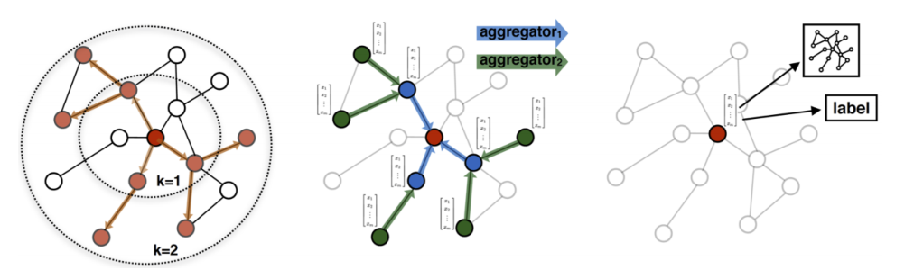
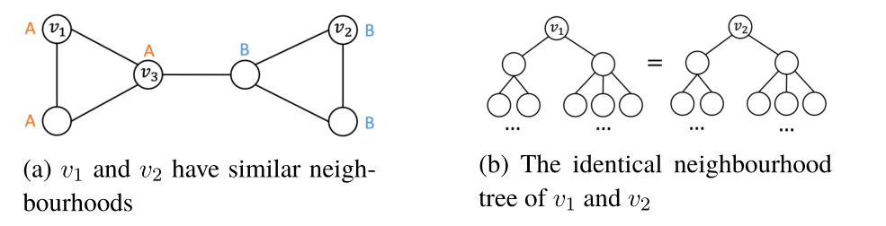

1.邻接矩阵：采用$|V| \times|V|$大小的矩阵进行表示，其中$V$表示图节点的数量。两个节点之间如果具有连接，则矩阵对应位置为非零。一百万个节点的图，它的矩阵具有$10^{12}$大小。

2.图嵌入技术：采用低维度的方法压缩图的向量表示。该技术可以保持拓扑结构和节点间关系。在目标空间中，相似的节点往往靠得更近。

图嵌入技术常常有两种方法：

（1）基于分解的方法：该方法是将图表示为一个举证，然后将其分解成一个向量。

（2）基于随机漫步方法：该方法依赖于对图的随机漫步，允许获取节点相似性和节点中心性。

（3）基于深度学习的方法（适用于本文）：学习节点间非线性依赖生成图表达。这样的方法采用神经网络架构。

以下方法是一些最新的方法，它们的特点之一是可以归纳地表示图形，可支持不可见节点和图。之前的研究都是直推的形式。这对于本论文很重要，因为该方法可以加快设备放置的速度，并且不需要反复训练就可以在不同的模型上工作。

GraphSAGE

归纳式的图嵌入技术，传统的方法都是传导式的方法，只能运用于静态图。使得其标记不可见节点成为可能。

每个节点基于其本身特点创建特征向量，与邻近节点的聚集特征相结合。v的邻居节点包含距离当前节点$K$层远邻居节点。每一层都由一个到v距离相同的节点样本组成。$v$的直接邻居是距离其$K=1$远的节点；他们的后代节点是$K=2$远。注意，由于聚合的计算成本可能很高，所以每个节点的样本只包括它们各自的近邻的一个子集。

下图（左边）表示邻居节点最大距离$K=2$的例子。嵌入是一个节点的特征与它自己的近邻的嵌入的聚合的串联。给定节点$v$和其邻节点，特征聚合从距离$v\left(\mathbf{h}_{v}^{0}\right)$的$K$跳节点开始。由于它们在当前邻域内没有进一步的邻域，因此它们的嵌入只是它们自己的特征向量。

下一级的节点（$v_{k+1}$）的嵌入是通过使用聚合函数结合上一层的邻居的特性使用如下函数进行嵌入$\left(\mathrm{AGG}_{k}\left(h_{u}^{k-1}, \forall u \in \text { neighborhood of } v_{k-1}\right)\right)$。并将它们与当前级别的自身特性连接起来。联结是通过乘以一个权重矩阵$W^k$并且通过非线性变换$\sigma$得到。该过程重复$K$次，直到节点v拥有了形成自身嵌入所需的所有信息。图中间部分提供了上述特征聚合描述的一个例子。

为了在不同层之间传递信息，每一层的权重矩阵$\mathbf{W}^{k}$是分开的。在训练的参数的时候，权重矩阵将会更新。在推理的时候，将会基于训练所得的参数将节点进行嵌入预测。算法如下：

P-GNN

位置感知的图神经网络P-GNN。GraphSAGE方法无法捕捉节点的位置和位置信息，只能捕获他们局部邻域。当位于图的不同部分的具有相同邻域结构的两个节点在嵌入图的向量空间的相同位置结束时，这就成为了一个问题。例如下图：

$v_1$和$v_2$具有相同的邻居树，子树如下图所示：

P-GNN的作者通过在图中引入称为锚集的节点集来解决这个问题。除了GraphSAGE中使用的邻域聚合之外，节点还会聚合来自锚集的信息。根据节点到锚集的距离来对这些附加信息进行权重。这使得嵌入还可以捕获节点相对于整个图的位置。在图2.9的例子中，向量$v_3$引入为锚集。$v_1$到$v_3$之间的最短路径和$v_2$到$v_3$的最短路径是不同的。因此，在嵌入空间内，$v_1$和$v_2$能够被区分出来。

算法2显示了P-GNN的更多细节。第一步是计算当前图G的锚集S。在本文中，作者选择数量为$\log ^{2}(|V|)$的节点作为锚集。这样做的原因是只有选择较小的锚集才能提供非常好的局部性信息。然而，并不是所有的节点都能被这些锚集覆盖。另一方面，只选择较大的锚集解决了覆盖问题，但不能提供良好的局部性数据，因为它覆盖了很多节点。选择不同大小的锚集可以平衡这种权衡，从而获得良好的覆盖率和更精确的位置信息。注意，在本文中，锚集是在算法的每次前向传递时重新选择的。

当锚集被选择之后，计算每个节点$v$的嵌入以及与所有节点$u \in S_{i}$的关系，其中$i \in 1 \ldots k$，$k$表示锚集的数量。$v$和$u$之间的关系采用$F$进行计算，结合两个节点的特征以及位置信息，如距离。最后的嵌入是由一个大小为$k$的向量$M_v$形成的。对于每个锚集$S_i$，每个元素响应$v$与每个节点$u$的关系的聚合。$M_v$与权值矩阵$W$相乘，通过一个非线性函数为节点$v$产生最终的编码$z_v$