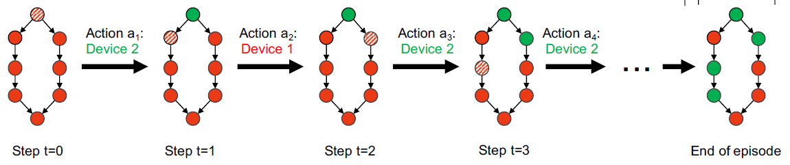
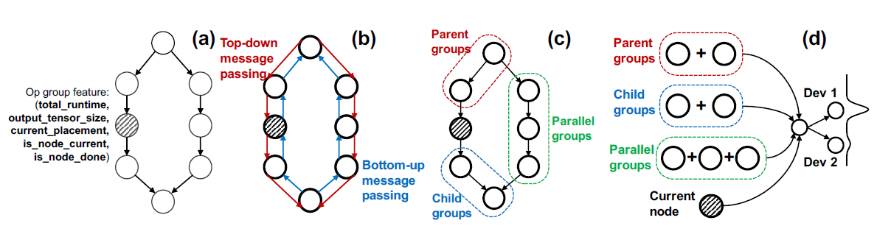

- 题目：Learning Generalizable Device Placement Algorithms for Distributed Machine Learning
- 作者：Ravichandra Addanki 2019 MIT 开源 
- NIPS会议

## 摘要

与其它强化学习进行网络模型自动切分调度不同，Placeto具有两大特点：（1）区别于其它方法一次性的输出，它采用迭代式的策略提升；（2）采用Graph Embedding技术捕捉图结构，使得它能应用于未知图。Placeto和其他方法相比寻找到相似效果的并行策略时间减少了6.1倍。而且Placeto可以通过对某一类计算图的学习，而不需要对相似图重新训练即可预测最优切分调度策略。

## 学习方法

将计算图抽象为$G(V,E)$，其中$V$表示神经网络计算图中的操作，E表示数据通信。对于一系列设备$\mathcal{D}=\left\{d_{1}, \ldots, d_{m}\right\}$，为图$G$中每个操作都设置一个映射：$\pi: V \rightarrow D$。目标是找到一种划分调度策略，使得执行时间$\rho(G, \pi)$，为了减小$V$，考虑对$V$进行提前分组。

### MDP过程

它假设搜索过程是一个MDP（马尔科夫决策）过程：

在第$t$步，智能体（强化学习模型）为当前计算图节点$v$选择调度设备，并更新状态$s_t$，将下一个未访问节点重新设置为当前节点，继续该过程，如下图所示：

在开始它设计两种奖励的方式：

（1）完成后奖励：每次做完一个节点的设备调度选择后，不给予奖励，完成计算图所有节点调度后给予奖励

（2）中间奖励：每完成一次决策就给予一次奖励，奖励如下$r_{t}=\rho\left(s_{t+1}\right)-\rho\left(s_{t}\right)$，其中$\rho$是$s$策略的执行时间

### 策略网络架构

MDP策略采用深度神经网络模拟，采用标准的策略梯度算法进行训练。其训练过程如下：

#### Graph Embedding

采用Graph Embedding架构来处理计算图中的每个节点相关的原始特征，采用以下三个步骤：

（1）编码每个节点的原始属性特征：该组中所有操作的总执行时间、总输出张量的总大小、当前计算调度设备的0-1编码、当前是否已采取调度调度策略指示。提前会从设备上收集每个操作运行时间的度量。

（2）本地临节点汇总：采用各个节点的原始特征，运用消息传递将每个相邻节点的信息进行聚合，聚合的方式如下：$\mathbf{x}_{v} \leftarrow g\left(\sum_{u \in \xi(v)} f\left(\mathbf{x}_{u}\right)\right)$，其中$\xi(v)$表示的是$v$的邻节点，$f,g$是可训练的参数。采用两个方向（从根节点至顶向下和从叶节点自底向上）两种方式的参数是独立的。自顶向下的聚合了所有能够到达$v$节点的所有子图节点的信息；自底向上的方法聚合了所有$v$节点能够到达的所有子图节点的信息。消息传递重复$k$次，它是一个超参数。采用这种方式，可以将学到的策略传输到不可见的模型中。

（3）池化聚合：在消息传递之后，我们聚合在每个节点计算的嵌入，以创建整个图的全局。对于当前节点$v$，我们执行三个独立的聚合：能够达到$v$的设置为$S_{parents}(v)$，能够从$v$到达的记为$S_{children}(v)$，将$S_{parallel}(v)$记为都不可达的。在每个集合上，我们都采用如下聚合$h_{i}\left(\sum_{u \in S_{i}(v)} l_{i}\left(\mathbf{x}_{u}\right)\right)$，其中$\mathbf{x}_{u}$表示节点编码，$h_i$和$l_i$表示多层感知器。

最后节点$v$的结果被连起来，作为后续策略网络的输入。

#### 训练

采用普通的策略梯度（PG）方法进行：
$$
\theta \leftarrow \theta+\eta \sum_{i=0}^{N-1} \nabla_{\theta} \log \pi_{\theta}\left(a_{i} \mid s_{i}\right)\left(\sum_{i^{\prime}=i}^{N-1} r_{i^{\prime}}-b_{i}\right)
$$
为了减小方差，引入了平局值$b_i$

## 实验

由于在Graph Ebedding阶段需要一定的神经网络模型计算图作为训练输入，但是现有的图不存在，所以该论文采用ENAS去生成结构相似的，可以达到类似精度的神经网络计算图作为训练数据（cifar10,ptb和nmt）。

#### 基线

- 单GPU训练
- Scotch：一种最小化通信量的图划分方法
- 专家设计的并行策略
- 基于RNN的方法（Google提出的第一种强化学习方法，他说是开源的）

#### 奖励

$$
R(p)=\left\{\begin{array}{ll}
r & \text { if } m \leq M \\
r+c *(m-M) & \text { otherwise }
\end{array}\right.
$$

其中M是设备上具有最大内存利用率峰值的可用内存总数，c是一个比例因子。

#### 分组

和Google文章的分组是一样的

https://papers.nips.cc/paper/2019/file/71560ce98c8250ce57a6a970c9991a5f-Reviews.html

审稿人意见2：创新性：图神经网络的应用很新颖，扫描的方式也是（至少对于图神经网络来说非常新颖）。使用ENVS的方式搜索数据集的方法也很新颖，提交的质量是健全的，但是我有几个疑问：（1）为什么使用REINFORCE中 的强化学习方法，而不是使用更好的RL方法，比如PPO（就像Spotlight一样）？这个方式虽然已经足够好了，但是我还是表示怀疑，因为在正常的RL环境中，REINFORCE方法的效果要差很多；（2）已经有论文明确提出了采用PPO或者Q-Learning的方法可以在不影响准确率的情况下降低方差，这是更好的选择，但为什么不采用该方法？

