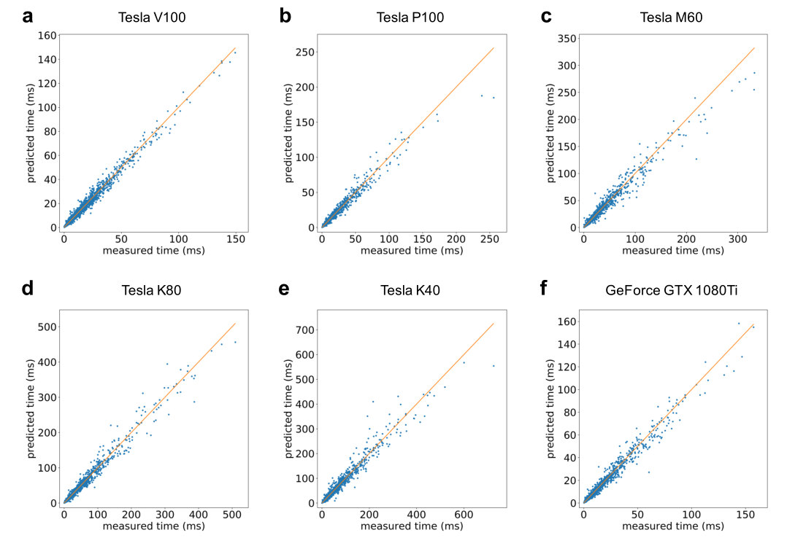

# 深度学习调度时间预测调研

## TensorFlow平台深度学习任务的资源调度问题研究

- 来源：电子科大硕士论文《TensorFlow平台深度学习任务的资源调度问题研究》

对深度学习任务执行时间的预估通常根据当前**任务的计算量**和**计算设备的处理速度**进行。最明显的batch_size会影响训练精度和训练时间，该论文做出的实验结果如下：

> （这张图并不严谨，并没有说明各个坐标的名称，batch_size的直线表达不明确）
>
> 左侧表示训练时间，右侧表示训练精度，横坐标表示批量大小

时间预估可通过epoch中全量数据和batch_size的数学关系得出全量数据的总迭代次数，预估结果如下：

这样估计的误差会随着Epoch的增大而不断降低。当需要时间预估时，通过读取任务执行过程的日志来获取当前状态完成一个batch-size数据训练的时间。

> 这样的预估方式具有局限性，不太准确，且需要在执行过程中计算，只考虑batch_size这一个维度。

论文同时也阐述了模型的预训练和预加载也会对训练时间产生影响

## Predicting the Computational Cost of Deep Learning Models

- 来源：Predicting the Computational Cost of Deep Learning Models

#### 背景

目前众多研究都是基于**训练时间**和所需**浮点运算数**成线性关系。但这样的假设是不正确的，当有其它活动占据主导执行时间的时候将会导致不正确。例如：从内存加载数据或者非最佳并行执行而造成的性能损失。

该论文将网络模型的各个部分计时组合起来，为整个执行时间提供的预测，该方法不仅可以为每个batch和epoch提供执行时间预测，而且可以为其选择合适的硬件和模型。

一般预测执行时间可以分成两因素：一个epoch所需的执行时间——一个单一的正向和反向训练所有训练数据——以及达到期望的精度所需要的epoch数量。

#### 本文工作

- 相关论文：PALEO: A PERFORMANCE MODEL FOR DEEP NEURAL NETWORKS

先前的工作大多基于大$O()$，时间复杂度。主要是基于在一个epoch当中，浮点操作的数量。例如PALEO系统计算一个epoch所需的浮点操作数，然后乘以一个比例因子，该比例因子是在系统上测试浮点运算速度得到的。。然而，这并没有考虑到执行的许多其他操作，这些操作可能不与浮点操作的数量成线性比例。它也没有考虑到各种系统限制，例如，由于数据大小或同时充分利用所有GPU核心的能力，GPU的性能不能达到最佳等情况。

该论文的工作是建立起一个普遍适用的数据驱动模型，用于预测深度神经网络中常用层的执行时间。通过这种方法，我们预测出了一个step所需的训练时长（前传和后传）。本文主要贡献：

- 可能影响深度学习训练执行时间的性能特征分类
- 利用深度学习预测深度学习网络的执行时间
- 在不同硬件的预测执行时间的性能比较。

#### 相关工作介绍

1. DAWNbench和MLPerf希望在训练机器学习模型架构时量化不同硬件芯片的执行性能。然而，在设计上，这些方法被限制在一些参考体系结构中。
2. 通过将该模型与该模型相似的模型对比来预测新模型的执行时间，然而这样的估计方式非常粗略。
   - 来源：Fathom: Reference workloads for modern deep learning methods
3. 另一种方法是根据在训练步骤中执行的单个浮点操作所生成的计时生成性能预测。这是合理的，因为大多数深度学习方法是基于使用浮点数学的线性代数运算，执行的浮点运算的数量很容易计算。
   - 例如上文提到的：PALEO: A PERFORMANCE MODEL FOR DEEP NEURAL NETWORKS

然而由于在GPU上的计算缺乏完美的并行性，实际中可能没有浮点运算的操作，没有考虑GPU之间数据交换的时间和主要内存，只考虑执行时间只与执行的浮点操作的数量近似线性增长。PALEO试图通过观察真实环境的深度学习训练，从中提取一个比例来对上述问题进行弥补。然而，这仍然假设在所有深度学习中浮点和非浮点工作的均匀分布。

#### 训练特征

本篇论文定义了在执行训练时可能影响执行时间预测的特征。将这些特性分为层特性、层具体特性、实现特性和硬件特性。这些类别中的每一个都包含了非常多的内容。因此，本论文在这里定义了这些功能的核心子集，但认为其他功能可以很容易地添加。该论文并没有对每一个特征对整体预测的影响作研究，只是提炼了一些核心的特征子集。

##### 层特征

这些与神经网络中特定层的那些特征有关，特别是与该层相关的超参数。这些包括但不限于：

- 激活函数：用于单个神经网络，例如Relu，SoftMax等，可以使用one-hot编码将其编码到特性集合中。
- 优化方法：用于在损失函数空间中确定最小值。Gradient Descent, Adadelta, Adagrad, Momentum, Adam and RMS等
- 批量大小：表示作为同一批处理的一部分一起处理的训练样本的数量。

##### 层具体功能

1. 全连接层特征

   - 该层输入数量：因为所有的层都是完全连接的，所以这个值实际上是前一层的输出数。
   - 该层神经元数量：这相当于该层的输出数。

2. 卷积特征

   - 矩阵大小：训练输入数据的大小
   - Kernel大小
   - 输入深度：输入数据通道或层数
   - 输出深度：输出数据中的通道或层数
   - 步幅大小：卷积核的步幅
   - 边缘填充：输入填充添加到矩阵外部的0的边界层的数量，以允许正确分析边缘像素

3. 池化层特征

   - Kernel大小
   - 步长
   - 边缘填充：输入填充添加到矩阵外部的0的边界层的数量，以允许正确分析边缘像素

4. 循环特征

   - 循环类型：默认、LSTM或者GRU
   - 双向作用

##### 硬件特征

   1. GPU技术识别芯片制造商和使用的芯片技术。这可能包括图灵、Volta、Pascal、Maxwell和开普勒等英伟达微架构，但也包括其他制造商。这可以被编码为一热编码。应该注意的是，这只是描述了GPU技术，而不是单个卡。这样就可以将同一代的卡片组合在一起。
   2. GPU数量：计算系统中GPU的数量。如果每张卡有多个gpu，那么这就是gpu的数量。
   3. GPU内存
   4. GPU时钟速度
   5. GPU内存带宽
   6. GPU内核数量
   7. GPU巅峰性能：记录在GFLOPS中，GPU时钟速度和GPU核心计数的结果。
   8. 卡连通性这是GPU可使用的不同互连的一热编码。这可以包括:PCIe3.0  x16, PCIe3.0 x4, NVLink。

   ##### 训练空间

   需要注意的是，由于这个特征空间包含了非常多的可能组合，所以用所有的值来训练网络是不可行的。因此，我们通过特征空间的随机子样本来训练我们的网络。

> 感觉随机选择存在一定的问题

   #### 预测方法

   ##### 一般考虑

   我们的方法是将每个深度学习网络分解成单个组件，将单个层作为我们将用于性能预测的原子操作

我们的方法是将每个深度学习网络分解成单个组件，将单个层作为用于性能预测的原子操作（见图1）。随机选择这些原子操作构建最简单的神经网络。然后使用前向或者后向传播执行这些原子操作，记录多次执行时间。上述原子操作的特性集合和执行时间随后被用来训练一个全连接的神经网络。用该网络预测新操作的执行时间。

一旦对单个操作做出了预测，这些预测就可以跨层组合在一起，从而为深度学习网络的整体性能提供预测。

##### 模型架构与训练程序

本论文定义了预测深度学习网络运行时间的深度学习网络模型。本质上就是简单的前馈神经网络。

##### 模型整体的预测计算

为了预测深度网络单个epoch的计算时间，我们可以先计算单个批处理向前和向后传递所需要的时间：
$$
T_{b}=\sum_{i=0}^{l} b_{M(i)}
$$
其中$l$是深度网络中的层数，$b_{M(i)}$是批量执行时间估计，通过我们的预测方法生成。对于第$i$层，其中$M(i)$是层$i$的一种类型。这里应该注意的是，$b_{M(i)}$也应该由我们在训练网络时使用的其他特征参数化，然而，为了简单起见，我们在这里没有列出这些特征。然后计算深度学习网络单个epoch的总执行时间，可以计算：
$$
E=p T_{b}
$$
其中$p$是处理数据所需的批数。为了计算训练网络的总时间，还需要预测所需的epoch数量——这超出了本工作的范围。然而，由于目前许多深度学习用户使用的是固定数量的epoch(例如100)，因此可以很容易地对这种形式进行估计。

##### 比较指标

为了评估我们的方法，我们比较了一个给定的(不可见的)测试数据集的预测执行时间和实际执行时间。如果我们的方法是有效的，我们将看到这两个数据集之间有很强的相关性。除了比较实际值之外，我们还查看预测值和实际值之间的均方根误差(RMSE)，其中值越小表示预测越好。

#### 实验

## Fathom: Reference Workloads for Modern Deep Learning Methods

- 来源：Fathom: Reference Workloads for Modern Deep Learning Methods

#### 理解深度学习工作负载的性能特征

关于工作负载最基本的性能问题就是时间花在哪里。许多从事深度学习硬件的架构师已经对此有了一定的认识，但他们的观点经常是相互矛盾的。一些人声称卷积，矩阵-矩阵乘法，或者矩阵-向量乘法是深度学习的主要核心。从某种程度上说，他们说的都对，但真相更微妙。它取决于模型、环境和被考虑的用例。关于少数几种操作类型支配整个计算时间的一般直觉是正确的。虽然说工作负载可以减少到单个操作是夸张的，但是分布是非常扭曲的，如图2所示。每条曲线上的每一点表示单个操作类型对执行时间的累积贡献。很明显，少数“重”操作类型（通常是5到15种）共同负责90%以上的程序持续时间。然而，需要注意的是，这些类型对于每个模型都是不同的(即，每条曲线最左边的点可能代表不同的操作)，也不是相同的。

## Optimus: An Efficient Dynamic Resource Scheduler for Deep Learning Clusters

论文提出了Optimus调度框架，针对PS框架，基于在线资源性能模型最小化作业训练时间。Optimus使用在线拟合来预测训练过程中模型收敛性，并建立绩效模型，以准确估计训练速度作为作业资源分配的函数。基于这些模型，设计了一种简单有效的方法，用于动态分配资源和分配深度学习任务，以最小化任务完成时间。（该框架是开源的）。

- 现有集群调度有以下问题：

  1. 集群中已经运行的作业在可用时无法从额外资源中获益（例如，在夜间工作负载较低时）。除非集群操作者手动重新配置它们的资源组合，或者作业所有者将作业重新提交为新作业。这将导致集群资源利用率低下。

  2. 现有的调度器针对不同的工作负载设计，但都不包括深度学习。

Optimus为生产集群中的深度学习作业定制的自定义集群调度程序，最小化作业训练时间，从而提高资源效率。重点介绍使用PS架构的数据并行技术训练作业。为每个正在运行的作业构建资源性能模型，并根据作业进度和集群负载动态调度资源到作业，以最小化平均作业完成时间和最大完工时间。

### 学习收敛曲线

#### 数据预处理

剔除离散点，对Loss进行归一化处理等数据预处理步骤

##### 在线拟合

我们采用下式进行拟合，因为大多数DL任务采用SGD，所以收敛速率是$O(1/k)$：
$$
l=\frac{1}{\beta_{0} \cdot k+\beta_{1}}+\beta_{2}
$$
其中$l$表示训练损失，$\beta_{0}$,$\beta_{1}$和$\beta_{2}$表示负系数。我们的在线模型拟合如下：在每个训练步骤结束后，我们收集一个损失数据点$(k,l)$。使用上述数据预处理方法进行预处理，并使用非负最小二乘求解器进行拟合。当随着作业的运行，获得越来越多的数据集，所以拟合模型将会不断改变。

### 资源-速度模型

资源-速率模型的建立是依托于参数服务器架构。

$p$表示参数服务器个数，$w$表示工作节点个数，$B$表示每个参数服务器通信带宽，$S$表示模型尺寸。当人工训练小批量正向传播的时间为$m \cdot T_{\text {forward}}$（批量大小乘以一个平均处理时间），反向传播时间$T_{back}$与$m$的大小是无关的。梯度的大小和模型的大小$S$是相同的。如果参数服务器是分布式的，那么工作节点和参数服务器之间的通信大小是$S/p$。令$w^{\prime}$表示同时向参数服务器发送梯度的工作节点数量。工作节点和参数服务器之间的带宽即为$B/w^{\prime}_p$。推梯度和拉更新参数是对称过程，所以每个worker的数据传输时间为$2 \frac{S / p}{B / w_{\rho}^{\prime}}$。参数服务器上的参数更新时间为$\frac{T_{u p d a t e} \cdot w_{\rho}^{\prime}}{p}$。此外，通信开销(例如，在参数服务器和工作者之间处理TCP连接和控制消息)随着参数服务器的数量和工作者的数量线性增加。使用$\delta \cdot w+\delta^{\prime}$来进行表示。

因此，对工作节点的一个训练步骤的持续时间可以被建模为：
$$
\begin{aligned}
T=& \max _{\rho}\left[m \cdot T_{\text {forward}}+T_{\text {back}}+2 \frac{S / p}{B / w_{\rho}^{\prime}}+\frac{T_{\text {update}} \cdot w_{\rho}^{\prime}}{p}\right.\\
&\left.+\delta \cdot w+\delta^{\prime} \cdot p\right]
\end{aligned}
$$
推导出同步和异步的训练速度：

###### 异步

单位时间所有工作节点完成训练步骤的总数（即速度）：$w \cdot T^{-1}$，如果工作节点总数越大，更多的工作节点可同时与参数服务器通信，因此可以将$p$个参数服务器和$w$个工作节点训练速度建模如下（假设$w^{\prime}$和$w$线性相关）：
$$
f(p, w)=w \cdot\left(\theta_{0}+\theta_{1} \cdot \frac{w}{p}+\theta_{2} \cdot w+\theta_{3} \cdot p\right)^{-1}
$$

###### 同步

所有的工作节点都以同步的速度从一个step进步到下一个step。训练速度为$T^{-1} \cdot w_{\rho}^{\prime}$，它是等于$w$，因为所有工作节点是同步的。
$$
f(p, w)=\left(\theta_{0} \cdot \frac{M}{w}+\theta_{1}+\theta_{2} \cdot \frac{w}{p}+\theta_{3} \cdot w+\theta_{4} \cdot p\right)^{-1}
$$

为了得到$\theta$就需要建立起上式的速度模型，并且收集数据点$(p, w, f(p, w))$。在我们运行每个训练作业之前，我们在训练数据的小样本集上训练它的模型，并使用$p$和$w$的可能组合。每次运行大概需要几十秒的时间，在每次运行中，我们推导出$(p,w)$下的运行速度。由于DL模型训练的迭代性质，对几个步骤的训练足以让我们对训练速度有一个很好的概念。使用最小二乘法进行拟合。

#### 资源调度

$Q_j$表示为了实现模型收敛而需要运行的剩余步骤时间。估计剩余的运行时间$t_j$。令$\text { Let } O_{j}^{r}\left(N_{j}^{r}\right)$表示表示作业$j$中每个工作节点（参数服务器）占用的r类型资源的数量。$C_r$表示集群中r类资源的总体容量，R是资源种类的数量。$J$是当前活动作业的集合。我们的调度程序旨在最小化这些作业的**平均完成时间**。我们可以解决以下优化问题来决定每个作业$j$的工人/参数服务器的数量。
$$
\begin{array}{ll}
\operatorname{minimize} & \sum_{j \in J} t_{j} \\
\text { subject to: } & t_{j}=\frac{Q_{j}}{f\left(p_{j}, w_{j}\right)} \quad \forall j \in J \\
& \sum_{j \in J}\left(w_{j} \cdot O_{j}^{r}+p_{j} \cdot N_{j}^{r}\right) \leq C_{r} \quad \forall r \in R \\
& p_{j} \in Z^{+}, w_{j} \in Z^{+} \quad \forall j \in J
\end{array}
$$
该式子是非线性甚至是非凸的。不能够使用凸优化的方法，并且是NP难题，因此下列启发式算法来解决该问题：我们定义了**边界收益**在工作完成时间缩减如下：
$$
\begin{array}{l}
\max \left\{\left(\frac{Q_{j}}{f\left(p_{j}, w_{j}\right)}-\frac{Q_{j}}{f\left(p_{j}+1, w_{j}\right)}\right) / N_{j}^{D}\right. \\
\left.\quad\left(\frac{Q_{j}}{f\left(p_{j}, w_{j}\right)}-\frac{Q_{j}}{f\left(p_{j}, w_{j}+1\right)}\right) / O_{j}^{D^{\prime}}\right\}
\end{array}
$$
其中$D(D^{\prime})$或指的是在任务$j$中工作节点（参数服务器）的主导资源，该式的直观思维是：比较一下增加一个工作节点（参数服务器）所带来的平均速度收益，选取最大的。

我们在每个调度区间内的资源分配算法如下：我们首先分配一个工作节点和一个参数服务器每个活动的任务，以避免饥饿，然后所有任务为了他们的边际收益计算使用迭代（7），然后我们选择任务最大的边际收益，并将一个工作节点或参数服务器添加到任务，根据这两项的（9）大（即,是否添加一个工人或添加一个参数服务器带来了更大的边际收益）。当作业的资源分配改变时，作业的边际收益被更新。这个过程不断重复，直到集群中的某个资源耗尽，或者所有作业的边际收益变为非正数。

### Tiresias：A GPU Cluster Mnager for GPU Distributed Deep Learning

目前预测分布式深度学习任务训练时间都有如下假设：（1）具有平滑的损失曲线；（2）达到它们的训练目标并完成。然而，很多较弱的模型在训练错误的探索阶段，它们的误差曲线不像最好的模型那么平滑。行的公共模型有时也表现出非光滑曲线。

而且分布式机器学习的终止条件也是具有非确定性的。

例如下面这两类损失函数训练曲线：

