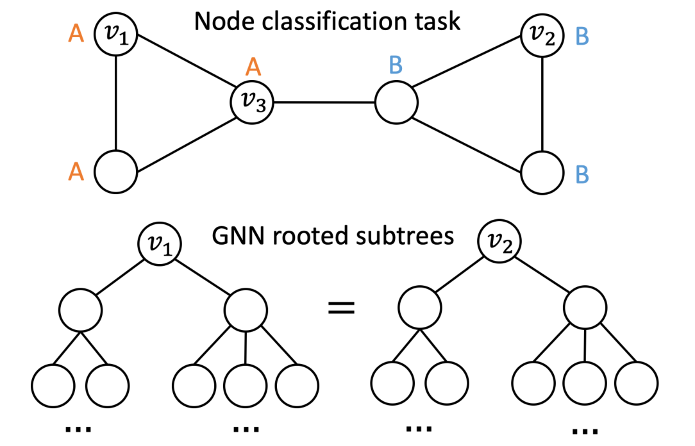
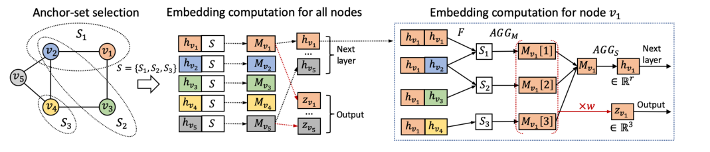
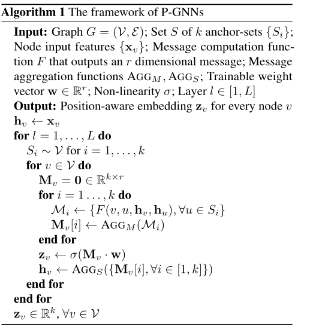

# 位置感知的图神经网络（P-GNN）

## 摘要

现有的图神经网络在捕捉给定图结构的能力上是有限的，因此本文提出了位置感知的图神经网络P-GNN，可以用于编码位置感知的图神经网络。P-GNN首先采样锚节点集，计算给定目标节点到每个锚节点的距离，然后根据锚节点进行非线性的距离加和。采用这样的方式P-GNN可以根据锚节点捕捉其他节点的位置。

P-GNN有以下优点

1. 他们是可归纳、可扩展并且可以合并节点特征信息
2. 将其应用于多个任务预测，发现在ROC和AUC分数上提升了66%

## 介绍

节点嵌入方式可以分成图神经网络GNN、矩阵分解方法和随机漫步方法。在GNN方法中，节点嵌入是通过GNN层通过非线性变换和聚合函数从节点的网络邻居聚合信息计算而来的。通过堆叠多个GNN层可以捕获远程节点依赖关系，从而在多跳中传播信息。然而，现有GNN体系结构的关键限制是它们不能在图结构的更广泛的上下文中捕获节点的位置/位置信息。例如，如果两个节点位于图的不同部分，但在拓扑上具有相同的领域结构，那么他们讲具有相同的GNN结构。因此，GNN会将它们嵌入到嵌入空间的同一点。下图给出了GNN不能够区分节点$v_1$和$v_2$的例子，他们总是嵌入到了同一个点上，因为他们具有相同的网络领域。研究人员已经发现了这个弱点，并使用启发式来解决这个问题，但是使用启发式的方式是不能够泛化至不可见的图，任意深度的GNN任然不能够区分结构同构的节点。

上图的节点需要进行A标签和B标签的分类，但有效的节点嵌入方法需要能够区分出节点$v_1$和节点$v_2$。然而，GNN方法无论深度如何，总会将$v_1$和$v_2$看作是同一个节点，因为这两个节点在图当中是对称的，他们用于消息聚合之后的GNN根子树是相同的。但是P-GNN可以打破这一点，它通过引入$v_3$作为锚节点，因为$(v_1,v_3)$和$(v_2,v_3)$的最短路径是不同的，因此$v_1$和$v_2$这两个节点是可以被区分的。

## 方法

在本节中，我们首先描述P-GNN框架，它扩展了GNN来学习位置感知节点嵌入。接下来我们将讨论我们的模型设计选择。最后，我们从理论上说明了P-GNN是推广至已有的GNN和学习位置感知嵌入的。

位置感知神经网络关键点概括如下：（1）在计算节点嵌入时，我们不只是聚合来自本地网络邻居的消息，同时还允许P-GNN聚合来自锚集的消息，锚集是所有节点随机选择的子集。如下图的左边。

需要注意的是，当模型向前运行时，锚点集都会重新采样。其次，在执行消息聚合时，不是让每个节点单独聚合信息，而是跨所有节点耦合聚合，以区分网络中位置不同的节点，下图中间部分。P-GNN使每个节点嵌入维度对应于根据一个锚集计算的消息，这使得节点的嵌入是位置感知的下图右边。

P-GNN包括了下面的关键点

1. 不同大小的$k$个锚集$S_i$。
2. 消息计算函数$F$，将两个节点的特征信息与其网络距离相结合。
3. 锚集消息矩阵$M$，其中每行$i$是由$F$计算的锚集信息。
4. 可训练的聚合函数$AGG_M$，$AGG_S$对锚集节点的特诊信息进行聚合转换，然后跨锚集对特征信息进行聚合。
5. 将消息矩阵$M$投射到低维嵌入空间$\mathbf{z} \in \mathbb{R}^{k}$。

P-GNN的架构图。P-GNN首先采样多个不同尺寸的锚点集合$S=\left\{S_{1}, S_{2}, S_{3}\right\}$（左边）。然后位置感知节点嵌入$\mathbf{Z}_{v_{i}}$是通过给出节点$v_i$和锚点集合$S_i$通过消息传递$M_{v_i}$计算得到，而且锚点集合$S_i$是在所有节点之间共享的（中间）。为了给$v_1$节点计算嵌入$\mathbf{Z}_{v_{1}}$，P-GNN首先通过函数F计算消息，然后通过一个可学习函数$AGG_M$将每个锚集$S_i$进行聚合来获得锚集消息矩阵$M_{v_1}$。然后，使用可学习函数$AGG_S$进一步聚合消息矩阵$M_{v_1}$，来获得$v_1$的消息节点$h_{v_1}$，该消息可以传递到下一级的P-GNN网络。于此同时，使用学习向量$w$将$M_{v_1}$减小为固定大小的位置感知嵌入$z_{v_1}$，这是P-GNN的输出（右边）

具体算法如下：

图$G=(\mathcal{V}, \mathcal{E})$；其中$S$集合表示$k$个锚集${S_i}$；节点输入特征为${x_v}$；消息计算函数的输出是一个$r$维的中间消息；消息聚合函数是$AGG_M$和$AGG_S$；可训练向量$\mathbf{w} \in \mathbb{R}^{r}$和非线性变换$\sigma$；网络层$l \in[1, L]$

### 锚集的选择

文章通过理论证明，结论是选择$k=c \log ^{2} n$个随机的锚点集，表示为$S_{i, j} \subset \mathcal{V}$，其中$i=1, \ldots, \log n, j=1, \ldots, c \log n$，并且$c$是一个超参数。为了采样出锚点集$S_{i,j}$，我们为在$V$中的每个节点设置$\frac{1}{2^{i}}$的采样概率。

### 消息计算函数

$F=F\left(v, u, \mathbf{h}_{v}, \mathbf{h}_{u}\right)$必须考虑到位置相似性和特征信息。
$$
d_{s p}^{q}(v, u)=\left\{\begin{array}{ll}
d_{s p}(v, u), & \text { if } d_{s p}(v, u) \leq q \\
\infty, & \text { otherwise }
\end{array}\right.
$$
其中$d_{sp}$是两节点之间的最短路径。1跳距离可以直接从邻接矩阵中识别出来，不需要额外计算。其他的特征信息可以通过拼接得到。
$$
F\left(v, u, \mathbf{h}_{v}, \mathbf{h}_{u}\right)=s(v, u) \operatorname{CONCAT}\left(\mathbf{h}_{v}, \mathbf{h}_{u}\right)
$$

### 消息聚合函数

$MEAN,MIN,MAX,SUM,MEAN$等。